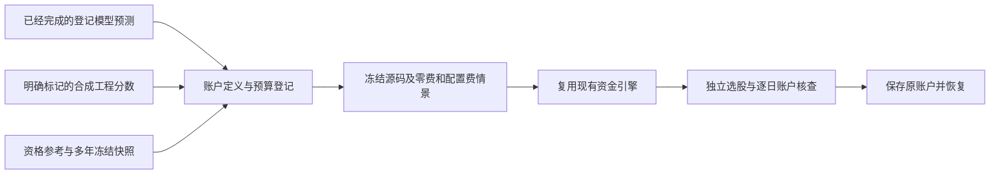

# 保存的模型分数怎样正式跑账户

E19 最小接线的源码、31项新增软件案例及两名独立只读复核通过；全量1224通过1跳过。正式工程3作业已完成：2完成、1启动前取消，登记6个合成账户意图、实际运行4个，0拟合；两个完成作业从原结果恢复。多年真实收益比较仍未开始。实际拟合输出兼容问题与旧验收更正见[修复报告](ML_ACCOUNT_BRIDGE_INTEGRITY_20261007.md)。

一周的人话例子：周五收盘后读取模型对每只股票保存的分数，按当时资格和固定规则选前100只；周一开盘尝试调整持仓，下次调仓继续读取已保存分数。账户计算买到多少、现金、持股、权益事件、费用与每天总资产。程序中断后读取原结果，不为了恢复分数重新训练。

## 提供什么，做什么

四份输入是预测表、原学习收据、资格及原始收盘参考表、日历。另声明快照身份、组合规则、原生账户参数、费用情景和预算。X/Y不重新传给账户，也不在这里训练。真实模型必须来自已经完成并核查过的alpha_learn作业，预测与收据内容必须完全一致；工程stub需要明确声明没有拟合策略。

原学习Y仍是明确执行窗口收益率，默认匹配两次计划调仓开盘。它不是任意第五天价格，也没有直接优化本账户回撤。选股按分数降序、代码处理并列，没有隐式小市值筛选。股票资格由决策时可知参考名单声明；主板账户或显式取更广学习名单的主板子集。

每个评分账户作业必须含zero_transaction_cost和configured。零费重新计算整个账户，不是事后加回费用。原资金引擎、持仓及权益事件规则保持原有计算；新增的固定run_id仅让输出文件位置能提前绑定、监督和恢复，不能覆盖原目录。公开报告和工作台通过原生run_id查看账户。

## 次数和失败怎样处理

任务先固定总账户意图和真实/合成子预算。两情景登记就占两个意图；失败、取消、冻结失败都不退回。事务统计同一任务的原生对照账户情景，包括取消的对照；在引入账户预算前已有的原生对照也会计入。更改显示名称不会获得新试验。同一作业已经启动或留下原生输出目录时拒绝重新执行。

拟合意图另由学习任务累计。账户工人和核查器不fit；恢复、提交、复核读取原预测及账户。进程退出但数据库收取暂时失败时，保留pending并重试收取，不重跑资金引擎。

## 核查到什么，没认证什么

独立核查重建评分选择、权重、执行计划，并检查原始报价、逐日资产、股票与现金、费用、权益事件及收益/回撤指标。输入声明与原账户档案绑定；收取后数据库继续绑定原始输出及审计哈希。

模型分数未被独立数学重现，供应商和历史修订也没有被认证。合成stub账户能验证会计接线，不能作为A股盈利证据。历史输入缺失、弱vintage和权益警告仍需逐项披露；不把已看历史称未见样本。

最多两数值worker、库线程两。资源输出范围明确为scored_account_result，同时计算job结果与已绑定原生run目录的文件字节；worker每0.2秒检查，终态再次核查。内存和磁盘是采样软停止，会超出阈值；不是OS硬隔离。父级同步审计仍未纳入worker槽、RSS和timeout监督。

本接口复用[评分到持仓](ALPHA_SCORE_TO_ACCOUNT.md)、[独立账户核查](ALPHA_ACCOUNT_AUDIT.md)及[持久训练](ALPHA_LEARNING_DURABLE.md)。E19首批总体上限12真实fit、32真实账户情景及最多6合成工程账户意图；精确多年日期、数据覆盖与模型矩阵必须先固定再运行。

当前状态与两级架构见[项目总览](PROJECT_MAP.md)（[网页](PROJECT_MAP.html)）；[完整蓝图](ML_SYSTEM_BLUEPRINT_20261005.md)、[完整工作包计划](CODEX_PROJECT_DELIVERY_PLAN_20261005.md)、[详细建设记录](BUILD_PROGRESS_20261006.md)。
