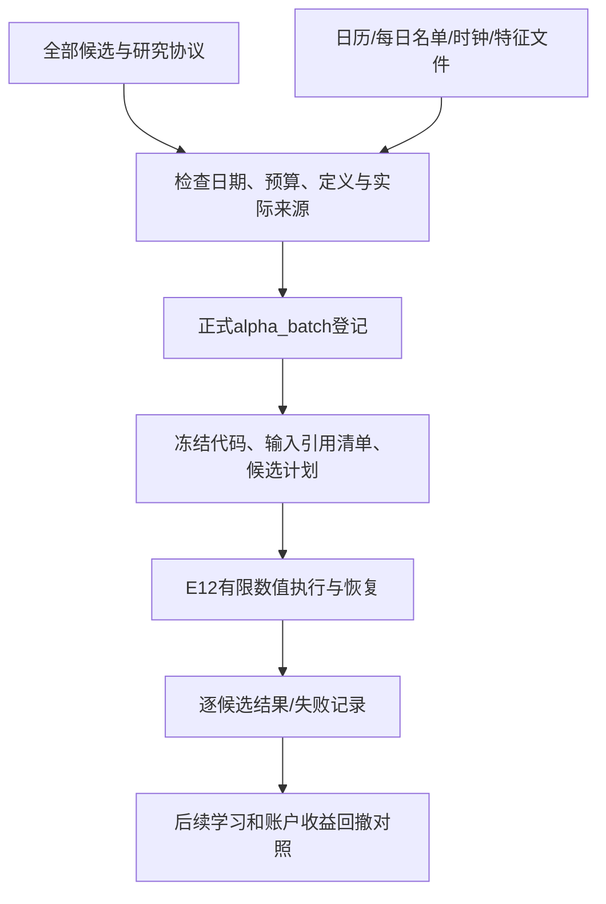

# 在跑很多候选之前先留下计划：E11正式批次登记

这一步让Alpha特征批次成为研究系统中的正式实验种类`alpha_batch`。它登记并冻结“准备研究什么、用哪份输入、按什么协议与预算进行”，不把登记当成已经运行。当前数值进程执行仍需E12；新模型接口、学习和账户桥接分别接续。

## 为什么不能只保留最好的回测

假设研究1000个公式，最后只展示收益最好的3个。即使输入没有明显未来泄漏，也可能只是在历史噪声里找到了赢家。需要同时记录所有候选、失败和取消，以及哪些区间用于修改思路、哪些留作后续检验。

[作者发布的Deflated Sharpe Ratio论文](https://www.davidhbailey.com/dhbpapers/deflated-sharpe.pdf)讨论多次尝试、选择偏差与非正态收益对表现评价的影响。这给这里的“完整尝试记录”提供依据；本阶段没有实现DSR，也没有凭一次登记纠正所有过拟合。[Qlib官方实验管理说明](https://qlib.readthedocs.io/en/latest/component/recorder.html)也把参数、指标和产物作为实验记录。本项目沿用自己已有租约、预算和冻结作业系统，不为记录能力引入新的云服务。

## 一个具体批次长什么样

例如我们登记四个特征公式，计划使用2020–2022年开发区间，2023年作为以后检验区间。此时明确冻结：

- 四个候选各自的名称、假设、家族和版本绑定表达式；不会先跑完再只登记赢家。
- 每个来源块的数值文件、缺失文件、单位/时点/来源定义、物化凭据，以及实际文件大小和SHA256。
- 完整日历、每日名单、每日决策时钟、名单ID与数据身份。
- 热身开始、开发起止、保留区间起止，明确二者不重叠。
- 候选数、输入字节、网格与缓冲区预算。本种类只构造特征，模型拟合与账户预算均为0。
- 当前Python源码冻结清单、环境版本和原始描述；所有输入按身份核查。

这里的2023年只是例子。当前项目已经多次查看历史样本，不能因换个字段叫“holdout”就把它称作从未见过的独立新数据。登记明确标记回顾性的时间划分；真正未来影子记录在后续阶段建设。

## 不仅核对单位，还核对具体含义

“开盘价”和“收盘价”都有人民币/股单位。如果把公式里的收盘价引用接到开盘价列，单位检查仍会通过。正式登记额外检查具体列名、命名空间、定义ID、当前算法参数、物化ID、来源ID/版本和实际数值/缺失文件哈希是否一致。

因此，本系统不会接受“单位看着一样”或“随便填一个64位ID”就算来源绑定成功。物化凭据本身仍是声明与文件一致性证据，不证明供应商保留了真实历史版本；这种局限不会被登记层升级成认证。

## 开发区间和来源文件分开

原始来源文件可以包含后面的日期；执行环境只准备热身至开发结束的日历与名单。保留区间的行不会因此进入开发批次数值执行。未来值仍通过E09的可知时点屏蔽。

日历、名单、时钟或特征任一文件变化，都拒绝使用旧冻结登记。输入按引用冻结而非复制所有大文件：原文件保持原位置，并在登记、冻结完成后和验证时核对内容。这样节省空间，但原文件丢失或改写就不能重跑旧登记；它不是数据备份。

## 重复、失败和预算

同一实质内容重新登记，返回原实验和原描述，不覆盖原冻结文件。改显示名称、顶层文字描述或输入角色列表顺序，不会消耗第二次实验预算。

同一公式如果在批次里用两个不同候选名字登记，会明确保留两条计划并计数；重复候选名拒绝。取消或失败的批次不会返还任务的实验次数预算。现在的候选清单标记为“计划中”，不会把尚未实际计算的候选称为已尝试；E12再记录具体执行状态，后续学习层再记录实际拟合次数。

如果代码冻结途中源文件变化，这次失败保留，不能覆盖重试当作第一次。已冻结代码也不会随项目之后的改动自动变成新版。登记身份可以继续验证；真正运行还要使用冻结执行器并核查环境，这属于下一阶段。

## 代码入口

| 入口 | 作用 |
|---|---|
| `AlphaBatchSpec.from_dict(...)` | 严格协议、日期、有限候选、预算、绑定与目标检查 |
| `verify_inputs(...)` | 项目内路径、大小、SHA与读取期间变化检查 |
| `inspect_inputs(...)` | 实际块/物化/具体列定义核查，构造开发范围环境，检查来源时点与版本门槛 |
| `Research.register(..., kind='alpha_batch')` | 与已有ML/账户登记分开分派到正式批次登记 |
| `alpha_experiments.register(...)` | 保存幂等实验身份，冻结源码与引用清单、全部候选计划 |
| `verify_registered(...)` | 重新核对登记、冻结清单、代码、输入和候选身份 |
| `execute/verify_completed` | 当前明确拒绝把E11登记当作已执行；E12接入执行与完成核查 |

当前冻结所有Python源码作为有限代码包，没有把原始市场数据或会话秘密上传GitHub。外部内容不提供自由代码执行入口；公式仍必须经过白名单AST检查。

## 本阶段验收与接续

合成协议检查覆盖开发/保留重叠、未来滞后、错误列、错误凭据、输入越界、大小/哈希变化、冻结代码变化、重复/取消计数、假完成状态和未执行保护。真实行情模型拟合为0，账户为0。这些检查为之后的研究真实性提供工程条件，不是策略有效性的指标。

下一步先建设模型接口、按成熟标签和训练范围进行学习、接入统一账户与核查；同时让E12有限数值执行和E14吞吐测量使用这个正式登记合同。完整闭环仍需保存同池小市值、固定组合、原16简单模型以及费用分支的真实账户对照。

## 独立复核后补上的拒绝检查

开发范围按协议日期选择，随后检查名单和时钟是否都在完整日历内。不能因为日历缺一天，就静默删掉那天的股票或压缩滚动窗口。完整日历必须是规范、排序且唯一的日期。候选清单的模式、全部预算、计数规则和候选计划要整体等于登记派生合同；只重算文件哈希不能改变已登记预算。另有直接反例拒绝伪造的已完成状态。

dataset_id和universe_id是声明标签，具体数据身份同时由文件哈希、名单内容和物化凭据绑定；标签本身不证明供应商历史。

冻结代码目录的实际文件集合也必须等于登记清单，拒绝新增包覆盖原模块或未登记字节码。冻结子进程使用-B避免生成额外字节码；这不等于操作系统沙箱。登记检查在准备数值叶子前约束展开缓冲估计，不能将它解释为全进程硬内存上限。
