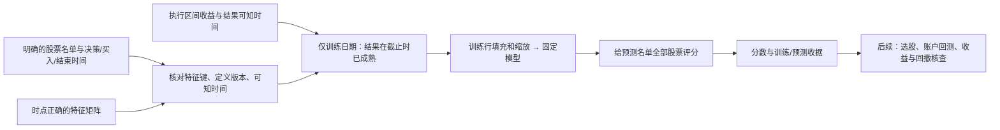

# 模型究竟拿哪些历史来学习（E16）

这是新模块的学习协议。它接在[六种模型接口](ALPHA_MODEL_INTERFACES.md)前面，之后还要接账户回测。旧机器学习研究与已做的账户保留；本次工程没有重新训练真实行情，也没有产生新的赚钱结论。

## 用一个星期的例子说明

假设我们周一开盘选股，目标是“这周一开盘买入，到周五收盘的价格涨幅”。我们在周一开盘前决定名单，输入只能使用此前已经知道的信息。训练模型时：
1. 两周前那一周已经结束，可以拿那周的输入和后来实际涨幅教模型。
2. 上周已结束且结果已知，也可以使用。
3. 上周五作出的另一条“五个交易日后收益”记录尚未结束，不能因为回看数据库有结果就提前教给模型。
4. 本周待选的每只股票仍然获得一个分数；没有未来收益记录也保留。预测时用不到它后来涨多少。

目标区间由每行的买入和结束时间明确给出。本模块不会猜周一、周五、固定五天，也不会先筛小市值或固定使用最早16个特征。输入股票名单、特征集合与日期由协议指定。协议V1支持执行区间的**小数收益率**，如0.03表示3%；还没有加入排序损失或期间最大回撤目标。收益标签不等于账户收益，分红、仓位等继续由账户处理。

## 一次调用按什么顺序做



训练日期必须早于预测日期，训练信息截止时间必须位于全部训练决策之后、第一次预测决策之前。只有目标结束且结果在截止时已知的行进入训练。特征也要在该行决策时已知；后来补写一个时间声明不能认证供应商历史真实性。

缺值仍有明确原因。某列在成熟训练行全部为空，默认报错；只有协议明确允许，才排除该列并记下名字。不能看预测列有没有值来决定保留哪些特征。其余列用训练中位数填充，并附加每列缺失标记；线性模型的缩放也只拟合训练行。

可选“每个决策日合计相同权重”减少某一天股票特别多造成的训练份额差异；默认每行同权。权重作用于回归模型，填充与缩放仍不加权。可选日期内打乱训练标签作为负对照；这只是一种否证工具，没有证明某个策略的收益。

## 最小用法

```python
from src.alpharesearch.learning import learning_spec, LearningRunner
from src.alpharesearch.models import model_spec

protocol = learning_spec(
    dataset_id="registered_dataset", universe_id="declared_universe",
    features=["pv16.return_5", "boards.close_upper_limit"],
    train=("2022-01-01", "2023-12-29"),
    predict=("2024-01-02", "2024-01-31"),
    fit_cutoff="2024-01-01T23:00:00+08:00",
    empty_feature_policy="exclude_train_empty",
)
runner = LearningRunner(max_calls=2, max_fit_intents=1)
result = runner.run(protocol, model_spec("ridge"), decisions, assembly, labels)
scores = result.predictions     # 股票/日期/决策/买入/目标结束/score及身份
receipt = result.receipt        # 实际训练行、排除列、成熟时间、参数、代码与内容身份
```

上例是接口说明，需要调用者实际提供表，不会自动下载或生成这些数据。示例列名应以实际注册表为准。decisions严格包含sample_id、trade_date、stock_code、decision_at、execution_at、target_end_at；assembly来自[特征拼装](ALPHA_FEATURE_REGISTRY.md)；labels包含同样三个样本键以及target_return、label_start、label_end、label_known_at、label_observed。不必提供预测股票的标签。真正缺少训练标签可以跳过；提供的训练标签如果股票/日期与sample_id互相矛盾，则报错，不能伪装成缺失后静默删行。

## 为什么记录身份和失败

训练身份绑定所用成熟行、目标、权重、缺失原因、定义版本、模型参数、代码与依赖版本。全体源矩阵的版本另存收据；追加不参与本次训练的未来值，不应改变实际训练内容。预测身份另外绑定预测输入、可知时钟和协议，收据也绑定输出表内容，分数可以回查由哪个训练产生。

同一Runner中重复请求相同训练会复用已拟合模型，不偷偷再训练；失败的新拟合请求计入有限预算并保留，不能靠同一请求自动重试。预测失败也不应该促发重新训练。调用数和新拟合意图数分别有限，实际调用模型fit的次数另外记录。

当前账本只在一个进程的内存中，重启后不会自动恢复。正式冻结任务、持久保存收据、执行限时和恢复需要后续执行器接入。输入已经在内存时才检查行数和矩阵大小，不能把这些上限称为操作系统内存沙箱。声明的历史截止时间不表示模型真的在历史那天运行；已看过的历史仍是回顾分析。

## 依据与边界

- [scikit-learn：避免数据泄漏](https://scikit-learn.org/stable/common_pitfalls.html)：只用训练数据拟合预处理。
- [TimeSeriesSplit](https://scikit-learn.org/stable/modules/generated/sklearn.model_selection.TimeSeriesSplit.html)：gap以样本行为单位。多股票每日面板不能把“五行”当作五个交易日；本模块直接检查结果可知时间。
- [Qlib DataHandlerLP](https://qlib.readthedocs.io/en/latest/component/data.html)：学习与推断处理可分离。训练需要标签，推断名单不应依赖未来标签有无。

合成反例检查时间、错键、未来数据扰动、未成熟目标、无预测标签、全空列、负对照、复用及失败计数。这是工程验证；新策略的最终评价仍由相同口径下的账户收益和最大回撤决定。
