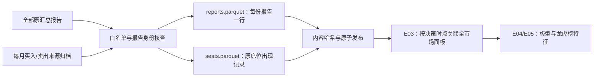

# E02：把全部龙虎榜报告变成可复查的本机输入

本包新增 `src/alpharesearch/snapshots.py`、`tools/alpha_events.py` 和对应反例测试。它接入现有来源归档，保留全部报告，不沿用“每只股票每天只选一份报告”的旧表。现有模型和账户没有自动改用新快照。

## 用人话说，现在多了什么

假设某只股票周五既有“当日涨幅榜”，又有“连续三日累计涨幅榜”。这不是两次独立的单日净流入，金额的统计区间不同。

旧的事件表为了得到每天一行，会选取一份完整报告。新快照把这两份各自留下来：原报告 ID、窗口、披露类别、金额、属于哪份报告的买卖席位。后续可以研究单日与多日事件，也可以构造不同窗口之间的关系，但不能把三日金额除以三伪造每天资金流，或把重叠的报告总额直接加起来。



最后两步仍是后续工程，图不能当作已经训练出新策略。

## 本机实际跑通的结果

| 内容 | 数量 |
|---|---:|
| 原汇总报告 | 139,192 |
| 月度买卖来源文件 | 186 |
| 快照中的原报告 | 139,193 |
| 原席位出现记录 | 1,386,025 |
| 只有席位接口提供、没有汇总的报告 | 1 |
| 单日 / 三日报告 | 101,590 / 36,551 |
| 十日 / 三十日报告 | 256 / 91 |
| 无法确定窗口的报告 | 705 |
| 普通席位 / 投资者分类披露 | 138,173 / 837 |
| 融资买入 / 融券卖出监控 | 177 / 6 |

数据区间为 2019-01-02 至 2026-09-24。139,192 份汇总全部能按股票、日期和原因精确匹配来源报告；没有任意模糊文本匹配。旧已选席位表为 118,238 份报告，新快照保留另外 20,955 份报告窗口。

462 条完全相同的席位出现记录被保留，包括匿名机构。相同名称、金额不能证明是同一家机构，也不能证明是数据重复。快照的席位编号只表示“此报告内这一侧的第几条”，不是永久机构身份。

本次单进程创建耗时约 77 秒。它没有训练模型或产生任何新增账户收益/回撤结论。数据和快照保留本机，不上传 GitHub。

## 时间与版本：保守假设保留在每份报告上

来源只有交易日期，准确公布时间缺失；交易日期只是公布日期的代理。当前规则是完整交易日期结束后的上海午夜才能使用，例如周五报告不能用于周五 15:10 的决定。准确公告早晚、跨日更新仍需要额外来源核查，这条规则不证明实盘当时一定已取得。

来源归档来自后来的最新快照，没有完整历史修订档案。每份报告保留 `latest_snapshot_only`，默认严格 E01 检查不会把它升级为历史原版。`source_version=2` 是采集格式版本，不是第二次财报/公告修订。做有条件探索时要明确选择允许弱版本。

## 为什么一些行不能直接变成特征

- 投资者分类可能重叠；837 份分类披露保留为 `non_seat_disclosure`，不能拿来算普通营业部集中度。
- 普通报告缺一侧、金额无效或一侧超过五行时，保留 `incomplete_or_invalid`，不截掉行或补造对手方。融资/融券的合法单向披露另行区分。本次真实来源没有普通无效报告，合成反例覆盖这些情况。
- 来源独有报告没有汇总金额；保持未知，不凭席位拼造汇总总额。
- 未确定的 705 个窗口保持未知，不默认为一天。
- 所有 `return_1d/2d/5d/10d`、来源“成功率”及事后解读都没有进入输出。输入采用白名单，未来新增列也不会自动变成 X。
- 归档计数与旧“已覆盖全部汇总事件”的验收，不足以证明所有日期、所有股票都没有遗漏。快照明确 `no_event_coverage_certified=false`；E03 无覆盖证据时不能把没找到记录说成“确认未上榜”。

## 怎么创建与检查

在已安装项目的环境里，从应用目录运行：

```powershell
python tools/alpha_events.py snapshot
python tools/alpha_events.py verify data/alpharesearch/event_snapshots/<snapshot_id>
```

第一条只读取已有本机来源文件，不联网采集。每个来源文件记录路径、字节数和 SHA256；读完后重算，变化就拒绝发布。月度标记的格式、行数、大小、日期范围和买卖方向也检查。

快照保存在 `data/alpharesearch/event_snapshots`。报告、席位、冻结适配代码和来源/政策/质量记录共同绑定内容身份；写入临时目录并核查后才发布。相同输入和代码版本会验证并复用现有快照。损坏文件、修改输出哈希而未改变内容身份、危险文件名或错配行数都会拒绝；原始文件和旧快照不覆盖。

中断残留 `_building-*` 保留为未完成材料，不能拿它当正式快照。没有自动删除旧证据。

## 每个主要函数做什么

| 函数 | 职责 |
|---|---|
| `build_event_tables` | 白名单读取、原报告匹配、窗口/类别/完整性状态、保留席位出现次序 |
| `_hash_rows` | 给实际报告字段/席位内容生成稳定身份，不包含未来收益和本机路径 |
| `_source_record` / `_load_sources` | 记录源哈希并检查月度归档标记，不替来源证明历史原版 |
| `create_event_snapshot` | 读取、构造、再次核查、冻结代码、原子发布或验证复用 |
| `verify_snapshot` | 内容身份、文件哈希、安全路径、报告/席位引用和计数核查 |

本包先通过报告重复冲突、匿名席位、多窗口、单向披露、类别重叠、未来字段、不合法键、来源变化、损坏与复用等反例，再创建上述真实快照。后续 E03 接入全市场日期×股票面板，E05 定义集中度、HHI、净额、事件年龄等，不把事件股票预先当作全模型名单。
