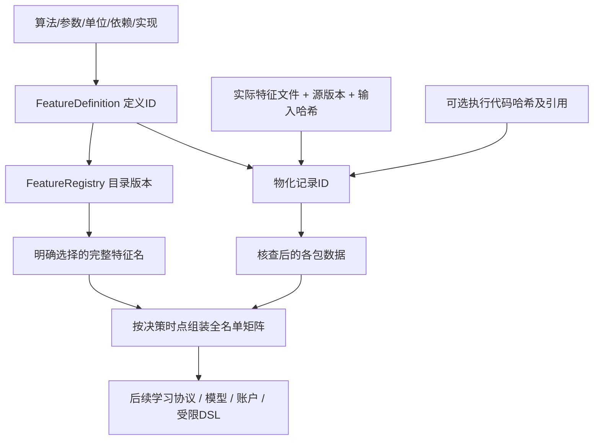

# 让所有模型输入都有名字、定义、版本和来源（E07）

这一包把原16项价量、板型、龙虎榜、财务和市场信息放进共同目录，并提供保留完整名单的矩阵组装接口。目录不是模型，覆盖诊断不是收益，新矩阵也还不是一套交易策略。

## 为什么不只是把几个表拼起来

例如同样写着“机构占比”，可以表示机构买额占买入榜、占买卖合计、占全天成交，甚至把三日榜金额除当天成交额。这些不是同一列。只凭列名存文件，日后很容易把不同口径当成同一结果。

本目录给每项特征一个完整名字，例如 `lhb_latest.lhb_w1_buy_institution_amount_share`，写明：单日窗口的最新已知普通报告，买入名单中机构专用标签行的买额，占该买入名单金额的比例；它是无量纲比值，原报告ID和决策关联是依赖项，缺失与版本限制仍保留。

再例如 `financial.annual_ep` 是已知年度归母利润除已知报告股本估算的市值；`pv16.return_5` 是原算法的五条个股行情行对数收益之和。它们在目录里有不同域、单位、参数、实现和来源，不会因同属“因子”而丢掉这些区别。

## 两种版本必须分开

**定义版本**回答：这个算法是什么、参数是什么、哪个代码实现它。目录记录完整特征名、可读定义、单位、域、依赖、参数、实现源码内容哈希、时点、缺失和局限。它们生成定义ID。参数的JSON键顺序不同不会制造两个定义，参数、单位或实现改变则会形成不同版本。

**物化版本**回答：哪个输入和执行产生了这一份已经算出来的文件。记录实际文件哈希、源快照版本、输入哈希、行数、对应定义ID，以及如果存在的话，执行实现哈希与执行记录引用。

注册当前算法**不能证明旧矩阵是按当前算法计算的**。缺少对应执行证据时，本接口标为 `execution_not_verified_against_definition`。即使调用方声明的执行哈希与定义匹配，也只是声明一致性；注册器不会赋予供应商历史真实性、独立复现或独立研究复核认证。后续正式执行器需要冻结代码、验证输入及执行记录。



同一特征名可以登记多个定义版本。查询时如果存在多个版本，就必须给出明确版本ID；不会按哈希排序猜哪个“最新”。同一版本重复登记去重。序列化目录被改单位、参数、代码哈希或目录ID，校验会拒绝。

## 原16项如何保留

`features/legacy.py` 读取白名单原始行情，按股票调用已有 `mlresearch.dataset.price_features`，只输出原16项和共同合同。不构造Y，不按市值或未来收益删股票，不触发训练或交易。

这保留了原算法实际行为：滚动窗口按个股行情行计算；缺失的市场交易日不插入行情；平价日的收盘位置为0.5；衔接收益指数内部把缺失日回报填0。连续 `min_history` 的资格仍作为另一个诊断保留。

这些兼容例外在目录里明说，不能包装成已实现严格日历语义。原算法控制组可以复现；未来DSL的严格日历、零分母和缺口处理可以作为**另一个明确版本**测试，不能默默替换旧16项再把表现变化归因于新模型。

## 怎样拼成每只股票一行X

组装接收完整的日期×股票×决策时点表，再按左连接加入信息：

- 原16、板型等股票日数据，按日期和股票匹配。
- 财务、龙虎榜决策投影，同时匹配已有样本ID，防止错接不同决策身份。
- 市场日代理，按日期广播到当天每只股票。
- 原始报告域的一行不是股票日输入，不能直接广播；需要E03/E05的因果投影或后续事件/序列通道。

完整名单原样保留，表中找不到的股票来源记为未覆盖；不因为模型特征缺失再造一个更小名单。源时点晚于决策时点时拒绝，而不是放进X。弱历史版本默认拒绝，显式放行保留每包源版本和警告。

列名前加包名防止覆盖，例如股票原16的 `pv16.return_20` 和市场的 `market.market_return_20` 不会混在一个 `return_20`。默认加入所给包的全部列，也能通过完整特征名明确选一部分；不会根据这个测试切片的覆盖或收益自动删列。

调用方必须先核查物化文件，再提供实际内容ID `block_ids`，不能只用“源码版本+行数”代替实际数据身份。成员主键和决策时点也形成身份，所以换名单、换时点、换特征文件或定义都会形成新矩阵版本。目录记录的是声明与一致性，调用方/后续冻结执行器仍负责核查真实文件。

## 怎样读取目录和诊断

```python
from src.alpharesearch.registry import (
    FeatureRegistry, definitions_for_block, coverage_diagnostics,
    materialization_receipt, verify_materialization,
)
from src.alpharesearch.assembly import assemble_features

registry = FeatureRegistry(definitions_for_block(feature_block))
entry = registry.resolve("financial.annual_ep")
print(entry.description, entry.unit, entry.definition_id)
coverage = coverage_diagnostics(feature_block)
receipt = materialization_receipt(
    feature_block, registry.definitions,
    artifact_hashes=verified_artifact_hashes,
)
verify_materialization(receipt)

combined = assemble_features(
    membership, stock_and_market_blocks,
    universe_id="declared_membership",
    block_ids=verified_materialization_ids,
    allow_weak_vintage=True,  # 仅显式研究配置，不赋予严格历史认证
)
X = combined.block.values
missing_reasons = combined.block.missing
```

覆盖诊断返回每列有效行数、各类缺失数量和有限值范围，不拟合均值/标准差，不进行因子选择，也不产生收益率。缺失处理、标准化等可学习参数仍必须在后续规定的成熟训练数据中拟合。

## 代码各部分的责任

| 入口 | 责任 |
|---|---|
| `FeatureDefinition` | 不可变定义及内容ID，检查单位/域/依赖/参数和实现哈希 |
| `FeatureRegistry` | 登记、去重、按明确版本查询、序列化及内容校验 |
| `definitions_for_block` | 把已支持的信息包转成可读目录，保留实际声明参数与兼容限制 |
| `implementation_hashes` | 只读取项目内声明的Python实现；按规范LF源码产生跨换行格式内容身份 |
| `materialization_receipt / verify_materialization` | 绑定实际文件及来源；区分定义和历史执行证据，拒绝身份变动 |
| `coverage_diagnostics` | 查看覆盖与缺失，不训练、不根据测试表现筛选 |
| `legacy_price_volume_features` | 原16兼容适配、单位/缺失/时点及历史资格诊断 |
| `assemble_features` | 核对主键、时点和版本，组装全名单矩阵并保存目录与来源绑定 |

## 本机验收

登记6组共255项定义：原16、板型29、原报告34、龙虎榜投影150、财务14、市场12。报告域34项没有直接拼进股票日矩阵；其余组装成 **221列、137772行、5111只股票**，全部名单保留。255项定义并不代表255个独立信息来源，很多共享原数据或是相近表示。

原16在447654条含热身行情上逐项与旧实现相同；追加后续行情后历史值与缺失一致。组装矩阵的历史前缀也一致；弱版本默认拒绝。目录JSON往返校验通过；旧特征文件哈希先核对再使用，但不冒充它们的历史计算由当前定义执行。

这个切片有92列全缺失：其中90列来自此切片没有相应普通报告的10日/30日/未知窗口，另2列为三日榜不适用的单日分母关系。完整保存诊断，不据此声称它们永远无用或自动删掉它们。模型实际使用哪些列由后续训练范围及登记配置决定。

24项新反例通过，全套 **663通过、1跳过**，有限静态核查通过。真实验收约577.5秒，0.2秒采样进程树峰值RSS约3.03GB，数值进程1、库线程上限2；这个时间包含原算法逐股票计算、旧实现全行对照、前缀复验、文件哈希与完整矩阵写出，不是模型训练或表达式批次吞吐。0真实新fit、0新账户。

## 下一步怎样接模型和表达式搜索

现在可以明确提出“原16+板型”“原16+龙虎榜集中度”“加财务”“加市场环境”等输入选择，做相同名单、相同学习/账户规则下的消融。下一步先建受限表达式的单位/域合同和正式批次身份，再建模型、成熟标签、训练处理与账户桥接；这样大批候选能共享经过检查的基础数据，全部尝试有账可查。

市场环境在同一天对每只股票取值相同，在模型系数固定时，市场特征的直接加性项对当天各股是同一个数，单独这个项不改变当天股票之间的排序。重新训练也可能改变其他系数，不能据此断言加入市场列绝不改变结果。后续要比较非线性模型或明确的“股票特征×市场状态”交互，并用对照检查效果。这个机制上的推理是实验设计依据，**不是已经得到收益改善**。

这一步仍没有新fit或账户，原始数据及研究矩阵只在本地保存。项目仍有模型/学习、账户桥接、表达式执行、资源批次与收益/回撤检验等工作需要接续。
