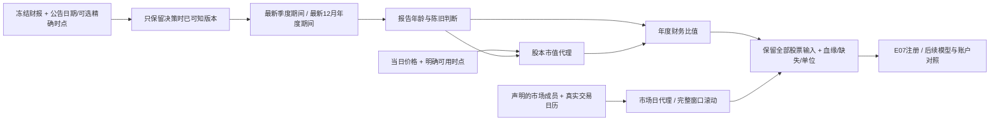

# 财报与市场环境怎样进入模型输入（E06）

这一步把已有财务研究和市场环境研究变成可复用的信息包：每行有单位、时点、缺失原因和来源；财报还能追溯到选中的具体报告。没有新增真实策略训练或账户回测。

## 周一打开模型时，它到底看到了哪份财报

假设公司 2023 年年报在 2024 年 4 月 26 日公告，净利润 1 亿元、总股东权益 4 亿元。数据只提供公告日期，没提供几点钟公告。4 月 26 日下午的输入不会使用它，按照合同，完整公告日过去后的上海时间零点才可用。

4 月 29 日，它已经可以使用。如果此前公布了 2024 年一季报，股本可以来自一季报，年度盈利仍来自最新已公布的 12 月年报。模型不会提前看到 2024 年报，也不会把季度累计利润冒充全年利润。

再假设 5 月 10 日公告年报修订，把这 1 亿元改为 2 亿元。如果源数据真的保存了这两个历史版本及各自公告时点，新接口能让 5 月之前的输入仍为 1 亿元、之后为 2 亿元。**本机现有快照并没有恢复这样的原始历史修订链**，这个能力是接口和反例验证，不能包装成现有数据已经达到严格历史版本质量。

晚公布的旧期间不会覆盖已知的新期间。最新报告字段缺失时也不会根据未来数据补全，或回退选一份更漂亮的旧报告。



## 财务包的14列

| 组 | 内容 |
|---|---|
| 股本与规模2列 | 最新已知季度股本；当日未复权收盘价×该股本 |
| 年度原数字3列 | 归母净利润、总股东权益、总资产 |
| 年度比值3列 | EP=年度归母利润/股本市值代理；BP=年度总权益/该市值；盈利代理=年度归母利润/年度总权益 |
| 年龄4列 | 季度/年度报告距期末多少自然日；距公告日期多少自然日 |
| 陈旧标记2列 | 季度期末年龄>240天；年度期末年龄>550天 |

240/550 是继承的、明确保存的研究口径，并不是普遍最优参数或法规。阈值之外的金额/比值留作缺失，缺失理由为 `stale_observation`；年龄和陈旧标记仍能看见。没有财报的股票继续保留，报告年龄等也不会猜成0。

亏损可以产生负 EP，负净资产可以产生负 BP，它们不是一概无效。盈利代理的权益分母需要为正，否则数学口径不适用；不加一个很小的数把除零伪装成正常值。股本必须正且有限，价格必须正且有可用时点。没有可靠价格时，已有年利润可以保留，市值和 EP/BP 不能计算。

股本数字可能落后于增发、回购、送转等公司行动，这里还没有行动桥接；“股本市值代理”不能冒充准确的当时市值。归母利润除总股东权益也不是精确归母 ROE，更不是已实现完整 TTM、QMJ 或复杂财务因子。

## 市场包的12列

市场名单由调用方声明。默认使用所提供的日期×股票行情键；也能提供明确成员表。它不悄悄选小市值或把事件股票当市场。

每日六项是：声明成员数、有效成员数、有效比例、各股 `log(收盘/参考前收)` 的平均值、上涨股票比例、这些日回报的横截面标准差。有效计算要求价格和参考价正且有限、成交量正且有限。

再计算20/60交易日的三类指标：日平均对数回报之和、这些日平均回报的时间标准差、日上涨比例的均值，共六项。

这里“回报之和”是**横截面平均对数回报的滚动和**，并不是某个等权可交易账户的收益，也不是官方指数收益。市场日均回报的波动与个股横截面离散程度是两个不同概念。

缺一天市场数据时，真实交易日历仍保留这一天。不会填0，不会把前后日期挤在一起凑够20天；相关窗口记为不完整。成员数和有效比例说明调用方提供的数据情况，不证明全交易所无遗漏。只有一只有效股票时，横截面样本标准差未定义。

## 时点和版本的处理

每行财务计算接收决策时点、价格观察结束时点和价格可用时点。未来价格、无时区时间、错日期、孤立主键会被拒绝。财报若有精确公告时点，可以在同日公告之后使用；日期信息则等到次日零点。相同股票、期间和时点的两个版本发生歧义时拒绝，不任意选最后一条。

财务默认拒绝实际选中的弱历史版本；研究显式放行时保存限制。新的包也没有把“今天下载的旧财报”自动改名为历史时点数据。

市场日数据默认声明收盘后60秒可用，这只是研究合同，不是已经测得的实盘延迟；数据供应商及成员名单的版本政策仍需调用方明确声明。组合模型还要由后续注册/组装层逐项检查是否已在决策截止前可用。

## 使用方法

```python
from src.alpharesearch.features.financial import financial_features
from src.alpharesearch.features.market import market_context_features

fin = financial_features(
    decisions, filings,
    source_id="frozen_financial_filings", version_id=filing_hash,
    quote_source_id="unadjusted_daily", quote_version_id=quote_hash,
    vintage="latest_snapshot_only", allow_weak_vintage=True,
)
X_fin = fin.block.values
selected_filing_ids = fin.lineage
market = market_context_features(
    bars, bounded_calendar,
    source_id="unadjusted_daily", version_id=quote_hash,
    universe_id="declared_market_proxy",
    vintage="market_observation",
)
```

`decisions` 包含 `sample_id / trade_date / stock_code / decision_at / close / quote_observed_end / quote_known_at`。`filings` 使用规范化的报告日期、公告日期、四个已有财务字段，精确时点是可选列。计算读取白名单，未来收益标签和其他供应商解释字段不会进入输出。

## 代码与验收

| 入口 | 做什么 |
|---|---|
| `features/financial.py: financial_features` | 核对时点与期间；选择最新已知期间及修订；计算14列、缺失理由和财报血缘 |
| `FinancialFeatures` | 返回特征块及选中的季度/年度记录、版本ID与报价时点 |
| `features/market.py: market_context_features` | 根据明确成员算每日代理，按完整交易日历计算滚动值 |
| `contracts.py: MissingReason.STALE` | 区分源数据无效与合法但已经陈旧的观察 |
| `tests/test_alpha_financial_market.py` | 用人工可手算数字检查公告、修订、陈旧、负权益、市场缺口和未来追加 |

复用冻结财务快照：133367条报告、3398只源股票。工程切片仍有5111只股票、137772行，不因财务缺失删行；年度EP可计算83646行，其余53228行源未覆盖、898行输入关系无效。缺失分布会进入E07目录，不能把市场范围扩大后财务覆盖也假设为全市场。

市场处理2023-10-09至2024-02-08的88个交易日、447654条行情（含热身）。未来追加后，过去财务数值/缺失/选中报告与市场值/缺失全部一致。匹配公告规则与陈旧条件的输入上，新财务代理与旧函数一致；采用旧市场名单规则时，20/60回报、波动和宽度六项与旧函数一致。默认拒绝弱财务版本，显式放行保留限制。

27项新反例通过，全套 **639通过、1跳过**；有限静态核查通过。真实验收约176.6秒，0.2秒采样进程树峰值RSS约1.01GB；其中包含完整输入哈希和新旧口径对照，并不是模型吞吐实测。0次新真实fit、0个新账户。源行情与冻结财务哈希前后相同。

第一次新反例发现财报身份哈希不能直接序列化带时区的 pandas 时间戳，已先转成规范JSON表示；失败日志保留。没有改动旧财报或账户算法来让新结果更好看。

## 学习来源与下一步

Qlib 的 PIT 设计明确把公告日期、报告期间和同一数字的后续修订分开；仅按日期过滤最新财报无法消除修订泄漏。这支持我们保留公告血缘和版本限制，而不是声称现有数据已成为完整 PIT。[Qlib 官方 PIT 文档](https://qlib.readthedocs.io/en/latest/advanced/PIT.html)

后续 E07 会把原16维、板型、龙虎榜、财务和市场特征统一注册，保存定义、依赖、参数与版本。新的市场/财务信息进入何种模型，以及能否改善收益和回撤，要在后续统一学习与账户协议下实际检验。
