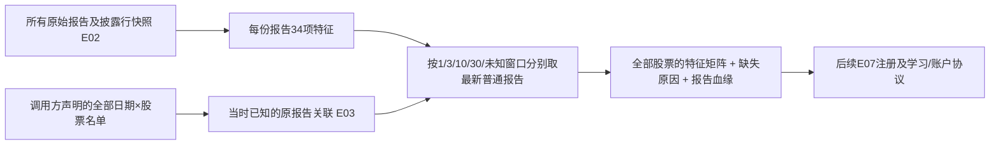

# 龙虎榜信息怎样变成模型输入（E05）

这一包增加的是**模型能够读取的信息**：同一份龙虎榜报告内的买卖列表金额、集中度、机构标签占比，以及这份报告距决策日的年龄。它尚未训练新策略，也没有新的账户收益或回撤结果。

## 从一个例子开始

假设周五有一份单日榜。它公布的买入列表有三行，金额分别是 6000、3000、1000 万元；名字依次是“机构专用”“沪股通专用”“某营业部”。本项目的源表已经按人民币元保存，不在这里再次乘一万。

这份列表总额是 1 亿元，第一行占 60%，前两行占 90%。三行金额占比平方相加得到 `0.6²+0.3²+0.1²=0.46`，这就是这份**披露列表内部**的 HHI 集中度。机构标签行金额占比是 60%，沪深股通标签行占比是 30%。这些分母都是这份买入列表的总额，不能解释为它们占全股票当天成交额的比例。

同一份报告的卖出列表另算一套。买入榜和卖出榜可能出现相同营业部，也可能出现多个无法识别具体机构的“机构专用”。我们保留源记录的行数，不把同名行合并，不声称识别了实际资金所有者，不把两个榜拼成所谓“全部机构净流入”。

如果只有报告日期而没有发布时间，目前的输入合同把周五报告设为**周六上海时间零点后**才可能使用。周五收盘时的模型输入不包含它；下周一的决策可以包含。这个时点是代理规则，原始历史公告时间和历史修订版本仍未被证实。

## 整条路径



E03 仍保存所有原报告关联。这里额外提供一个固定宽度的表格视图，方便 Ridge、树模型等读取。它只投影普通席位榜；融资、融券和投资者类别披露在报告特征表中完整保留，后续可以通过事件或序列通道使用。

**名单由调用方决定，本模块不筛小市值，不只保留上榜股票。**没有可用报告的股票也会有输入行，并显式显示哪些龙虎榜数字不知道。

## 34项报告特征分别是什么

| 组 | 项数 | 具体含义 |
|---|---:|---|
| 买入披露列表 | 10 | 列表金额、行数、最大一行占比、前两行占比、HHI、固定分母熵、机构标签行数/金额占比、沪深股通标签行数/金额占比 |
| 卖出披露列表 | 10 | 同样十项，只使用卖出列表及卖出金额 |
| 原报告汇总 | 8 | 汇总买额、卖额、成交额；汇总买额减卖额、净额不平衡比、买卖比；单日净额/单日成交额、单日榜成交额/单日成交额 |
| 报告结构 | 6 | 窗口天数、窗口是否已知；普通、融资买入、融券卖出、投资者类别四个标记 |

列表熵是 `−Σ p×log(p) / log(5)`：五行等额时为 1，一行独占时为 0。分母固定为五，不会把观察到一行时的 `log(1)=0` 当成正常分母，也不会因为行数改变而悄悄更换定义。

“净额不平衡比”是 `(汇总买额−汇总卖额)/(汇总买额+汇总卖额)`。净额从两个报告汇总数字计算，不把原文件另一个净额字段当成自动一致的事实。买卖比是 `汇总买额/汇总卖额`。榜内汇总与名单内金额使用不同名称，因为名单不是全部交易。

金额单位为人民币元；份额和比值无量纲；行数、窗口和年龄为计数；标记为 0/1。榜成交额与源表日成交额口径可能不同，比例并不被强行限制到 1，不能当作概率。金额单位沿用已有数据接入合同，尚未增加新的供应商审计。

## 五个窗口，怎样给某只股票一行X

默认分别建立窗口为 `1、3、10、30、0（未知）` 的五组字段。每组取当时已知的**最新一份普通报告**，提供上述 28 项列表/汇总数字，再加“是否有报告”和“距报告几个交易日”：每组 30 列，共 150 列。调用方也可以只要求 `(1,3)`，得到 60 列；这不是要求未来模型必须使用所有列。

单日榜和三日榜不会相加。三日、十日、三十日及未知窗口里的两个“单日比例”始终缺失，不用多日金额除当天成交额，也不除以窗口长度冒充平均每日资金流。

每组排序固定为报告日期、已知时间、原报告 ID，取最后一份。同日多原因报告的 ID 最后裁决只是可复现规则，**不是经济上唯一正确的聚合**，后续可以做事件序列和其他事先登记的聚合对照。不同报告间金额可能重叠，本视图不把它们求和。

最新报告损坏或不完整时保留该报告的缺失，不寻找较早完整报告替换。这样不会在实验过程中悄悄选出更好看的输入。输出另外保存被选中的报告 ID、报告日期、可用时间、交易日年龄，能追查一行数字从哪里来。

## 0与缺失不能混淆

| 情况 | 输出 |
|---|---|
| 普通榜两侧完整，买入列表金额恰好全为0 | 列表金额0、行数真实；份额/HHI/熵数学未定义 |
| 某行金额缺失、为负或无限 | 普通报告的列表特征无效；不跳过该行求部分总额 |
| 普通榜缺卖出侧 | 不完整，不把卖额猜成0 |
| 合法单向融资买入或融券卖出榜 | 已披露的一侧可计算；未披露侧和普通汇总关系未定义 |
| 自然人、中小投资者等重叠类别披露 | 保留类别标记；不算营业部集中度或把类别金额相加 |
| 有列表但没有匹配汇总 | 列表仍可用，汇总字段来源未覆盖 |
| 没找到报告，且没有完整覆盖证明 | 数字及报告存在标记缺失，不宣称“当天没上榜” |
| 调用方有合格完整覆盖证明且确实无该类报告 | 报告存在标记0；金额/集中度仍不虚构成0 |

E03 的覆盖证明仍是声明检查，并不替代外部真实性核查。本机当前真实快照没有获得“全市场无遗漏”认证，所以真实验收中没有把未知事件补成确定无事件的零。

## 怎样调用

```python
from src.alpharesearch.snapshots import verify_snapshot
from src.alpharesearch.features.lhb import report_features, latest_report_features

manifest = verify_snapshot(snapshot_folder)
# reports、seats读取该快照；panel来自E03的attach_events。
report_block = report_features(
    reports, seats,
    source_id="all_original_lhb_reports",
    version_id=manifest["snapshot_id"],
)
decision = latest_report_features(
    panel, report_block, windows=(1, 3),
    allow_weak_vintage=True,  # 仅显式允许弱历史版本研究；并未升级为严格历史证据
)
X = decision.block.values
why_missing = decision.block.missing
selected_report_ids = decision.lineage
```

报告层计算可以保存弱版本特征；决策投影默认拒绝可用关联或覆盖警告中的弱版本。显式放行会保留元数据警告，不能由此宣称严格历史收益可复现。

本模块拒绝孤立席位、重复行 ID、重复或跳跃排名、金额排名不一致、头表与实际行数不一致、未知单位/状态、无时区时点，以及错股票、错窗口、提前可知或不存在的决策关联。源表里可能有额外的未来收益列，计算只读取白名单，绝不把它们复制到输出。

## 代码中各部分做什么

| 文件或入口 | 职责 |
|---|---|
| `features/lhb.py: report_features` | 核查报告/席位结构；逐侧计算列表特征；计算窗口安全的汇总关系；保存单位与缺失理由 |
| `SIDE_UNITS / SUMMARY_UNITS / STRUCTURE_UNITS` | 声明输出名单及单位，防止标签或解释字段混进X |
| `latest_report_features` | 核对E03关联与报告特征；按窗口选当时已知的最新报告；保留全名单及血缘 |
| `LHBDecisionFeatures` | 一起返回特征块与选中报告血缘，避免只有矩阵却找不到来源 |
| `features/base.py: FeatureBlock.validate` | 检查主键、时点、单位、有限值与缺失理由的一致性 |
| `tests/test_alpha_lhb_features.py` | 用人工可手算的小数据检查集中度、窗口、匿名行、坏数据、未来追加和投影规则 |

## 本机验收

实际报告范围为 2023-12-06 至 2024-02-08，4246 份报告、42426 行披露。投影到既有 2024 年初切片：5111 只股票、137772 行，名单全部保留；选择报告关联 14757 条，其中单日组可见 8941 行、三日组可见 5816 行，其他窗口在这个切片没有可用普通报告。

追加2月后续数据后，1月的数值、缺失和血缘保持一致；默认拒绝弱版本，显式放行后仍保留版本限制；多日金额没有进入单日分母；源快照输出哈希前后相同。处理约 46.7 秒，0.2秒采样的进程树峰值 RSS 为 2064416768 字节，不等于精准峰值或未来全量预算。

41项新反例通过；全套软件检查 **612通过、1跳过**；独立构建 wheel 含新模块且不含原始数据。第一次全套检查有611项通过、1项失败：旧检查点测试的Windows默认临时目录路径过长；改用项目内较短临时目录复验通过，未修改账户算法掩盖失败。wheel首次命令把目录当成包名，改成显式相对目录后构建通过；日志均保留。

合成反例先发现了适配层使用了错误的 `EventPanel.values` 属性，已改为已有接口的 `EventPanel.panel`。第一次失败日志保留。随后修正测试使“不回退到旧完整榜”确实同时包含新旧两份报告，而不是只测一份。没有把失败包装成成功研究。

## 来源与研究边界

龙虎榜公开的是规定条件下的前列营业部/交易单元，并区分单日信息和异常期间累计信息；机构专用的名称也不提供实际所有者身份。这支持本包保留列表、窗口和匿名标签的做法，不证明这些特征能预测收益。[深交所公开交易规则第5.4节（2021归档版本）](https://docs.static.szse.cn/www/fund/guide/W020210331716400647184.pdf)

上交所科创板页面还说明公开成交数据只含竞价交易，不能自动当作大宗和盘后交易也都包含在内。这是保持源口径标签、限制成交额解释的理由。[上交所科创板交易公开信息](https://star.sse.com.cn/star/disclosure/diclosure/)

旧规则只用于理解披露语义，不重新生成所有历史的上榜门槛。HHI、固定熵和最新报告投影是这里明确提出的可检验设计，没有借来源声称其已经产生 Alpha。

下一步 E06 把已有财务与市场环境接入共同合同；E07 注册原16维及新包，保存依赖、版本、覆盖和重复关系。之后再建立新模型、学习时点和账户桥接，比较相同名单下真实收益与回撤，保留失败和负对照。
