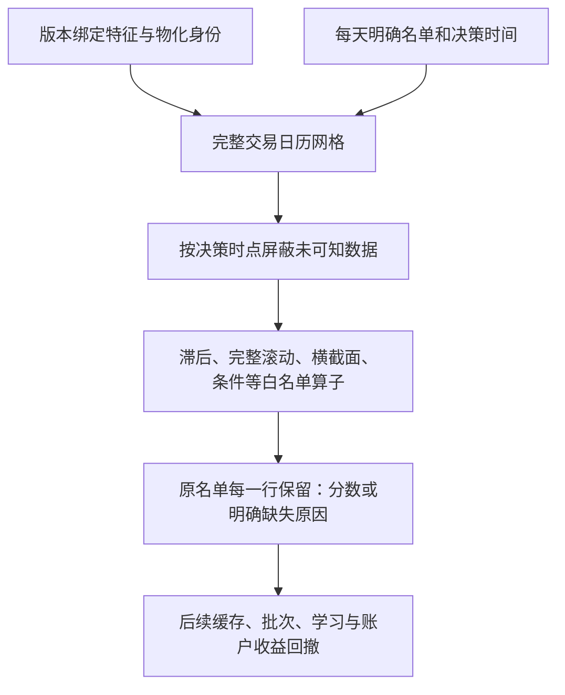

# 公式如何真正计算：E09完整日历数值算子

E08负责检查公式；E09负责把合法公式算成“某日某股票的一个分数”。这里还没有训练模型或收益回测。最终会把分数或特征接到同一套样本外训练和账户执行，再看收益、回撤和对照。

## 从每天的工作理解

我们先给系统三样东西：这段时间的完整交易日历、每天明确的股票名单、每天几点作决定。再提供版本绑定的价格/成交量等特征。当天15:10决策时，15:01已可知的行情可以使用；16:00才可知的某项数据保持未知，不提前使用。

随后逐个计算表达式。例如某股票连续交易日收盘值是`1、2、3、4、5`，3日平均在第三天才是2，第四天是3，第五天是4。前两天没有完整窗口，保持缺失。这个例子使用无量纲手算输入；真实股价的单位会先由编译器检查。

如果中间一天没有该股票行情，日历里的那一天仍然存在：`1、缺失、3、4、5`。第三、第四天的3日平均都缺失，第五天才是4。我们不把“前三条实际行情”冒充“连续三个交易日”。停牌、来源漏行和真实交易机会仍需要上游与后续账户分别判断。

## 每个算子的口径

| 算子 | 当前口径与边界 |
|---|---|
| `lag/delta` | 按完整交易日历向过去移动；滞后0合法；负滞后拒绝 |
| `ts_mean/sum/std/min/max` | 必须有完整窗口；标准差使用样本分母N−1；常数窗口标准差0合法 |
| `ts_rank` | 当前值在完整窗口中的平均并列名次/窗口有效数量 |
| `ts_corr/cov` | 两条同域日序列配对，完整窗口；协方差N−1；零方差相关性未定义 |
| `cs_rank` | 只在当天声明名单中，对已知有效数排名；并列平均名次/有效股票数 |
| `cs_zscore` | 当天名单内均值和样本标准差；单个有效值或全部一样时未定义 |
| `broadcast` | 明确把每日市场数广播到同日股票；不从报告域偷做广播 |
| `add/sub/mul/div/minimum/maximum` | 编译时检查维度；缺失不填零；除数0未定义 |
| `gt/lt` | 两边已知才得到0/1；缺失不会被当成条件不成立 |
| `log/exp/signed_power` | 编译时要求无量纲；对数非正、溢出等保持未定义而非无穷 |
| `where` | 非零条件为真，0为假，未知条件仍未知；没选中的分支缺失不污染结果 |

二元滚动要求两个输入都属于同一个每日域，拒绝“常数与序列配对滚动”的含糊接口。若需要常数与每日数做普通比较或乘法，可以明确使用普通运算。

横截面排名允许只有一个有效成员，此时它的排名为1；这只是数学定义，不说明这个日期存在可学的选股能力。覆盖数量和缺失需在后续研究诊断中呈现，不能用这种退化排名充当模型有效性。

## 名单与历史是两件事

一只股票今天不在名单里，不代表它过去的行情应该删掉。源特征可以保留它的非成员日期，用来形成过去窗口；当日横截面计算只纳入当日明确成员。未来新加入的股票不能改变此前日期的排序。输入名单的一行即使没有任何可用特征，也保留并标明原因。

这里的真实工程检查采用行情键名单，不宣称它就是可成交名单、非ST名单或小市值名单。正式研究时要传入已登记的相应名单；账户层还要处理可交易性。这使数据构造与选股选择可分别比较。

## 缺失和版本怎么处理

没有源行是“来源未覆盖”；报告值无效是“无效记录”；可用时间晚于决策是“尚不可知”；头部缺完整历史是“历史不足”；已有完整日历窗口但内部缺值是“窗口不完整”；零分母、零方差相关等是“数学未定义”。滚动结果将窗口内的缺失总结为窗口状态，原始缺失原因仍在绑定的来源块里。

只有最新快照或未知历史版本的来源默认拒绝；探索明确放宽也保留限制。公式引用绑定定义ID和物化ID。传入的物化ID属于调用方声明，本模块不凭一个ID证明原文件真实、历史执行真实或独立复现；未来缓存/正式执行层还需要验证冻结文件和实际执行。

输出时点表示“在已声明决策时间进行的特征变换”，不把它误称为原报告发布时间。所有来源通过可用时间检查之后才参与数值计算。

## 代码各入口

| 入口 | 作用 |
|---|---|
| `LeafBinding` | 连接已登记特征定义、实际块列、物化身份 |
| `ExpressionEvaluator(...)` | 检查日历、每日时钟、成员唯一性、有限网格预算，准备计算环境 |
| `_leaf` | 映射完整网格，区分来源缺行与未来未可知，保留来源版本限制 |
| `_rolling` | 计算完整窗口，区分头部历史不足与窗口内部缺失 |
| `_visit` | 按结构化节点组合数值；不执行Python表达式字符串 |
| `evaluate(...)` | 重新验证编译合同与资源预算，输出原名单逐行分数、缺失和来源身份 |

运行前限制网格数量和估计缓冲区，超限明确拒绝。估计值不是操作系统内存硬隔离，也不包含所有pandas中间开销；真实切片另测进程工作集。默认只计算一个有限面板，不自动用几千进程或搜索上万公式。

## 依据和验证

滚动实现使用pandas数值操作；[官方窗口说明](https://pandas.pydata.org/docs/reference/window.html)、[官方滚动相关定义](https://pandas.pydata.org/pandas-docs/version/2.1/reference/api/pandas.core.window.rolling.Rolling.corr.html)和[官方滚动排名定义](https://pandas.pydata.org/pandas-docs/version/2.2/reference/api/pandas.core.window.rolling.Rolling.rank.html)提供接口口径。这里额外明确完整交易日历和完整窗口，不能把第三方默认行为当成金融研究规范。

专项检查用手算窗口、名单变化、零方差、缺行、未知条件、未来可用时间、弱版本、溢出和资源边界等反例验证。真实有限检查保存输入哈希、四个表达式、全名单输出、独立日回报排序对照与未来前缀检查。真实数量、耗时与峰值在建设进度里记录。初轮发现只读数组写入与实现哈希接口错误，修复后保留失败记录并重新验收。

接下来E10让重复子表达式共享计算、缓存按输入/名单/时间/代码版本隔离，限制内存和磁盘占用，再测有限批次吞吐。随后才把广泛候选接入防反复试验偏差的批次、学习与统一账户。没有收益和回撤证据之前，不把公式跑通称为策略成果。
