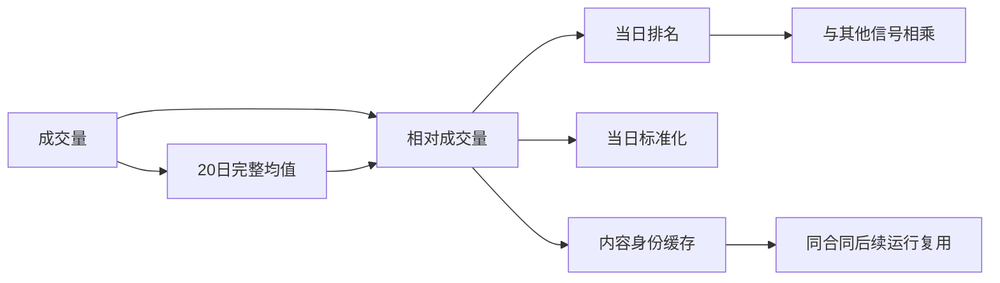

# 同一子公式为什么不必反复算：E10共享计算与缓存

这一阶段使多个公式共享相同的计算步骤，并把已算结果按完整身份保存在本机。它服务于广泛实验的成本与可恢复性；没有训练新模型，没有新的账户收益或回撤结论。

## 直观例子

我们研究三个分数：相对成交量的当日排名、相对成交量的当日标准化值、近期下跌排名乘以相对成交量排名。三个公式都用到：

```text
相对成交量 = 今天成交量 / 过去20交易日平均成交量
```

系统把这个重复结构识别成共享节点。它可以算一次，供三个公式使用。这是结构完全相同的复用；不会自动证明`a+b`和`b+a`等价，也不会据收益挑选哪个节点留下。



## 什么情况下可以复用

每个节点的身份包含结构化公式、绑定特征版本、来源和物化声明、实际准备的数值/缺失/观察及可用时钟、完整日历、每日名单、决策时钟、名单ID、代码实现和Python/NumPy/pandas环境。

因此，哪怕调用方错误地复用了一个旧物化ID，只要实际输入变了，就不能命中旧数值。决策从15:10改成15:20、名单增加股票、日历调整、源时钟或代码变化，也会隔离缓存。成本是这些身份检查本身也要花时间。

同一个计算环境准备后的源数组固定且只读。调用方应在整个批次中保持绑定数据不变；新输入使用新计算环境。多个公式批次先检查数量预算、准备所需叶子，再逐个输出，不把所有候选的大矩阵永久积在内存中。

## 内存、磁盘和中断

内存采用有限LRU：达到预算后淘汰最近较少使用的缓存节点。准备的来源叶子另有预算，超限明确拒绝；它不是操作系统硬隔离，也不代表整个进程只用这点内存。当前表达式的临时缓冲仍受E09估计预算，实际进程峰值另外测量。

磁盘缓存也有预算，超过后继续正确计算但跳过新增缓存。写入先在缓存根内的临时目录完成两个数值数组与清单，最后原子提交；原来的证据、原始数据和已存在缓存不会被清理。写锁有人持有时跳过本次写入，仍可正常计算。异常退出留下的锁或临时目录不自动冒险接管；预算扫描包括已有文件，后续资源/恢复层再明确处理。

缓存只接受浮点数值和整数缺失码，读取使用`allow_pickle=False`；检查文件哈希、合同、形状、类型、有限值与缺失一致性，并限制容器大小。损坏、缺文件或多出数组明确失败，不悄悄重算覆盖旧条目。

这是本机缓存完整性检查，不是对恶意同时改写清单和数组的密码学认证，也不是供应商历史数据或独立复现认证。[NumPy官方读取说明](https://numpy.org/doc/stable/reference/generated/numpy.load.html)解释对象数组与pickle的区别；[官方保存说明](https://numpy.org/doc/stable/reference/generated/numpy.savez.html)说明多数组容器。这里使用非对象、非压缩的明确数组结构。

## 代码入口

| 入口 | 作用 |
|---|---|
| `CachedExpressionEvaluator(...)` | 在E09口径上加入缓存根和有限预算 |
| `_leaf/_request` | 固定实际准备输入，形成含数据/时钟/合同的节点身份 |
| `_visit` | 按内存→磁盘→实际计算的顺序取结果，重复节点可复用 |
| `_read_disk/_validate_array` | 校验身份、文件内容和数值/缺失合同 |
| `_write_disk` | 有写锁、有预算、原子提交，不覆盖已存在证据 |
| `evaluate_many(...)` | 有限候选预检查、叶子准备、逐个产出；不做拟合或自动选择 |
| `contracts.timestamps(...)` | 已带时区的pandas时钟向量检查；对象仍逐项严格检查，NaT/无时区继续拒绝 |

## 这次真实测量说明什么

固定8个公式，447654行含热身、88个交易日；目标137772行、5111只股票。无缓存、冷缓存、新计算环境读取磁盘缓存的输出数值与缺失全部一致，原E09四公式也保持一致。

| 路径 | 本轮测量时间 | 节点实际计算 |
|---|---:|---:|
| 无缓存 | 14.11秒 | 未使用节点复用 |
| 冷缓存 | 20.58秒 | 25个 |
| 新环境磁盘暖缓存 | 16.88秒 | 0个，8个根节点命中 |

**这组小型便宜公式里，缓存没有比无缓存更快。** 身份、哈希、磁盘和对照读取的开销不能忽略；不同阶段也包含不同写出/核对成本，不能把时间比值当成纯算子加速率。正确性和复用能力已经通过，是否改善大批昂贵表达式吞吐，要等E14的32/64列正式资源测量。不能因为暖缓存0计算就宣布性能提升。

本轮缓存磁盘97236315字节；路径结束时节点内存保留约28.34MB、准备叶子约16.19MB，均在各32MB配置内。整个核查含三路径及比较约53.6秒，进程采样峰值约0.84GB；这也说明“缓存32MB”不等于“全进程32MB”。

23项缓存/时钟专项检查、联合85项检查、全项目757通过1跳过；有限静态检查与隔离打包通过。导入与类型注解的失败记录保留，不包装成策略发现。工程证据提交review，没有独立复核接受声明。

下一阶段E11正式登记每个批次的范围、候选和预算，冻结代码/输入/协议并保存所有尝试；再接模型、学习和统一账户。未来报告仍以收益、回撤和同口径基准对照为终点。
