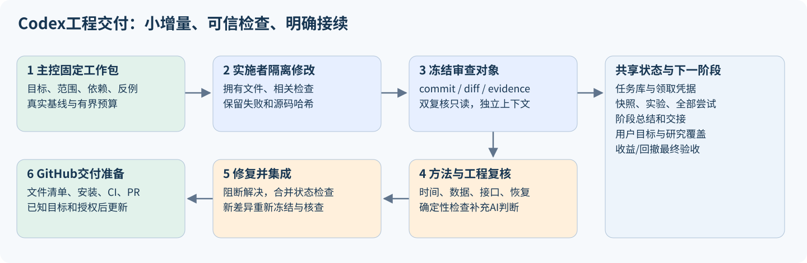
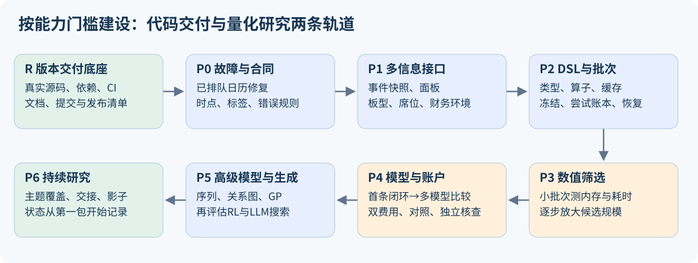

# 怎样用Codex一步步把量化研究蓝图建设成可交付的代码项目

2026-10-05 · 工程实施规划 v0.1 · 规划任务 `task-b2bac8817dbb`

这份文件把[系统蓝图](ML_SYSTEM_BLUEPRINT_20261005.html)转成工作包、质量门槛、Codex协作方法和GitHub交付路径。本轮交付的是规划、仓库盘点、一次有界的软件基线检查和发布草案；没有实施广域研究系统，没有新增研究数据上的策略拟合或账户回测。软件测试可能训练合成数据的小模型，这与登记策略实验分别计数。

## 1. 先给出整体做法

**采用“一个主控维护路线，实施者完成小工作包，两名新上下文按方法与数据/工程分别复核，确定性检查提供证据，集成人按依赖合入”的交付方式。**

把工作分成两条轨道：工程建设负责让代码、接口和证据可信；策略研究负责比较信息与模型最终能否改善收益和回撤。工程完成不等于策略成功，策略的漂亮历史结果也不能代替工程验收。

开始时每次推进1个核心实施包；接口稳定后最多2个互不冲突的包并行。公式计算与数值筛选的并发独立管理，不能用大量Codex会话替代数值程序。每包交付可运行增量、必要测试、独立复核和简明说明；达到阶段门槛后再进入下一阶段。

## 2. 当前真实起点：先解决版本完整性

本轮本机盘点记录于 `research/codex_delivery_plan_20261005/inventory.json`。它不证明远程仓库状态或历史中不存在敏感信息。

| 项目 | 本轮观察 | 对建设的影响 |
|---|---|---|
| 当前Git分支 | `codex/research-controller-v7` | 后续继续使用 `codex/` 前缀，按工作包新建分支 |
| 当前HEAD | `f3f0ea1`，有界研究总控交付 | HEAD并不包含当前全部ML能力 |
| 远程配置 | 没有remote、upstream或远程跟踪引用 | 尚不能判断与哪个GitHub仓库比较或推送 |
| 已跟踪文件 | 250个；其中34个有修改 | 要逐项确认归属，保护原有改动 |
| 未跟踪文件 | 初始盘点4,532个，含本轮刚建少量规划文件 | 大量来自研究目录和浏览器资料，不能整体加入Git |
| 当前ML源码 | `src/mlresearch/` 等尚未跟踪 | 普通从HEAD新建worktree会缺少这些能力 |
| GitHub配置 | 未发现已跟踪的 `.github/` 工作流 | CI、PR模板和规则需首次建设 |
| 许可证 | README称MIT并链接LICENSE，仓库未发现许可证文件 | 先核实作者/第三方代码归属，再补真实许可证 |
| README | 顶部仍称V6，历史段落仍称没有账户系统 | 当前能力、历史限制和安装说明要统一 |
| 依赖 | 有pyproject与requirements，未发现项目依赖锁 | 当前环境能跑不证明干净克隆可复现 |
| 测试 | 30个 `test_*.py` 模块 | 需要保存当前基线，再建立变更对应的质量门槛 |
| 数据和研究库 | 大数据与 `data/technical/` 已忽略 | Git保存代码；本机数据库、快照和证据另行备份 |

**第一批工作必须先建立“当前真实代码的可交付基线”。** 不能从旧HEAD分出去后误以为拿到了全部现有功能，也不能为了变干净删除研究记录。

## 3. Codex各入口怎样分工

| 入口/能力 | 我们怎样使用 | 边界 |
|---|---|---|
| 当前主Chat | 路线、依赖、冲突、质量门槛和阶段总结 | 保留一个明确的集成责任人 |
| Plan模式 | 跨模块或高风险修改先厘清接口和验收 | 模式不是持久任务数据库 |
| 项目内子Agent | 在已授权的双复核流程中，使用新上下文只读审查 | 两人不先读对方意见；同模型仍有共同盲点 |
| 桌面worktree | 隔离获准并行的实施包和差异 | 在本项目中显式传共享研究库root；忽略文件不会自动随普通Git迁移 |
| 用户侧新Chat | 用户希望单独跟进某工作流时使用 | 本规划没有创建侧栏新Chat；实施子任务默认留在当前工作流 |
| 本机CLI/V7总控 | 固定范围、轮数、调用数和时间的研究与复核循环 | 已存在，不保证侧栏可见；工程适配需要单独实现 |
| Skills/AGENTS | 将重复的入场、实施、核查和交接操作固化 | 短规则引用详细手册；不把全部蓝图塞进入场提示 |
| GitHub Codex审查 | 仓库接入后，为PR增加差异审查 | 接入状态未知；不能取代本机数据与统计复核 |
| Automations | 后续有明确监控任务时，检查完成、失败或需处理变化 | 本轮不创建；无额度/无运行主机时不承诺必定唤醒 |
| SDK/app-server/API | 当现有CLI传输缺乏必要能力时再评估 | 首期复用现有控制器；不先新增一套重复调度平台 |

上述产品能力已核对OpenAI官方文档：[worktrees](https://learn.chatgpt.com/docs/environments/git-worktrees)、[AGENTS.md](https://learn.chatgpt.com/docs/agent-configuration/agents-md)、[非交互CLI](https://learn.chatgpt.com/docs/non-interactive-mode)、[GitHub审查](https://learn.chatgpt.com/docs/third-party/github)。这里是本项目的使用方案，不表示这些入口已经全部启用。

## 4. 六个职责，以及谁可以修改什么

| 职责 | 输入 | 产出 | 写入范围 |
|---|---|---|---|
| 主控/架构 | 用户目标、蓝图、任务、旧结果 | 下一包、依赖、范围、验收、预算 | 路线与任务记录 |
| 实施者 | 已领取任务、基线commit/文件哈希、合同 | 代码、必要测试、说明、交接 | 包内拥有的文件与独立输出目录 |
| 方法复核 | 冻结diff、标签/切分、统计与报告 | 泄漏、选择偏差、目标口径检查 | 只读；返回复核结果 |
| 数据/工程复核 | 源字段、单位、日期、计算证据 | 算术、接口、失败恢复、资源和回归检查 | 只读；返回复核结果 |
| 确定性核查器 | 输入、收据、账户与哈希 | 可重复的检查报告 | 所属验收输出目录 |
| 集成/发布 | 两份复核、测试、依赖与候选提交 | 合入或退回、PR描述、发布清单 | 单一集成分支；远程动作按用户授权 |

同一个Codex可以承担主控和集成，但不能把自己的另一角色标签当作独立复核。两名复核者各自获得冻结材料，不继承实施者的整段聊天叙事；先找反例，再读实施者结论。若某次只有自检，要显式记录，不能勾选双复核完成。

## 5. 一个工作包从开始到结束：固定九步

1. **入场**：读AGENTS、Worker指南、catalog/list和任务context，核对父链及旧失败。已有总控领取时不重复claim。
2. **固定范围**：写明要改变的用户/研究行为、文件归属、禁止改动、验收、日期/快照、计算与修复预算。
3. **保全基线**：保存commit、实际工作区源码哈希和依赖；当前未提交代码先经R0整理，必要时按明确清单复制源码，数据共享只读。
4. **写接口与反例**：先明确输入输出及失败行为；设计能击穿实现的测试。例如1990日历配2019行情、部分席位缺失、未来报告加入后旧特征变化。
5. **小范围实现**：每包形成可核查增量；不夹带全库重排、模型搜索、依赖升级或会计口径变更。
6. **必要验证**：先跑直接相关检查；通过且涉及共享接口时再跑相关回归。只有新失败或新修改才重跑；不要反复执行相同训练。
7. **冻结并双复核**：锁定审查commit/diff与证据哈希。两名只读复核者给出接受、修订或暂缓，列出具体阻断。
8. **修复与集成**：阻断问题修复后重新冻结变更部分，原失败和意见保留；新代码合入组合状态再跑必要集成检查。新合入改变原审查对象时不能沿用旧接受。
9. **总结与接续**：人话说明做了什么、检查证明什么、限制、下一包；写checkpoint/handoff，再创建有父链的下一任务。达成停止条件或预算上限时明确原因。

每个包要有“可以失败的验收条件”，不要只写“代码已实现”“测试通过”或“审查无异议”。

## 6. 阶段路线：先闭合一条链，再扩大研究规模

| 阶段 | 交付能力 | 进入下一阶段的门槛 |
|---|---|---|
| R：版本与发布底座 | 当前源码基线、提交清单、依赖和离线CI | 干净代码副本可安装、测试；无研究库/浏览器资料混入提交 |
| P0：已知故障与合同 | 修复日历范围，明确时点、标签和错误规则 | 已排队任务 `task-28ab0d6b9fe2` 验收；不重置旧实验预算 |
| P1：信息接入 | 事件快照、板型/龙虎榜/财务/环境包与特征注册 | 合成反例、前缀稳定性、真实源样例及覆盖报告通过 |
| P2：表达式与批次 | 类型化DSL、算子、缓存、正式登记和尝试账本 | 非法表达式被拒绝，血缘/缓存键完整，重启不重复计算 |
| P3：数值筛选 | 有界并发、分块计算、完整候选账本和诊断 | 先用小批次实测内存/时间/磁盘，失败可恢复 |
| P4：研究闭环 | 特征包×模型比较、账户桥接、独立核查 | 同口径对照、双费用资金路径和所有候选结果齐备 |
| P5：高级表示与生成 | 序列、关系图、GP以及后续RL/LLM候选生成 | 与简单模型公平对照，数据结构有效，预算与选择范围明确 |
| P6：持续研究 | 主题覆盖、阶段状态、未来影子预测与运行手册 | 能接力恢复，冻结未来预测，不把旧历史重命名为未见验证 |

R和P0可在文件归属清楚后分别推进；P1部分特征定义可以先写，但实际实现必须使用已接受的合同。P6的状态展示与交接从第一包就开始，未来影子记录在P4接口稳定后即可建设，不必等所有高级模型完成。

**首个端到端切片**：共享日线和一个龙虎榜事件快照 → 原16维加少量已核查板型/事件特征 → 一个固定线性模型 → 合法预测 → 原生账户桥接 → 双费用资金路径 → 独立核查和报告。先用合成数据验证工程；真实历史执行另立冻结研究任务。这个切片通过后，才扩大到千级候选。新增事件包也要有“不使用事件”的对照。

## 7. 可领取工作包清单

以下编号是规划ID，**不是已经创建的数据库任务**。只有E00关联现有排队任务。实施时按依赖逐包创建，不一次制造几十个空任务；每包根据实际范围可再拆分。

| ID | 范围与建议位置 | 具体交付和关键验收 | 依赖 |
|---|---|---|---|
| R0 | 当前dirty工作区 | 文件归属表、保全哈希、选择性提交方案；不覆盖用户改动 | 无 |
| R1 | 发布清单与忽略规则 | 精确包含/排除清单、候选提交扫描；保留本机证据 | R0 |
| R2 | pyproject/依赖与安装 | 明确core/research/高级模型extras，锁或constraints策略、干净安装与wheel smoke | R0 |
| R3 | CI/测试分层 | 修复两项通知测试的错误合同；离线软件测试、必要静态检查、打包与链接；真实数据检查留本机 | R1,R2 |
| R4 | README/AGENTS/贡献说明 | 当前能力、运行入口、审查规则、许可证归属处理、迁移与限制 | R1 |
| R5 | GitHub交付 | 目标仓库、分支、完整提交、PR和检查；授权后才执行远程写入 | R3,R4 |
| E00 | 现有日历故障 | executor/audit一致修复范围及60日回看；0研究fit/账户 | 已有task-28ab0d6b9fe2 |
| E01 | 新 `alpharesearch/contracts.py` | decision/known_at/execution/label_end、缺失/单位合同；未来信息反例 | E00,R0 |
| E02 | events快照 | 原报告ID、窗口、来源和披露假设；重复报告、未知窗口、部分席位 | E01 |
| E03 | panel适配 | 日期×股票主键、名单与日历；未上榜/缺文件/无效数据分别表示 | E01,E02 |
| E04 | causal板型特征 | 当时连板、一字、触及两端等；禁止未来连板和盘中顺序推断 | E03 |
| E05 | 龙虎榜特征 | 同报告集中度/HHI/净额、机构席位、事件年龄；金额分母和多窗口核查 | E03 |
| E06 | 财务与市场包 | 严格公告可用性、缺失/陈旧标识、市场覆盖；保留代理口径限制 | E01,E03 |
| E07 | 特征注册 | 原16及新包的定义、来源、依赖、版本、覆盖与诊断；原16回归 | E04,E05,E06 |
| E08 | DSL结构 | 类型化AST、单位/域、可用性和复杂度限制；任意eval不可进入 | E01,E07 |
| E09 | DSL算子 | 明确rank/lag/delta/滚动/横截面语义、ties/NaN、真实交易日历 | E08 |
| E10 | DAG/缓存 | 共享子表达式、完整缓存键、原子写入及损坏识别；旧证据不清理 | E09 |
| E11 | 注册批次 | 正式kind/dispatcher/audit合同，冻结代码、协议和所有尝试；工程适配另包 | E07,R3 |
| E12 | 数值执行 | 进程级工作、共享资源预留、恢复/取消；不重复fit、失败不退预算 | E10,E11 |
| E13 | 初筛与统计 | 开发范围固定、代理收益/回撤、条件特征通道、选择账本 | E07,E11 |
| E14 | 吞吐实测 | 32/64列小批次的峰值RAM、磁盘和耗时；据实设全局上限 | E12,E13 |
| E15 | 模型接口 | Ridge/ElasticNet/Huber、RF/ExtraTrees/HGB适配；先用已有依赖 | E07,R2 |
| E16 | 学习协议 | fit范围、预处理、成熟标签、预测身份、多次训练计数；负对照 | E15,E11 |
| E17 | 账户桥接 | key/池/日历/价格/权重/时点/训练截止校验，坏输入强制失败 | E16,E01 |
| E18 | 独立核查 | 账户源与信号源分开记录；事件血缘、复算与现金权益核查 | E17,E02 |
| E19 | 首个闭环/批次 | 合成切片后另立真实登记；所有候选、双费用、同池小市值/固定组合/原16简单模型对照 | E14,E18 |
| E20 | 序列与事件数据集 | N×T×D、掩码、可用事件顺序；过去样本不受未来追加影响 | E07,E16 |
| E21 | 神经网络 | MLP→GRU/TCN→Transformer逐步启用，依赖/CPU/GPU实测 | E20,R2,E19 |
| E22 | 席位关系图 | 当时节点/边与身份规则，稀疏图统计→图模型；未来边隔离 | E02,E20,E19 |
| E23 | GP/符号回归 | 在已验证DSL内生成、去重、深度和尝试预算；与模板同预算 | E09,E12,E19 |
| E24 | RL生成 | 状态/奖励/反馈范围冻结，无评价区间泄漏；全部搜索轨迹 | E23 |
| E25 | LLM生成 | 主题→假设→受限AST，生成代码不得直接自由执行；提案/调用预算 | E23 |
| E26 | 组合/风险研究 | 纯ML与大小市值增强独立路线；权重/留仓/尾部风险消融 | E18,E19 |
| E27 | 工作台状态 | 工作包/尝试/资源/拒绝原因/收益回撤前沿及连续研究路径 | E11,E19 |
| E28 | 未来影子记录 | 当时预测哈希与时间戳，未来结果到达后评估；先不实盘下单 | E18,E19 |
| E29 | 运维与恢复 | SQLite备份API、证据清单、恢复演练、环境和存储容量手册 | R3,E12 |

这些包预计各需要若干可审查提交。当前没有吞吐与修复工时实测，不能给可靠完成日期。按已通过的能力门槛衡量进度，避免用代码行数、候选数或聊天轮数当完成度。

现有模块也纳入持续维护，不能让新Alpha层成为唯一工作：行情下载/更新与清洗继续执行单位、复权、增量和完整性合同；账户保留现金、公司行动、费用与持仓回归；工作台保留请求认证、下载路径及前后端一致性；researchops保留租约、冻结、失败和恢复。这些不要求首期全部重写。发现真实缺陷或要改变合同，就从对应模块另立工程包并纳入依赖图；没有问题的模块以兼容检查为主。旧事件脚本保留历史标识，逐步把可复用定义迁入受核查的接口。

## 8. 并行开展：文件所有权和资源必须明确

初期主控加1名实施者；冻结后启用2名只读复核者。并行槽位有限时先收取实施，再并行复核。接口稳定后2名实施者在不同worktree工作；共享接口由一个包拥有，另一包依赖冻结版本。不能同时修改researchops分派、contracts和账户桥接再让集成者猜语义。

例子：E04板型与E05龙虎榜可在E03合同完成后并行；E08类型合同与E09算子必须先后；E17桥接与E18核查先固定合同、后分别实现与复核。

新worktree必须检查HEAD是否包含当前代码，显式提供 `--project <worktree/lhb_backtest>` 与 `--root <原项目/lhb_backtest/data/technical>`。共享root是可写任务库，源快照按只读使用。不要把 `.venv`、行情和数据库整份复制进worktree，也不依赖自动复制忽略文件来解决大数据路径。

Codex并发、模型内部线程和数值进程是三种资源。P3暂定从2个数值进程、各最多4线程开始测量；这是实验起点，不是已经证明安全的上限。必须测总进程树峰值RAM、复制和缓存成本，之后冻结可执行上限。

## 9. 怎样保证质量：每个门槛证明什么

| 门槛 | 主要问题 | 通过后的结论 |
|---|---|---|
| G0 范围/基线 | 是否遗漏当前代码、混入用户改动、基线是否明确 | 审查对象清楚 |
| G1 合同/算术 | 单位、日期、缺失、窗口和运算是否正确 | 限定输入下计算正确 |
| G2 时间因果性 | 加入未来数据是否改变旧X？label是否成熟？预处理是否只fit过去？ | 覆盖的反例下无对应泄漏 |
| G3 执行与恢复 | 去重、租约、预算、缓存、进程退出与损坏文件 | 覆盖的故障可以被检测/恢复 |
| G4 安装/回归 | 干净clone、依赖、wheel/assets、共享功能 | 交付环境中功能兼容 |
| G5 数值/账户 | 模型预测能否复算？现金、费用、权益和每日NAV是否一致？ | 数值和账户核查通过 |
| G6 研究判断 | 同池/同口径对照、全部尝试、选择范围和区间 | 能作限定历史比较 |
| G7 发布 | 文件清单、历史扫描、许可证、CI、迁移和撤回方案 | 可以进入明确目标的版本交付 |

**两名Agent都接受不能代替上述确定性证据。** 哈希不证明供应商数据真伪；软件测试不证明收益有效；账户审计不证明未来仍能盈利；历史中看过的日期不因换模型而变成未见样本。

G6/E19必须具体保留适当的同池小市值、固定组合（当前固定随机11定义沿用原证据）、原16维简单价量模型，以及零交易费用和配置费用两条实际资金路径；需要时补重抽随机与暴露匹配对照，不能把固定组合和每周随机重抽混为一谈。已审计对照核查身份后复用，不为了凑齐本包重跑；不同池比较与同池消融分别解释。

测试只写在重要合同和实质风险处。收益计算、未来数据不变性、席位分母、预算竞争、恢复去重、桥接错误等需要反例；文字改动、可逆外观调整不为凑数量写测试。低影响文档用链接/显示检查即可。

## 10. 软件CI和真实数据验收分层

1. **每包快速检查**：对应函数和坏输入，分钟内给反馈；必要lint只针对实质错误。
2. **共享接口回归**：researchops/账户/模型合同相关测试；集成到目标基线时一次完整软件测试。
3. **干净安装检查**：从候选commit取得只含源码的副本，安装声明依赖，构建wheel，检查HTML/JS等包资产及命令入口。
4. **真实数据合同验收**：本机冻结快照上检查时点、覆盖、前缀稳定性与算术。合成样本不能覆盖真实1990/2019日历差异。
5. **登记研究执行**：另有快照、日期、候选清单与预算，保存失败、收据和真正账户核查。

GitHub托管CI运行软件与合成数据检查。它不下载完整行情、不读取本机研究库、不启动真实Codex付费循环。真实数据验收在本机输出可公开的概要和哈希；大证据本机留存。将来要接可信自托管runner时，单独设计访问与资源隔离，不在首版实现。

首期建议Python3.12的Linux与Windows两个CI作业；本轮只实际检查Windows3.12.2旧环境，其他组合未验收。pyproject声明最低3.10，应增加3.10兼容验收，或以证据修改支持范围。依赖锁/constraints按平台与extras明确，不能把Windows全环境导出当成所有平台锁。

## 11. 当前基线检查如何解读

首轮记录：baseline_01摘要（本机证据，未随公开源码提供）、首轮JUnit（本机证据，未随公开源码提供）；短路径复核记录：baseline_02摘要（本机证据，未随公开源码提供）、第二轮JUnit（本机证据，未随公开源码提供）。最终427/429及2失败以第二轮为准，首轮保留路径错误。共两次有界pytest、一次只读ruff，没有为本任务修复旧代码。

短路径复核仍有2项通知测试失败，当前软件发布门槛未通过。二者都已处于 `needs_attention`，未生成成功通知；差异在错误预期：当前 `synthesis_notice_schema` 把允许的证据ID枚举进结构，未知ID先被结构检查拒绝，测试还期待后续“双复核/关联证据”文案。需要在R3核定稳定的错误合同，并分别覆盖结构拒绝和业务拒绝；不能简单删掉负面用例或放宽证据约束。本轮只做定位，不修改生产代码或断言，也不能由这两条状态断言推导整个通知系统正确。

<!-- BASELINE_RESULT -->

首轮：429项，47项setup错误、1项失败；大部分指向我设置的过深临时路径，日志保留。Ruff只读检查记录1939项问题，主要是长行、分号和导入顺序，未自动修复。

第二轮仅改变pytest临时根到仓库内短路径，不改产品源码：429项，其中427通过、2失败、0错误，耗时62.1秒。这次重跑由路径错误定位触发；不会覆盖首轮，也不在相同条件下继续重复。

这只检查当前本机源码和既有环境。还需要干净clone、声明依赖安装、打包、其他平台以及实际数据合同验证。即使本轮软件检查通过，E00已知市场日历错误也依旧需要修复；旧测试没有覆盖它。

## 12. 首两批建设怎么排

| 顺序 | 工作 | 完成后我们能看到什么 |
|---|---|---|
| 第1包 | R0：真实源码/文件归属与保全 | 不再从过时HEAD误开分支；可审查的基线提交拆分 |
| 第2包 | E00：现有日历修复 | 执行器与核查器在真实范围例子中一致；仍无新策略收益结论 |
| 第3包 | R1/R2/R3：发布清单、依赖与CI | 干净代码副本可安装、软件检查运行；允许后续安全并行 |
| 第4包 | E01/E02/E03：合同、事件快照和面板 | 日线与龙虎榜按可用时点关联，缺失原因可诊断 |
| 第5包 | E04/E05及必要E06/E07 | 原16与至少两类新信息包可比较；全部定义和覆盖可查 |
| 第6包 | 先E11最小正式登记/预算合同，再E15/E16/E17/E18 | 一种模型输入新信息，合法信号进入现有账户并被核查 |
| 第7包 | E08–E10、E12–E14：DSL、执行和吞吐，沿用E11 | 能在预算内生成/筛选多候选，失败可接续 |
| 第8包 | E19：首个固定真实批次 | 同口径真实账户收益/回撤及负面结果，不靠IC宣告成功 |

第6包先完成E11登记合同，再按E15→E16→E17→E18推进合成数据工程切片，符合机器清单E16依赖E11。E11不依赖DSL，可以前移；第7包沿用这一合同，补表达式执行及资源管理。真实历史批次仍要等E14/E18及完整冻结协议齐备。R4文档贯穿，R5在每个达到发布门槛的增量执行，不必等整个蓝图实现才上GitHub。

## 13. 研究规模扩大后，Codex额度花在哪里

Codex负责查来源、提出机制、写可靠实现、读失败和做审查；程序负责重复算公式和训练固定候选。一次“研究主题”可以生成一个冻结批次，同一接口服务很多候选。不要每个公式都开一轮四Agent研究。

首批规模沿用蓝图建议：最多4,000次提案（含非法）、2,000合法表达式、200深入候选、24次实际fit尝试、12个组合、2费用情景共24条账户路径。每次fit、重训、种子或调参都计数，失败也计数；控制模型需要新fit时也占预算。初期固定每配置一次fit，避免隐藏年度多次训练。

先保存32/64列吞吐，再决定扩到2,000或10,000。选择规则、各主题配额、交互特征探索、所有候选表现与多重选择范围要事前冻结；此处数字是规划预算，不是已执行协议。IC仅作诊断，最终看含费CAGR、每日最大回撤、分年表现和收益/风险取舍。

## 14. 状态与交接：不靠聊天记忆维护项目

| 信息 | 权威位置 | GitHub对应物 |
|---|---|---|
| 用户目标/路线 | 本文及蓝图版本 | 文档和里程碑 |
| 领取、尝试、失败、父链 | 本机research.sqlite3与正式收据 | Issue/PR引用task/experiment/evidence ID |
| 源码交付 | 审核后的Git commit | 分支/PR/发布标签 |
| 数据身份 | 冻结快照与manifest/hash | 合法可公开的schema和清单概要 |
| 数值与账户 | runs/证据包与独立核查 | 可公开的结果表与证据身份说明 |
| Agent会话 | Codex上下文和会话记录 | 不将含凭据或本机资料的完整rollout上传 |
| 当前状态 | checkpoint/handoff和阶段报告 | 状态摘要，不复制一套相冲突的研究数据库 |

新会话先读这些记录，不必读几万字聊天。每次额度/进程中断先确认PID、收据和租约；有已完成结果就recover，不能盲目重训。工作区/数据库备份是独立工程工作，GitHub并不保存被忽略的研究库。SQLite有写入时使用备份API，不直接复制单个sqlite文件。

## 15. GitHub更新准备：包含哪些，不包含哪些

| 类别 | 建议交付 | 理由与门槛 |
|---|---|---|
| 源码、工具、软件测试 | 按工作包精确清单 | 包含依赖功能，避免孤立发布untracked子模块 |
| 配置 | 示例与非敏感默认值 | 外部路径和凭据用参数/环境提供 |
| 文档 | 当前指南、架构、阶段摘要和限制 | 采用仓库相对链接；清除仅本机有效引用 |
| 数据 | 合成fixture、schema、快照manifest概要 | 未确认行情/席位数据再分发许可，不公开原始大数据 |
| 研究结果 | 经筛选的小表、报告与证据身份 | 明确登记/事后导入、回顾性/未来记录和限制 |
| 本机研究库 | 本机备份保留 | 不加入Git；数据库、leases、runs完整输出另行存储 |
| 浏览器/临时资料 | 保留在本机工作目录，排除发布 | 浏览器profile、缓存、截图原始路径、认证与rollout不打包 |
| 模型二进制 | 默认本机保存 | 后续有清晰许可、大小、版本与安全加载策略才分发 |

`.gitignore`不能隐藏已经跟踪的文件，也不能清理旧Git历史。首推前检查**拟上传的提交与历史对象**，输出路径和类别，不把疑似凭据原文打印进报告。本轮尚未做全历史敏感信息扫描，不宣称可以直接公开全部历史。发现真实问题时先保全并处理，历史重写作为另行明确范围的工程动作。

GitHub普通Git单文件超过100 MiB有上传限制，项目大行情更适合独立数据存储和快照清单；LFS只在分发需求和许可明确后评估。[GitHub文件说明](https://docs.github.com/en/repositories/working-with-files/managing-files/adding-a-file-to-a-repository)

## 16. 如何拆成可审查提交和PR

当前改动跨多个研究阶段，先建立“归属清单”，不要把4,500多个文件一次提交，也不要把当前全部改动当作本轮写的。

建议先整理五组相互可运行的交付：

1. **现有ML研究能力**：mlresearch、researchops分派、工具、必要测试及依赖；检查是否引用其他未跟踪模块。
2. **现有循环与通知修复**：loop/quota/notification和控制器变更及对应测试；保留失败/预算行为。
3. **现有工作台集成**：server/web/assets及UI验证，连同其必需后台依赖。
4. **文档与工程底座**：Worker/当前README、蓝图、本文、PR模板、CI和许可证问题处理。
5. **后续新功能**：日历修复、事件、DSL、批量执行等逐包PR。

分组顺序需按实际import与协议依赖核定；不能为了小PR让某提交无法运行。可以采用有依赖的堆叠PR，先合入底层后再重定位上层。每个PR绑定任务和基线，描述具体触发与前后行为、验证范围和剩余限制。

工作包分支例：`codex/p0-calendar-scope`、`codex/p1-event-snapshot`、`codex/p2-alpha-dsl`。当前本轮没有新建Git分支、提交或推送。

## 17. 已准备的GitHub草案及启用条件

草案位于 `research/codex_delivery_plan_20261005/github_pack/`，没有复制到根 `.github/`，不会自动运行。

| 草案 | 用途 | 启用前检查 |
|---|---|---|
| `PULL_REQUEST_TEMPLATE.md` | 问题、结果、任务、验证与限制 | 与项目实际分工匹配 |
| `engineering_issue.md` | 工程包范围、文件归属、反例和退出条件 | 关联真实任务，禁止用模板替代领取 |
| `research_issue.md` | 假设、对照、日期、全部尝试与预算 | 计算前正式register，不只有Issue文本 |
| `ci.yml` | 无行情和付费Codex的软件CI草案 | 在候选代码上验证依赖、平台和workflow；Action固定到核查过的SHA |
| `AGENTS_REVIEW_RULES.md` | 以后附加到适用AGENTS的精简审查规则 | 保留现有指令，不覆盖；检查适用路径 |
| `RELEASE_CHECKLIST.md` | 本机证据、提交、清洁安装与远程目标 | 每项有实际证据和状态 |
| `PR_BODY_DRAFT.md` | 本轮规划的说明草案 | 修改为实际最终提交范围后才用于PR |
| `gitignore_additions.txt` | 浏览器/缓存/凭据模式候选 | 逐项核对，不能掩盖合法历史证据 |

CI草案使用只读仓库权限、正常PR事件、限时执行与并发取消；没有发布、自动merge或写入权限。已有ruff问题按明确基线治理，新代码要求达到相关规则，不能用大范围自动格式化或全局忽略掩盖问题。必要检查稳定后再设置分支规则，避免把从未运行的job名字设为required。[GitHub Python CI](https://docs.github.com/en/actions/tutorials/build-and-test-code/python)、[保护分支](https://docs.github.com/en/repositories/configuring-branches-and-merges-in-your-repository/managing-protected-branches/about-protected-branches)、[Action固定版本](https://docs.github.com/en/actions/reference/security/secure-use)

仓库接入Codex后，可在PR请求 `@codex review`；本轮没有发送该评论或启用自动审查。它是补充代码审查，研究质量仍依赖本机信息时点、全部尝试和独立账户核查。

## 18. 发布顺序与权限边界

先确定目标URL/仓库名称和可见性；本轮已向用户询问，因为本地确实没有remote。回答未到时，发布草案继续按不含原始数据、凭据和本机环境的范围准备。

发布流程：目标核对 → 候选commit清单与历史扫描 → 选择性提交 → 干净安装/测试/打包 → PR内容 → 按已获得的具体授权推送分支和创建PR → 远程CI和补充审查 → 处理反馈 → 合并/标签。

“准备更新GitHub”在本轮落实为检查和可审阅草案。没有把它解释为创建公开仓库、上传所有本机研究记录或直接合并。后续若用户明确授权目标分支推送或PR创建，不重复索取已授予权限。当前缺少目标信息；可完成本地建设的部分不因此暂停。

## 19. 什么情况下继续、停止或者告诉用户

| 情况 | 动作与说明 |
|---|---|
| 工程包通过门槛 | 总结增量和证据，接有依赖的下一包 |
| 找到缺陷但可在范围内修复 | 保留失败、修复、必要重测；不声称阶段完成 |
| 需要改公共会计或协议 | 新工程任务，明确迁移与回归；不混入策略包 |
| 预算/额度耗尽 | checkpoint/handoff，说明未完成项；额度恢复不绕过暂缓和旧预算 |
| 缺关键数据/权限/外部条件 | 明确阻断和需要的变化，继续独立可做工作 |
| 新的重要账户结果 | 先核查双费用和对照、两名复核，再说明收益/回撤与研究路径 |
| 只有IC改进 | 保存诊断，继续研究；不作为用户要求的成功通知 |
| 数据或账户错误影响旧结论 | 告知影响范围，冻结问题版本，按可追溯任务修复 |

停止状态区分“本包已完成”“工程阻断”“预算达到”“用户暂停”“值得注意的账户成果”。每次阶段报告最后简述自上次报告以来做了哪些主题、放弃哪些、为什么下一步如此安排。

## 20. 本轮交付与下一步

本轮完成仓库/任务/环境盘点、工作包与质量门槛设计、一次有界软件基线检查、GitHub草案和独立复核。本轮所有产品源码均应与入场哈希一致；验证记录与复核意见保存在同名research目录。

当前P0工程任务仍为 `task-28ab0d6b9fe2`，本规划不重复创建或自动领取它；旧循环保持原状态。下一实施顺序为R0源码交付基线与E00日历合同修复，其后依赖/CI与事件接入。所有新增研究批次仍要冻结登记，收益与回撤仍是最终研究验收目标。

本文、工作包机器清单和GitHub草案都是规划材料，不是当前V7可直接执行的campaign输入。首次实施要把一个工作包转成合法任务、明确实际预算后领取。GitHub目标、干净安装和历史发布审查尚未完成；不能把这些草案称为已发布或已验证的CI。
