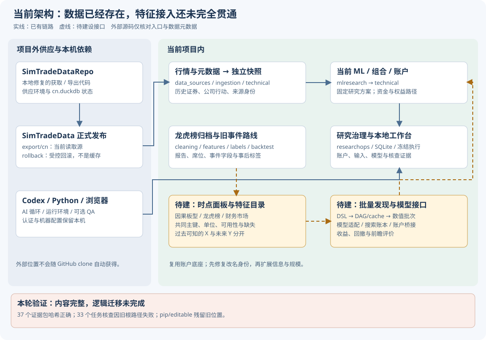

> 本报告是 2026-10-06 07:53 UTC 的结构盘点快照。后续的环境重建、改名兼容和新增模块请看 [当前建设进度](BUILD_PROGRESS_20261006.md)，不要将历史缺口误读为当前仍未修复。

# 本地项目结构、总体蓝图、外部联动与清理审查报告

2026-10-06 · 本机审查 · 面向项目所有者 · 无删除、无新策略训练、无代码推送

## 1. 我的判断：有可复用的研究底座，距离总体蓝图仍有明确缺口

这个项目已经有实质性的能力：数据获取与修复、历史快照、机器学习样本与训练、信号转账户、资金曲线核查、研究任务登记、冻结执行和本地工作台。它可以作为继续建设的底座。已有账户引擎、数据契约和证据链值得保留。

但当前还不能称为已经完成的“可广泛发现 Alpha、比较多种模型、批量筛选并持续验证”的平台。最大缺口是：原有龙虎榜与板型信息没有通过统一的历史可用时点合同接到当前 ML 面板；特征和模型仍以具体研究脚本为单位；表达式语言、共享计算缓存、大规模数值调度以及前瞻观察还没有形成通用系统。

**需要渐进扩建，不需要现在推倒重写。** 模块已经分开，主要问题是模块之间缺少稳定的接口、统一的来源与时点记录，以及适合扩展的注册机制。把这些补齐比重新命名全部文件或拆成很多服务更有价值。

另外，手动改名已经完成物理搬迁，但没有完成运行环境和研究证据的逻辑迁移。本轮查到的路径问题会阻止历史证据核查，必须排在继续扩大研究之前。

| 问题 | 本轮结论 | 意味着什么 |
|---|---|---|
| 当前项目在哪里 | `<LOCAL_REPOSITORY>`，是实际目录；旧目录不存在 | 新目录名可以继续沿用 |
| Git 是否损坏 | 没有；250 个已跟踪文件全部仍在 | 普通工具遇到的工作树报错来自旧沙箱路径边界，不能误判为 Git 配置损坏 |
| 研究证据是否丢失 | 37 个分析证据包的文件哈希和清单身份均正确 | 内容保留完整；这不是账户收益数字已经被推翻的证据 |
| 改名是否完全兼容 | 没有；33 个有证据的任务核查全部失败 | 路径身份检查仍保存旧位置；恢复研究流程需要处理 |
| 发布包是否还完整 | RC4 的 260 个文件全部符合原清单，ZIP 哈希也一致 | 已有候选包可以保留；不能直接推送当前整个本地仓库 |
| 现在是否仅用了最初 16 个特征 | 不是；已有财务与市场上下文组，最大固定组合为 31 个输入 | 但仍没有能自由接入各类新特征的通用目录 |
| 现有数据是否已经全部用于当前 ML | 没有 | 龙虎榜、席位结构、历史板型等仍需要接入工程 |
| 是否应该直接大批跑上万策略 | 当前还缺共享缓存、统一搜索账本和吞吐测量 | 先建批次执行能力，再据实提高规模 |

## 2. 审查范围、证据和统计口径

本轮对当前项目根目录进行全量文件元数据盘点，对 Git 跟踪和忽略状态逐文件核对，解析了 `src`、`tools`、`samples` 中 149 个 Python 文件的语法及依赖；进一步查看关键入口、配置、ML 合同、快照与研究核查代码，并与已保存的长期蓝图逐项比对。

本轮复用了以下规划作为审查参照：

- [最大范围项目准则](PROJECT_CHARTER.md)：以真实账户收益和回撤为最终目标，不把最初 16 个特征、小市值或某一模型固定成永久边界。
- [系统蓝图](ML_SYSTEM_BLUEPRINT_20261005.md)：数据、时点、特征、Alpha 生成、数值执行、模型、组合、账户、研究管理的九层能力。
- [工程建设与交付规划](CODEX_PROJECT_DELIVERY_PLAN_20261005.md)：具体工作包 E00–E29，以及版本、依赖、测试和发布准备。
- [持续探索雷达](RESEARCH_RADAR.md)：保留尚未尝试的方向及清单之外的探索，防止研究再次缩窄。

**这里区分三种证据：** 本轮直接核查的文件、哈希和运行探针；之前保存的工程验收记录；根据实际代码与总体规划作出的架构判断。旧报告说“已通过”并不等于本轮在改名后重新运行了那项验收。

全量盘点时间为 **2026-10-06 07:53:36 UTC（纽约时间 03:53:36）**。之后新增的本报告及审查输出不包含在该快照总量中。大小为文件逻辑字节数：GB 使用十进制，GiB 使用二进制；不是系统实际分配空间或保证能够释放的容量。没有跟随重解析链接，没有文件扫描错误。

| 项目 | 快照结果 |
|---|---:|
| 项目内文件数 | 84,890 |
| 项目内文件逻辑容量 | 12,503,971,202 字节，约 12.504 GB / 11.646 GiB |
| Git 索引已跟踪文件 | 250 |
| 已跟踪文件丢失 | 0 |
| 已跟踪文件匹配当前 ignore 规则 | 0 |
| 本轮解析的 Python 文件 | 149 |
| 本轮删除的文件 | 0 |

这不是逐行正确性证明，不是新一轮策略盈利验收，也没有重跑全量软件测试或全部历史账户。本轮只检查已知的项目外数据目录元数据与必要入口是否存在，没有审计项目外供应代码全文，没有读取浏览器历史、Cookies 或个人资料内容。

## 3. 当前目录：哪些是真正的源码，哪些是数据与工程产物

```text
<LOCAL_REPOSITORY>/
├── README.md                       新项目入口
├── .gitignore                      本地仓库忽略规则
├── .github/workflows/ci.yml         CI 定义
├── AGENTS.md                       既有协作说明文件，本轮不将旧要求视为有效指令
├── lhb_backtest/                    当前应用和 Python 包的实际根目录
│   ├── pyproject.toml              包名、依赖、打包规则
│   ├── main.py / *.bat             命令与 Windows 入口
│   ├── src/                        核心实现，见下表
│   ├── compat/                     平台兼容代码
│   ├── tools/                      操作、验证、维护入口
│   ├── config/                     数据源与研究参数
│   ├── tests/                      软件、契约与核查测试
│   ├── samples/ / notebooks/       示例与探索
│   ├── docs/                       总体规划、读者说明、阶段报告
│   ├── research/                   历次研究、交付证据、协议、临时 QA 混合区
│   └── data/                       原始数据、清洗数据、快照、账户与研究数据库
├── .venv/                          主开发环境
├── .local_delivery/                独立安装验收环境、构建和交付临时材料
├── release_candidates/             经过筛选的公开源码候选包
├── .qa_*/ / .pytest_cache/          本地测试临时目录
└── .git/                           历史、索引、分支与本地配置
```

顶层目录名已经体现扩大后的目标；内部 `lhb_backtest` 和 `src.*` 导入名仍保留历史命名。这会造成认知成本，但不会自动限制研究能力。现在连内部目录一起改名，会同时影响导入、批处理入口、配置、冻结副本、测试与历史路径；应在运行和证据迁移稳定之后另立范围明确的兼容改造。

### 3.1 核心模块逐项说明

| 模块（位于 `lhb_backtest/src/`） | 现在负责什么 | 对总体规划的价值与缺口 |
|---|---|---|
| `data_sources` | AKShare、BaoStock、Tushare、SimTradeData 本地读取、元数据与质量检查 | 已有供应适配与质量基础；不同来源不是默认同口径、同覆盖 |
| `ingestion` | 增量获取、龙虎榜报告与席位归档、上游更新、暂存与受控发布 | 可保留；仍依赖项目外供应代码，需要版本与环境记录 |
| `cleaning` | 股票代码归一、K 线清洗、限价处理、龙虎榜清洗 | 是统一面板前的基础；应继续保留来源和未知状态 |
| `features` | 原有龙虎榜特征、集中度等研究字段 | 已有领域信息积累，但没有自动接入当前通用 ML 输入 |
| `labels` | 原事件研究的未来收益、封板与连板等结果标签 | 后验结果不能当作当时已知特征；构造新板型输入必须另做因果版本 |
| `backtest` | 原事件筛选、统计和网格研究 | 事件条件统计与账户资金曲线有不同含义；应清楚标识 |
| `reports` | 原研究图表和报告 | 保留解释价值，避免把事件统计报告呈现为账户业绩 |
| `workbench` | 较早的事件工作台、数据库和网页 | 属于历史产品路径；不是当前技术/ML 工作台的唯一实现 |
| `technical` | 独立行情快照、证券与市场规则、组合、真实资金账户、核查及当前网页服务 | 当前最重要的可复用底座；不必因扩展模型而另造一套账户引擎 |
| `mlresearch` | 样本、固定研究方案、Ridge/HGB 训练、评分、财务上下文、结果与核查 | 已闭合具体研究链；尚不是任意特征、任意模型、任意目标的通用平台 |
| `researchops` | SQLite 任务、证据、冻结执行、控制器、有限预算循环、通知与额度判断 | 已有研究治理骨架；改名暴露了位置与证据身份耦合问题 |
| `utils` | I/O、配置、日历、日志等通用能力 | 应被上层复用；不同研究路径需要一致的日历与时点约束 |

`technical/server.py` 同时连接账户、ML 和研究管理；`mlresearch` 已使用技术研究中的数据和账户能力。因此这是有共享底座的本地模块化系统。另一方面，旧数据清洗层与获取层存在双向依赖，示例、工具、报告与模块之间也有历史耦合。新功能应通过明确接口接入，逐步减少这种耦合，而不是通过复制一整套流水线扩展。

### 3.2 其他目录与入口

| 路径 | 作用 | 处理建议 |
|---|---|---|
| `lhb_backtest/tools/` | 更新、检查、工作台、研究与 ML 命令入口 | 区分日常支持入口与一次性修复脚本；记录前置条件 |
| `lhb_backtest/tests/` | 软件行为、输入合同、冻结执行、账户核查回归 | 保留；合成数据测试通过不能证明策略赚钱 |
| `lhb_backtest/config/` | 上游路径、数据范围、研究配置 | 本机路径和可共享默认配置分开；本轮未修改 |
| `lhb_backtest/compat/` | Windows 等兼容补丁 | 有必要，但要记录作用范围，避免环境依赖被隐藏 |
| `samples/` | 用户示例 | 明确哪些调用需要真实本地数据，哪些可在干净安装中运行 |
| `notebooks/` | 探索及展示 | 公开版本先检查输出与本机路径；保留原始本地版本 |
| `docs/` | 长期准则、用户指南、阶段报告与本机说明混在一起 | 建立“当前入口—长期设计—历史报告”的阅读关系 |
| `research/` | 研究证据、实现过程、外部协议模式、临时 UI 测试混在一起 | 必须分类；不能全部视为公开源码，也不能全部视为垃圾 |
| `tmp_inspect.txt` | 名称像临时文件，但实际已经被 Git 跟踪 | 未验证用途，不能凭文件名删除 |
| `.local_delivery/` | QA 环境、修复工作副本、wheel 和空测试账户 | 根据验收依赖选择性保留；不应与产品源码混为一体 |
| `release_candidates/` | 经过允许清单筛选、可能转换过的公开版本 | RC4 是审阅对象；本地原目录不是相同的公开内容 |

逐文件索引见 [代码与文件索引](LOCAL_STRUCTURE_FILE_MAP_20261006.html)。索引列出解析的 149 个 Python 文件、顶层定义与其他源码/测试/文档路径；它是定位辅助，不宣称每个函数都已完成语义审计。

## 4. 现在真实的数据与研究链路



可以把现状理解成两条已经存在、但尚未全面接通的路线。

**当前 ML/账户路线：** 项目外供应仓库维护数据库，发布为 Parquet；本项目读取相应行情、元数据和公司行动，形成独立快照；ML 代码把历史信息变成一行行“日期×股票”的输入，训练与输出分数；技术账户引擎把分数或其他信号变成持仓与资金路径；研究层保存代码、输入身份和核查证据。

**原龙虎榜事件路线：** 本项目获取原报告与席位明细，清洗和构造事件字段，生成事后标签，再做条件统计、筛选和旧工作台展示。这条路线已经积累信息，但当前独立技术快照明确不读取龙虎榜。见 [快照实现](../src/technical/data.py#L22)。

因此，“数据文件里已经有龙虎榜集中度”与“当前 ML 的 X 已经用上集中度”是两回事。后者还要说明：报告什么时候可用、是一日还是多日窗口、同一天多个报告如何识别、缺失与未上榜如何区分、席位明细是否完整、分母来自哪个报告、能否在当时生成相同结果。

连板、一字板、日内触及两端等同样需要区分。过去到当天已经观察到的状态可以成为输入；未来最终连了多少板是标签。仅凭日线 OHLC 也无法确定日内先涨停再跌停还是相反，不能把无法观察的先后顺序包装成确定事实。

## 5. 与总体蓝图逐层对照：完成了什么，缺在哪里

“有文件”不等于“能力完成”。下面以是否具有可复用接口、真实接入和可核查证据判断；不采用按文件数推算的虚假完成百分比。

| 蓝图层 | 当前状态 | 已有实现 | 主要缺口 |
|---|---|---|---|
| 数据获取与质量 | 已有基础，持续维护 | 多来源、清洗、受控更新与质量修复 | 供应代码版本、环境与来源覆盖需要统一记录 |
| 历史可用时点与面板 | 部分建成 | 行情/证券/财务约束、快照、现有 ML 面板 | 跨来源事件合同、通用主键与缺失状态、修订版本限制 |
| 特征目录 | 部分研究实现 | 原 16、规模、年度财务、市场状态、旧龙虎榜字段 | 统一来源、单位、可用性、定义版本、依赖、覆盖与因果板型包 |
| Alpha 表达式与生成 | 规划阶段 | 有手写信号与固定组合 | 类型化 DSL、算子语义、表达式去重，GP/RL/LLM 受限生成 |
| 数值缓存与批次执行 | 部分建成 | 具体实验可执行，部分有限批次、冻结作业 | 共享 DAG/cache、全局资源预留、数千候选统一账本与吞吐基准 |
| 模型与学习协议 | 具体方案可运行 | Ridge、受限 HGB、现有时间划分与核查 | 通用适配、更多模型、序列/事件/图输入、搜索与选择纪律 |
| 组合与风险 | 已有基础 | 选股、仓位、账户及已有状态研究 | 纯 ML 与规模增强独立路线、可控权重与风险消融、统一优化接口 |
| 账户与独立核查 | 当前较强底座 | 成交、现金、权益、收益与回撤路径、核查 | 新信号/新来源严格桥接；改名恢复；持续完善坏输入反例 |
| 研究治理与工作台 | 已有骨架 | 任务、证据、循环、冻结执行、网页 | 吞吐/尝试账本、研究前沿与路径、前瞻记录、恢复演练与可移动身份 |

### 5.1 不是永远停留在 16 个，但扩展仍然是“具体研究加代码”

`mlresearch/contracts.py` 的研究类型目前枚举为 `signal`、`complete`、`universe`、`fixed_blend`、`financial_context`；部分完整矩阵仍要求周频、Top100 和原 16 个价量特征。见 [当前 ML 合同](../src/mlresearch/contracts.py#L34)。

现有年度财务/市场上下文研究扩展到：原 16 个加规模 1 个，年度财务与缺失/陈旧信息 8 个，市场状态 6 个，合计最大 31 个输入。见 [财务上下文实现](../src/mlresearch/financial_study.py#L24)。这纠正了“始终只用了 16 个”的印象，但也没有解决“用户给出一个有意义的新信息包，就能规范接入并批量比较”的问题。

目前 ML 主路线是 Ridge 和 HistGradientBoostingRegressor。项目有其他统计、手写信号及市场状态方法，不等于已经具备随机森林、神经网络、图模型等可互换的预测模型接口。当前没有建成通用 `alpharesearch` 体系。

### 5.2 E00–E29 工作包的实际落点

下表保留原规划编号；“未建成”指规划要求的通用能力，不否认个别旧研究存在类似局部代码。

| 工作包 | 审查状态 | 接下来需要证明的交付 |
|---|---|---|
| E00 日历故障 | 前阶段登记为完成，本轮未重新跑日历验收 | 改名后环境恢复，并保持既有执行器与核查器一致 |
| E01 时点/单位合同 | 现有合同分散，新的统一合同未建成 | decision、known_at、execution、label_end 明确，未来信息反例失败 |
| E02 事件快照 | 原报告归档已有，通用事件快照未建成 | 原报告身份、窗口、来源、可用性与完整性可核查 |
| E03 面板适配 | 固定研究面板已有，新跨来源适配未建成 | 日期×股票主键、历史名单、不同缺失原因分开 |
| E04 因果板型 | 有历史检测/标签，输入包未建成 | 当时可知连板、板型和未知盘中顺序明确 |
| E05 龙虎榜包 | 旧字段已有，当前 ML 接入未建成 | 同报告集中度、净额、席位、事件年龄与窗口约束 |
| E06 财务/市场包 | 已有具体研究 | 转为注册包，保留修订版本与代理口径限制 |
| E07 特征注册 | 未建成 | 所有特征的定义、依赖、版本、来源、覆盖可查询 |
| E08 DSL 结构 | 未建成 | 类型化 AST、单位/域、时点和复杂度限制 |
| E09 DSL 算子 | 未建成 | rank/lag/rolling/横截面等明确 NaN、ties、日历语义 |
| E10 DAG/缓存 | 未建成通用体系 | 共享子表达式、完整缓存身份、原子写入与损坏识别 |
| E11 注册批次 | 现有任务/实验登记可复用，新特征搜索合同未建成 | 冻结范围、所有候选、失败和训练次数均登记 |
| E12 数值执行 | 现有冻结执行可复用，统一资源调度不足 | 数值进程、取消/恢复、内存和并发预留 |
| E13 初筛/统计 | 具体研究指标已有，通用选择账本不足 | 开发区间代理评估、条件特征通道、累计尝试记录 |
| E14 吞吐实测 | 尚无目标扩展系统的吞吐验收 | 用 32/64 列小批次记录 RAM、耗时和磁盘，再定规模 |
| E15 模型接口 | Ridge/HGB 具体实现，通用接口未建成 | 线性、稳健、袋装树及提升树使用相同输入/输出合同 |
| E16 学习协议 | 现有具体协议可复用 | 成熟标签、预处理 fit 范围、预测身份、负对照及选择计数 |
| E17 账户桥接 | 当前 ML→账户链已有，新体系桥接未建成 | 错误 key、池、日历、时点、权重和价格强制拒绝 |
| E18 独立核查 | 已有账户/ML 核查 | 扩展事件血缘与新桥接复算；先修复路径身份 |
| E19 首个新体系闭环 | 未完成 | 同口径真实账户、基准、费用分支、负面结果与冻结证据 |
| E20 序列/事件集 | 未建成 | N×T×D、掩码、历史事件顺序与未来追加不改变过去 |
| E21 神经网络 | 未接入通用研究体系 | 从小型 MLP 到 GRU/TCN，再决定 Transformer；实测资源 |
| E22 席位关系图 | 未建成 | 当时节点/边、身份规则、稀疏图统计，再考虑图模型 |
| E23 GP/符号回归 | 未建成 | 已核查 DSL 内生成、去重、深度和尝试预算 |
| E24 RL 生成 | 未建成 | 状态、奖励与反馈范围冻结，保留搜索轨迹 |
| E25 LLM 生成 | 研究控制器已有，不等于 Alpha 生成已建成 | 假设→受限 AST；不能让候选自由执行任意代码 |
| E26 组合/风险 | 有组合和状态研究，统一扩展不足 | 纯 ML、规模增强、权重与尾部风险分别比较 |
| E27 工作台 | 已有技术/ML/研究页面 | 展示候选、预算、拒绝、资源、收益回撤前沿与研究路径 |
| E28 前瞻影子记录 | 未建成 | 当时信号时间戳和哈希，未来结果到达后评价 |
| E29 运维/恢复 | 有备份与历史恢复资料，演练能力不完整 | 可移动根路径、SQLite 备份、环境重建、恢复实测 |

这张表是本轮的现状判断，不把原规划中的工作包编号当作已经全部创建或完成的数据库任务。当前数据库中“可扩展特征目录与历史可用时点契约”仍是 queued，与上述缺口一致。

## 6. 项目之外的联动：仓库单独复制还不够

### 6.1 两个已确认的数据位置

| 项目外路径 | 实际角色 | 元数据盘点 | 影响 |
|---|---|---:|---|
| `<LOCAL_PROVIDER_REPOSITORY>/` | 本机供应代码仓库，包含本地修复 | 只确认必要脚本/环境存在，未全面审计其源码 | 更新并非只依赖原版第三方仓库；需要记录修复版本 |
| `<LOCAL_PROVIDER_REPOSITORY>/data/cn.duckdb` | 供应获取状态和原始整合数据库 | 3,602,395,136 字节 | 更新/恢复关键状态，不是普通缓存 |
| `<LOCAL_PROVIDER_DATA>/data/export/cn/` | 正式发布的 Parquet 读取源 | 21,962 文件，1,256,668,772 字节 | 本项目日常读取的外部数据源 |
| `<LOCAL_PROVIDER_DATA>/data/export/cn.update-rollback/` | 受控更新的回滚副本 | 21,962 文件，1,258,405,350 字节 | 条件性历史副本，必须先确认恢复链与发布状态 |
| `<LOCAL_PROVIDER_DATA>/data/export/cn.update-owner.json` | 更新发布归属标记 | 64 字节 | 由发布流程管理，不能按临时文件删除 |
| `<LOCAL_PROVIDER_REPOSITORY>/data/lhb_update.lock` | 更新互斥锁文件 | 1 字节 | 文件存在不代表正在运行；也不能凭存在直接清除 |

项目配置中的 `../../SimTradeDataRepo` 与 `../../SimTradeData/data/export/cn` 以 `lhb_backtest/` 为基准解析，见 [配置](../config/config.yaml#L75)。这次只改同一父目录下的项目名，两条相对路径仍指向原来的外部位置。这部分没有因改名自动失效。

上游调用包括 `scripts/download.py --skip-mootdx-ohlcv`、`export_parquet.py`、`check_integrity.py`，优先用外部仓库自己的 Python 环境；内部维护/验证还涉及通达信导入、基准修复和供应写入细节。已有数据契约说明供应代码经过本地修复，所以不能让未来使用者以为只要下载未经修改的第三方代码就一定可复现当前数据。

外部正式导出 manifest 记录的日期边界为 **2026-09-24**，市场目录描述为 5,559 只证券，历史总日期范围从 1990-12-19 到 2026-09-24。这个数量不是当前某个策略的候选股数量；导出总覆盖也不表示项目当前研究使用所有历史年份。内部更新报告记录最近目标范围校验通过，不代表本轮重新验证了全部供应数据内容。

部分一次性修复工具提到 `cn.previous`，目前实际发布目录未发现该路径。它们需要满足原修复前提或参数化以后才能重用，不应被当成现在可无条件运行的日常入口。

### 6.2 非数据的本机依赖

| 联动 | 当前方式 | 应记录/处理什么 |
|---|---|---|
| Python | 主环境来自 `<LOCAL_PYTHON>`；当前 Python 3.12 环境 | 包声明支持范围与实测范围分开，保存精确验证约束 |
| 外部供应 Python | `SimTradeDataRepo/.venv/Scripts/python.exe`，不存在时可能回退当前解释器 | 分别记录供应和项目环境，不把回退误认为等价 |
| Codex CLI | 环境变量覆盖、安装目录搜索或 PATH | AI 控制循环需要已安装 CLI 与用户认证；数值账户引擎本身不必依赖 AI 登录 |
| Git / gh | 本机工具与 GitHub 登录 | 不把认证配置或凭证放进源码包 |
| Edge / Chrome | 本地 UI 验证工具 | 可选 QA 依赖；专用测试 profile 与个人 profile 分开 |
| 在线供应接口 | AKShare/东方财富、BaoStock、Mootdx；Tushare 可选 | 更新需要网络和供应可用性；冻结本地账户应可脱离在线获取 |
| 历史绝对路径 | 冻结作业、数据库元数据、旧报告和环境安装记录 | 改名后需要受控映射；不是去删除历史文件 |

本轮没有读取用户外部账号配置，没有购买服务，没有访问之前 Downloads 里的 Notebook，也没有扫描其他无关项目。项目外已知数据目录合计约 **6.118 GB**，与项目内 12.504 GB 分开计算，不能称为当前仓库本身的容量。

## 7. 磁盘占用：研究证据是主要内容，源码并不大

### 7.1 项目内主要占用

| 路径 | 文件数 | 逻辑容量 | 性质 |
| --- | --- | --- | --- |
| `lhb_backtest/data` | 29,208 | 10,821,743,875 B · 10.822 GB | 真实数据/研究账本，全部忽略 |
| `.venv` | 19,478 | 674,477,714 B · 674.48 MB | 主环境，保留待修复 |
| `.local_delivery` | 18,181 | 643,855,322 B · 643.86 MB | 独立安装验收与交付材料 |
| `lhb_backtest/research` | 7,527 | 253,325,084 B · 253.33 MB | 历史研究与过程资料混合 |
| `release_candidates` | 1,150 | 25,116,062 B · 25.12 MB | 公开候选包，不是数据 |
| `.git` | 1,849 | 12,359,308 B · 12.36 MB | 本地历史 |
| `lhb_backtest/docs` | 49 | 4,070,540 B · 4.07 MB | 设计与读者说明 |
| `lhb_backtest/src` | 210 | 2,336,991 B · 2.34 MB | 核心代码及缓存 |
| `lhb_backtest/tests` | 66 | 1,278,753 B · 1.28 MB | 软件测试及缓存 |
| `lhb_backtest/tools` | 47 | 317,390 B · 0.32 MB | 命令与维护工具 |

其中 `lhb_backtest/src/` 所有文件合计约 2.34 MB，包含源码和少量已生成缓存；不是几十 GB 的软件代码。当前占用主要来自数据、账户、模型面板、快照以及测试环境。真正需要改善的是存储分类、依赖关系与保留策略。

### 7.2 数据目录逐项

| 数据路径 | 文件数 | 逻辑容量 | 实际 ignore |
| --- | --- | --- | --- |
| `lhb_backtest/data/technical` | 21,547 | 7,765,480,637 B · 7.765 GB | 21,547/21,547 |
| `lhb_backtest/data/workbench` | 1,730 | 1,114,281,994 B · 1.114 GB | 1,730/1,730 |
| `lhb_backtest/data/validation` | 12 | 604,947,390 B · 604.95 MB | 12/12 |
| `lhb_backtest/data/raw` | 380 | 439,438,535 B · 439.44 MB | 380/380 |
| `lhb_backtest/data/clean` | 3 | 411,520,085 B · 411.52 MB | 3/3 |
| `lhb_backtest/data/backups` | 9 | 168,538,106 B · 168.54 MB | 9/9 |
| `lhb_backtest/data/factor` | 4 | 149,016,970 B · 149.02 MB | 4/4 |
| `lhb_backtest/data/quality_repair` | 5,256 | 97,402,577 B · 97.40 MB | 5,256/5,256 |
| `lhb_backtest/data/output` | 51 | 67,837,595 B · 67.84 MB | 51/51 |
| `lhb_backtest/data/update_work` | 209 | 3,262,642 B · 3.26 MB | 209/209 |
| `lhb_backtest/data/update_reports` | 4 | 13,679 B · 0.01 MB | 4/4 |
| `lhb_backtest/data/import_tdx_day.log` | 1 | 3,368 B · 0.00 MB | 1/1 |
| `lhb_backtest/data/download_efficient.log` | 1 | 297 B · 0.00 MB | 1/1 |
| `lhb_backtest/data/download_mootdx.log` | 1 | 0 B · 0.00 MB | 1/1 |

`data/validation/project_review_20260925` 约 605 MB，是实数数据验收副本，不是仅凭目录名就能删除的测试垃圾。`data/workbench` 是旧事件工作台的历史，也不能因为当前另有工作台就立即整库删除。`quality_repair`、`backups`、`update_work` 要结合修复与恢复记录判断，而不是只看名字。

### 7.3 当前技术/ML 研究账本在哪里

| 技术研究路径 | 文件数 | 逻辑容量 |
| --- | --- | --- |
| `lhb_backtest/data/technical/runs` | 5,726 | 3,867,459,594 B · 3.867 GB |
| `lhb_backtest/data/technical/ml_runs` | 145 | 1,746,297,770 B · 1.746 GB |
| `lhb_backtest/data/technical/validation` | 11,297 | 988,257,968 B · 988.26 MB |
| `lhb_backtest/data/technical/snapshots` | 42 | 804,056,610 B · 804.06 MB |
| `lhb_backtest/data/technical/campaigns` | 1,764 | 188,552,693 B · 188.55 MB |
| `lhb_backtest/data/technical/analysis_evidence` | 1,755 | 154,638,056 B · 154.64 MB |
| `lhb_backtest/data/technical/worker_jobs` | 693 | 6,412,156 B · 6.41 MB |
| `lhb_backtest/data/technical/regimes` | 8 | 3,684,662 B · 3.68 MB |
| `lhb_backtest/data/technical/loops` | 81 | 3,224,471 B · 3.22 MB |
| `lhb_backtest/data/technical/research.sqlite3` | 1 | 1,986,560 B · 1.99 MB |
| `lhb_backtest/data/technical/foundations` | 5 | 736,013 B · 0.74 MB |
| `lhb_backtest/data/technical/batches` | 5 | 170,981 B · 0.17 MB |
| `lhb_backtest/data/technical/sessions` | 21 | 2,921 B · 0.00 MB |
| `lhb_backtest/data/technical/latest_batch.json` | 1 | 46 B · 0.00 MB |
| `lhb_backtest/data/technical/latest_foundation.json` | 1 | 46 B · 0.00 MB |
| `lhb_backtest/data/technical/latest_regime.json` | 1 | 46 B · 0.00 MB |
| `lhb_backtest/data/technical/latest.json` | 1 | 44 B · 0.00 MB |

应优先保留：账户 `runs`、模型与面板 `ml_runs`、输入 `snapshots`、分析 `analysis_evidence`、冻结 `worker_jobs`、控制器 `campaigns`、循环 `loops` 和 `research.sqlite3`。它们有相互引用，不能按“文件可再生成”简单清理。源头修订、环境变化或历史选择可能导致重跑不再等价。

## 8. 哪些不会上传，哪些只是你以为不会上传

### 8.1 本轮按真实 Git 规则核查的结果

- `lhb_backtest/data/` 当前 29,208 个实际文件全部被忽略，没有已跟踪数据文件。
- `.venv`、`.local_delivery`、`release_candidates`、根目录 `.qa_*`、常见 Python/pytest/ruff 缓存被忽略。
- 本机交付说明、改名审查资料有专门的目录/文件规则。
- **`research/` 不是整体忽略：快照里有 2,409 个未跟踪且未忽略文件。** 其中研究协议、上下文、会话、QA、历史过程资料混在一起。
- `docs/` 有 37 个未跟踪且未忽略文件；`src/` 有 22 个；`tools/` 有 4 个；测试有 6 个。未跟踪并不等于自动上传，但广泛 `git add` 会把未忽略内容纳入。

Git 官方说明明确区分“忽略未跟踪文件”和“移除已跟踪文件”；ignore 规则不会自动清除已经进入索引或历史的内容。被忽略的文件也可被显式强制加入。规则如何匹配、父目录忽略后的重新包含限制见 [Git 官方 gitignore 文档](https://git-scm.com/docs/gitignore)。

### 8.2 两个具体的会话遗漏

当前 `**/session.json` 只匹配这个精确文件名，没有覆盖所有 `*_session.json`。本轮在未忽略研究文件中发现：

| 文件 | 结果 | 发布处理 |
|---|---|---|
| `research/ml_noteworthy_stop_20261004/revision_session.json` | 存在非空 `token` 字段 | 应保留本机隔离，不进入公开源码 |
| `research/ml_noteworthy_stop_20261004/scope_handoff_session.json` | 存在非空 `token` 字段 | 同上 |

本轮没有输出字段值，没有确认其当前是否仍可用，也没有把它们认定为 GitHub 或某供应商凭证。另两个带 Session 字样的文件是协议 schema，不能仅凭文件名一刀切认定为凭证。公开筛选应该检查内容类别，而不是只扩大一个宽泛通配符。

### 8.3 当前 HEAD 不是当前完整 ML 源码

本地 HEAD 为 `f3f0ea1a947d9e61c7102b4464383b80a2246f69`，分支为 `codex/research-controller-v7`。本轮只读核查发现 **37 个已跟踪文件存在工作区修改**，没有执行回滚或覆盖。

**`src/mlresearch/` 的 17 个非缓存源码文件全部还未被 Git 跟踪。** 新增循环/通知/额度代码、部分新测试、根 README、根 `.gitignore` 和 CI 定义也存在未跟踪内容。因此直接推送旧 HEAD 并不等于发布现在的完整项目；直接把所有未跟踪文件加入又会混入私人研究资料。

已有公开候选 RC4 用明确清单选取了 260 个文件，并对部分文档做了公开版本转换。它与本地研究全目录的内容故意不同。本轮重新核查 RC4 文件及 ZIP：无缺失、无多余文件、无哈希差异。

前阶段可达 Git 对象模式扫描检查了 779 个历史 blob，记录到两项私人本机路径；这是有限模式扫描，不能当作穷尽秘密、数据许可或版权的证明。保留本地历史，同时由干净源码候选建立首次公开历史，仍是符合你已选交付范围的路径。

### 8.4 本轮对忽略规则实际做了什么

只在本地 `.git/info/exclude` 加入了本次审查目录规则：`/lhb_backtest/research/structure_audit_20261006/`。已验证生效，避免新审查清单中的本机路径被误加到公开仓库。这个规则属于当前机器，不会随 clone 分享；Git 官方把此文件列为本仓库本地忽略位置，见 [同一官方说明](https://git-scm.com/docs/gitignore)。

没有修改公共 `.gitignore`，没有改生产源码，没有删除会话文件，没有更改原研究历史。忽略规则遗漏修复与发布筛选属于下一实施包。

## 9. 改名后发现的真实故障：证据内容没坏，位置身份过严

### 9.1 文件哈希正确，但研究层拒绝它们

本轮以只读方式打开研究数据库，SQLite integrity 检查为 `ok`。数据库记录：22 个 completed、3 个 deferred、4 个 queued、9 个 review 任务；没有运行中的实验或活动 campaign。数据库状态是历史任务状态，不表示实际实现质量或蓝图完成比例。

37 个分析证据包实际文件都在新目录，已按原清单逐项复算哈希，清单指纹也正确。但 payload 的 `folder` 保存了旧根路径。当前研究对象先对根目录 `.resolve()`，随后比较整个路径字符串。

```python
# 当前 verify_evidence 中的位置身份检查（摘录）
folder = self.root / "analysis_evidence" / evidence["fingerprint"]
if str(folder) != payload["folder"] or content_id(payload["artifacts"]) != evidence["fingerprint"]:
    raise ValueError("分析证据身份变化")
```

见 [研究对象根目录处理](../src/researchops/service.py#L52) 与 [核查实现](../src/researchops/service.py#L487)。33 个有这些证据的不同任务调用现有只读 `verify_evidence` 后全部失败。数据库还有 72 个作业目录保留旧位置，旧路径全部不存在，但映射到新根目录的 72 个位置全部存在。

这会影响历史证据展示、提交/复核门槛及后续流程；**不能由此推断历史收益已经算错，也不能因此删掉证据重做。** 这次验证的是内容完整性和现有核查入口的兼容性，没有完整复算所有账户。

### 9.2 单独建旧路径 junction 不能完全解决

因为 `Research` 会 `.resolve()`，即使入口经旧目录链接到新目录，解析后仍可能是新路径，严格字符串比较仍失败。兼容链接能帮助旧脚本读取绝对位置，但需要配合受控元数据/解析机制，才能解决上述身份检查。

正确修复方向是：保存迁移记录，明确允许的旧根→新根映射，验证解析后的文件仍位于预期目录，保持内容哈希和清单指纹核查；新设计把不可变内容身份与可变化的存放根路径分开。不能全盘替换冻结原件，也不能删除路径约束让任意位置都通过。

**前一轮迁移验收漏了这个真实研究入口。** 当时检查了文件和环境的部分状态，没有覆盖 `verify_evidence` 的路径身份门槛；本轮报告修正这一结论。当前还未实施迁移修复。

### 9.3 虚拟环境也保留了旧位置

| 本轮运行探针 | 实际结果 |
|---|---|
| 新目录下 `python.exe -m pip --version` | 成功，pip 26.1.1 / Python 3.12 |
| 新目录下 `pip.exe --version` | 失败：`Failed to canonicalize script path` |
| 从项目顶层查找 `src` | 未找到；当前旧 editable 安装未提供有效根目录入口 |
| 从 `lhb_backtest/` 内查找 `src` | 找到新路径下的包 |
| editable finder | 仍引用旧项目路径，文件名对应旧包 0.1.0 |

相对目录的 Windows 入口能帮助定位新项目，但不足以证明环境已恢复。官方 Python 文档说明 venv 脚本依赖绝对路径，移动父目录后通常应在新位置重建环境，见 [Python 3.12 venv 文档](https://docs.python.org/3.12/library/venv.html)。

修复顺序应是先保存当前验证约束和环境信息，再建立或修复新位置的安装，验证顶层与应用入口、命令包装器和必要研究依赖，最后再考虑淘汰旧环境。主 `.venv` 约 674 MB **现在不属于可直接清理项**。

当前 `pyproject.toml` 已声明新包 0.2.0，以及研究可选依赖，但现有 editable 元数据仍是旧版本，这正说明“改了包声明”与“环境重新安装正确”是两回事。

## 10. 可以清理什么：逐项列出条件，避免损失研究证据

本轮只是生成候选清单，**没有删除任何文件，也没有检查所有候选是否正被进程使用**。下述“可以优先清理”表示类别可再生成，实施前仍需确认用途和活动进程。容量已按路径去重。

### 10.1 A 类：优先候选，约 66.91 MB

| 候选路径 | 逻辑容量 | 实施条件 |
| --- | --- | --- |
| `.qa_cd2` | 18,901,560 B · 18.90 MB | 测试沙盒；确认无活动依赖 |
| `.qa_r2` | 3,512,568 B · 3.51 MB | 测试沙盒；确认无活动依赖 |
| `.qa_r3` | 19,448,421 B · 19.45 MB | 测试沙盒；确认无活动依赖 |
| `.qa_r5` | 19,024,571 B · 19.02 MB | 测试沙盒；确认无活动依赖 |
| `.qa_rel_focused_01` | 3,514,791 B · 3.51 MB | 测试沙盒；确认无活动依赖 |
| 源码/pytest/ruff 缓存（附表逐目录） | 2,508,161 B · 2.51 MB | 可再生成；与上面五目录去重 |

这五个根测试目录合计 64,401,911 字节，另有不在这些目录中的源码/pytest/ruff 缓存 2,508,161 字节；合计 **66,910,072 字节**。没有把测试目录内的 `__pycache__` 再算一遍。

清理前应确认目录是该项目的测试沙盒、没有仍在运行的验证依赖它们，也没有把其中某个具体文件作为唯一验收证据引用。不要把根 `.qa_*` 的规则扩展成删掉 `data/technical/worker_jobs` 或所有带 validation 的目录。

### 10.2 B 类：满足条件后，另有约 1.74 GB 候选

| 候选类别 | 逻辑容量 | 实施条件 |
| --- | --- | --- |
| 19 个浏览器形态目录（附表逐项） | 1,080,740,570 B · 1.081 GB | 确认专用、未占用和证据引用 |
| `.local_delivery/validation_env` | 641,338,704 B · 641.34 MB | 保留重建材料后淘汰 |
| RC1–RC3 源码目录 | 17,964,658 B · 17.96 MB | 保留差异与验收摘要，确认无引用 |

19 个浏览器 profile 通过 `Local State` 与 `Default/Preferences` 的文件形态识别。只盘点路径和大小，没有读取个人浏览器内容；形态识别不足以自动证明“全是可删除的私人浏览器缓存”。需确认是本项目专用 QA profile、相应浏览器已退出、报告/截图/核查摘要已独立保留，且没有不可替代的正式清单依赖后再删除 profile 子目录。

独立 `validation_env` 可在保留精确依赖约束、验收日志、wheel 和可重建步骤后淘汰。旧 RC1–RC3 是被后续版本替代的候选，但仍要保留原清单、变换和差异记录，并确认没有环境指向它们。**RC4 及 ZIP 保留。**

B 类共 **1,740,043,932 字节**；与 A 类之间没有路径重叠。A+B 合计约 1.807 GB，但这不是已执行或保证可释放的空间。

`.local_delivery/p0`、两个空 workbench QA 数据库、`lhb_backtest.egg-info` 还有小量条件候选，没有放进上述容量承诺；先确认依赖和副本关系。外部 `cn.update-rollback` 约 1.258 GB 也单独列入附表，不能算进项目内容量，且只能在更新/恢复合同允许时处置。

### 10.3 C 类：本轮明确保留

| 路径/类别 | 为什么保留 |
|---|---|
| `.git` | 原始历史、分支、索引和恢复能力 |
| 主 `.venv` | 当前环境尚未恢复，先建立替代环境再处理 |
| `data/raw`、外部 `cn.duckdb`、正式 `export/cn` | 数据原件、供应状态与当前发布源 |
| `data/clean`、`factor`、`snapshots` | 被研究引用的输入；重新生成不保证相同版本 |
| `runs`、`ml_runs`、`analysis_evidence` | 账户、模型、结果及证明链 |
| `research.sqlite3`、`campaigns`、`worker_jobs`、`loops` | 任务、冻结代码、输入、失败记录与研究选择过程 |
| `quality_repair`、`backups`、`update_work`、真实 validation 副本 | 修复与恢复依赖尚需逐批确认 |
| 旧 `workbench` 数据和阶段研究报告 | 历史研究，不能因有新 UI 就抹掉 |
| 失败/被拒绝的研究候选 | 防止幸存者偏差和重复尝试，保留搜索历史 |
| RC4、ZIP、发布清单、约束和验收摘要 | 当前具体审阅和可重建发布依据 |

完整清单含 19 个浏览器目录和其他候选的路径、字节与条件，见 清理候选 CSV（本机附件，不随公开源码提供） 与 清理候选 JSON（本机附件，不随公开源码提供）。它们是审查输出，不是删除脚本。

## 11. 接下来怎样整理：先恢复，再扩大能力

### 11.1 第一包：恢复改名后的可运行与可核查状态

交付包括：新根目录环境安装；严格的旧根映射/迁移记录；只读证据核查恢复；冻结作业历史位置可访问；当前本机路径说明更新。验收至少覆盖 37 个证据包、33 个核查任务和 72 个旧作业目录，而不是只看数据库 integrity。

保存原哈希与迁移前后记录，不改写旧冻结输入或历史报告中的原始事实。以后路径迁移要加入跨目录的真实核查反例，防止再次发生“文件都在，系统却拒绝”的问题。

### 11.2 第二包：建立本地与公开内容的清楚边界

本地项目保留全历史；公开候选通过允许清单选取源码、可共享配置、测试、必要用户文档和适当示例。私人研究账本、真实数据、会话、环境、供应账号和机器审查报告不进入公开源码。公开文档应说明哪些功能可用合成示例运行，哪些需要用户自行取得数据。

修复具体的会话 ignore 缺口，核查 notebook 输出与研究资料选择。依赖声明应以 `pyproject.toml` 为主要入口，验证时保留精确 constraints；当前 requirements 与 extras 的用途需要统一说明。已有 CI 定义不等于远程 CI 已运行，本輪没有宣称 GitHub Actions 通过。

原 Git 历史继续留在本地。当前 origin 已指向 `https://github.com/Xenoxym/a-share-quant-research-platform.git`。报告主体的盘点阶段未推送；随后已只读确认目标公开仓库为空，并获授权发布经检查的源码与本公开报告。最初选择是在本地准备后审阅；2026-10-06 后续消息已授权完成报告后直接首次发布；许可证仍未决定，不能擅自补成某个开源许可证。

### 11.3 第三包：真正把新信息接到 ML，而不是继续换几个参数

先完成 E01–E03：共同历史时点合同、事件快照和面板适配；随后 E04/E05/E06/E07：因果板型、龙虎榜、财务/市场和特征目录。先验证信息可用、单位一致、缺失可解释，再讨论模型收益。

最小交付应是原 16 基线与至少两个新信息包可以在同一名单、同一切分、同一账户口径中比较，并能回答“这个输入来自哪里，当时是否知道，是否真的影响了账户结果”。

### 11.4 第四包：扩展模型和统一账户桥接

建立模型接口、学习协议、训练/预处理范围与输出主键核查。用现有依赖先试线性/稳健与袋装树，不必一开始安装所有深度学习框架；同时保留将日线转成序列、事件和关系图数据的接口。不能因为第一批采用表格模型而永久关闭其他方向。

新模型结果仍进入已有账户与核查层。收益更高或相近收益下回撤更低，才作为通知你的重要成果；IC、RankIC、拟合误差、吞吐等用于诊断或工程验收，不能替代账户成果。

### 11.5 第五包：多候选发现系统

把 DSL、算子、共享 DAG/cache、注册批次、数值 worker 和初筛接起来。先用小批实测耗时、内存、磁盘，按你授权的默认从两个数值进程起步；再扩大几十、几百乃至上千候选。候选生成、模型 fit、代理筛选与完整账户路径分别计数，失败也保留，不能只记录获胜者。

GP、符号回归、RL、LLM 可以作为候选生成器逐步接入同一受限表达式体系，避免每种方法各自发明一套不可比较的研究流程。复杂候选必须能解释其数据依赖、可用时点、预算和最终选择依据。

### 11.6 第六包：扩大研究和维护，不让总体规划再次缩窄

继续保留纯 ML、小市值增强、不同持有期、组合权重、风险/尾部管理、序列模型、席位图和清单之外的新方向。每阶段在报告末尾记录“上次以来做了什么、淘汰什么、下一包为什么”，同时维护雷达与累计搜索账本。

加入冻结版本的前瞻影子记录和恢复演练，避免长期只在已经反复看过的历史上优化。资源允许不等于无限搜索；可选择的历史次数越多，越需要独立评价与如实记录。

## 12. 建议的长期目录关系：分开职责，渐进迁移

```text
项目根/
├── README / pyproject / CI          共享安装与工程入口（可逐步统一）
├── 应用与研究源码                  暂保留 lhb_backtest/src，兼容现有导入
│   ├── 数据与时点适配
│   ├── 特征注册 / Alpha DSL         新能力
│   ├── 模型与数据集适配             扩展现有 mlresearch
│   ├── 组合与账户                   保留现有技术账户底座
│   └── 研究治理与界面               保留 researchops，扩展账本
├── tests / examples                可共享且无需私人数据的基础验证
├── docs                            当前指南、设计、历史报告分层
├── 本地数据与不可变证据             私有；位置允许配置，内容身份稳定
├── 本地 QA 临时区                   可再生成，与正式证据分开
└── 公开源码导出                     明确允许清单，经过验证和审阅
```

这是后续整理方向，不是本轮已经移动了这些目录。新功能应先在现有包中建立稳定接口，待覆盖测试与兼容入口准备好再迁移命名。供应获取代码可以保持独立，但必须有版本化依赖记录；未来不能仅靠机器上碰巧存在的一份目录才能解释数据怎么来的。

## 13. 本轮验证、产物和边界

| 本轮直接完成 | 结果 |
|---|---|
| 全项目元数据盘点与真实 Git 忽略匹配 | 84,890 文件；0 扫描错误；250 已跟踪文件均存在 |
| Python 静态结构与依赖解析 | 149 个文件，索引随报告提供 |
| SQLite 只读完整性和状态 | integrity ok；没有记录中的活动实验/campaign |
| 分析证据内容核验 | 37/37 哈希与清单正确 |
| 实际研究证据门槛探针 | 33/33 失败，定位到旧路径字符串身份 |
| 冻结作业位置映射 | 72/72 新目录位置存在，旧位置均不存在 |
| Python/pip/导入探针 | 确认命令包装器与 editable 位置残留问题 |
| RC4 与 ZIP 重新核验 | 260/260 文件正确；ZIP 哈希一致 |
| 清理候选容量去重 | A 66.91 MB；B 1.740 GB，均未执行 |
| 公开边界检查 | 找到两项未忽略、含 token 字段的会话文件；没有输出值 |

本轮没有：重新训练模型、重跑全部账户或全量测试、部署、购买数据、推送代码、删除文件、全面审计上游源码、确认所有数据分享许可证、证明不存在任何其他凭证遗漏。前阶段的全量测试与干净安装证据保留在原交付目录；本轮只将其作为历史记录引用。

本轮实际写入：本目录的审查脚本、清单、图、索引和报告，以及 `.git/info/exclude` 的本机审查目录规则。没有改动生产源码、配置、原数据、研究数据库或历史证据原件。

### 13.1 可追溯附件

| 附件 | 内容 |
| --- | --- |
| summary.json（本机附件，不随公开源码提供） | 全项目容量、Git 与数据库统计 |
| inventory.json（本机附件，不随公开源码提供） | 全量逐文件快照（较大，仅本机） |
| dependencies_and_cleanup.json（本机附件，不随公开源码提供） | 外部元数据、源码依赖、会话遗漏（不含字段值） |
| rename_evidence_checks.json（本机附件，不随公开源码提供） | 37 包与 33 任务的逐项核查 |
| runtime_checks.json（本机附件，不随公开源码提供） | Python/pip/导入探针 |
| detail_sizes.json（本机附件，不随公开源码提供） | 技术研究与交付目录容量 |
| browser_profile_metadata.json（本机附件，不随公开源码提供） | 19 个浏览器形态目录 |
| final_checks.json（本机附件，不随公开源码提供） | RC4、ZIP 与清理去重核查 |
| cleanup_candidates.json（本机附件，不随公开源码提供） | 分级清理清单 |
| CLEANUP_CANDIDATES.csv（本机附件，不随公开源码提供） | 表格版清理清单 |
| [FILE_MAP.html](LOCAL_STRUCTURE_FILE_MAP_20261006.html) | 源码、测试、配置与文档索引 |
| audit_structure.py（本机附件，不随公开源码提供） | 元数据盘点脚本 |
| inventory_dependencies.py（本机附件，不随公开源码提供） | 依赖与候选提取脚本 |
| probe_dependencies.py（本机附件，不随公开源码提供） | 路径与环境探针脚本 |
| build_report.py（本机附件，不随公开源码提供） | 本报告构建脚本 |

这些清单包含本机绝对路径和私人研究状态，属于本地审查资料。未来公开发布应提炼通用的架构说明，不应直接把本报告和完整 inventory 当成公开文档上传。

### 13.2 本轮研究/审查路径简记

从手动改名后的实际位置开始，先排除 Git 损坏误判，再盘点源码、数据和 ignore 规则；对照长期蓝图确定已有模块与缺口；追踪配置所连接的项目外供应代码和导出数据；检查 SQLite 和冻结证据，发现严格路径身份兼容故障；运行最小环境探针，发现 pip 包装器与 editable 旧路径；复核 RC4；最后按可再生成、条件可清理、应保留三类生成去重清单和本报告。

没有用新的策略收益或 RankIC 来替代本次结构审查，也没有把尚未实现的总体设计写成已完成能力。下一实施包首先解决改名恢复与公开边界，再回到更广的特征、模型与 Alpha 系统建设。
