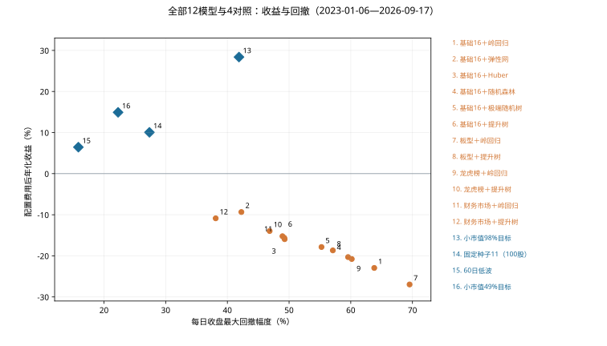
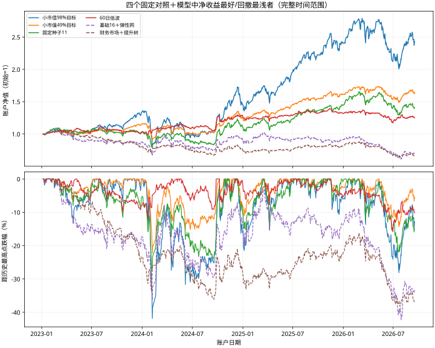

# 12个模型和新增信息，实际账户表现如何

阶段结果快照：2026-10-09T06:01:48.274126+00:00。历史账户区间2023-01-06—2026-09-17，897个交易日。

## 1. 结论：这批机器学习还没有学出值得采用的策略

12个模型的配置费用后年化全部为负，范围-26.97%到-9.34%；同一资格名单的小市值对照为+28.38%，最大回撤幅度41.88%。没有模型在相近收益下明显降低回撤，也没有模型超过小市值收益。这次是有效的否证结果，不能包装成策略成功。

基础16特征弹性网在模型中净年化最好：-9.34%，累计-29.47%，最大回撤42.27%。加入财务与市场信息的受限提升树在模型中回撤最浅：38.11%，但年化-10.87%，与小市值的正收益差距很大。它们只是这一批中的描述性极值，不是统计意义的赢家。

零交易费用下仍有10个模型亏损；另两个只达到约3.25%和0.94%年化。交易费用确实恶化表现，但去掉费用也没有使模型接近小市值。所以接下来既要检查分数是否学到有用关系，也要检查组合如何使用分数。

## 2. 所有模型与对照放在一起看

以下全部使用同一个历史日期和完全相同的合格股票日期名单。最大回撤以正的“跌幅”显示，越小越浅；年化按252个交易日复利换算，不是日历年公式。平均仓位是每日实际股票市值占权益的平均比例。

| 方法 | 扣费年化 | 扣费累计 | 最大回撤幅度 | 平均股票仓位 |
|---|---|---|---|---|
| 基础16 · 岭回归 | -22.95% | -60.46% | 63.81% | 70.38% |
| 基础16 · 弹性网 | -9.34% | -29.47% | 42.27% | 74.81% |
| 基础16 · Huber稳健回归 | -15.95% | -46.11% | 49.28% | 73.74% |
| 基础16 · 随机森林 | -20.31% | -55.43% | 59.57% | 70.87% |
| 基础16 · 极端随机树 | -17.86% | -50.35% | 55.26% | 71.58% |
| 基础16 · 受限提升树 | -15.23% | -44.45% | 48.93% | 71.87% |
| 加板型 · 岭回归 | -26.97% | -67.33% | 69.53% | 68.65% |
| 加板型 · 受限提升树 | -18.67% | -52.09% | 57.09% | 72.92% |
| 加龙虎榜 · 岭回归 | -20.77% | -56.34% | 60.16% | 71.28% |
| 加龙虎榜 · 受限提升树 | -13.96% | -41.45% | 46.85% | 72.10% |
| 加财务市场 · 岭回归 | -15.62% | -45.37% | 49.22% | 78.13% |
| 加财务市场 · 受限提升树 | -10.87% | -33.61% | 38.11% | 78.25% |
| 小市值98%目标 | 28.38% | 143.32% | 41.88% | 93.06% |
| 固定种子11 · 100股 | 10.06% | 40.64% | 27.37% | 91.72% |
| 60日低波 · 98%目标 | 6.45% | 24.90% | 15.85% | 90.72% |
| 小市值49%目标 | 14.92% | 64.05% | 22.28% | 45.12% |

## 3. 新增信息到底有没有帮助

这是同一种模型在基础16项上新增一组信息的账户比较。正的年化差表示亏得少一些或赚得更多；正的回撤改善表示最大跌幅减少。改善不等于已经赚钱，也不是新增特征的因果证明。

板型组在两种模型上都变差。龙虎榜组有小幅改善。财务与市场组改善较大，但两种模型仍亏损；它同时引入股本、市值估算、财务和市场变量，还改变实际仓位，不能把改善全部归因于某一个特征。

| 模型 | 增加的信息 | 年化差（百分点） | 回撤改善（百分点） | 仓位差（百分点） |
|---|---|---|---|---|
| 岭回归 | 板型29项 | -4.02 | -5.73 | -1.73 |
| 岭回归 | 龙虎榜 | +2.18 | +3.65 | +0.89 |
| 岭回归 | 财务＋市场 | +7.33 | +14.59 | +7.75 |
| 受限提升树 | 板型29项 | -3.45 | -8.16 | +1.05 |
| 受限提升树 | 龙虎榜 | +1.26 | +2.08 | +0.23 |
| 受限提升树 | 财务＋市场 | +4.36 | +10.82 | +6.38 |

## 4. 去掉交易费用，会不会变成好策略

零费用是独立算过的账户情景；没有把已经扣除的费用直接加回净收益。滑点与成交费用改变现金、可买股数和后续复利路径，因此“费用总额”不等于两条账户最后收益的差。

换手按全年双边成交金额除以平均账户权益计算，买入和卖出都计入，不是只算买入或除以二的口径。模型约56—79倍/年，小市值约12倍，固定种子约3.56倍。高换手是重要诊断，但本批零费用结果已经说明预测和选择也需要继续研究。

| 方法 | 零费年化 | 零费最大回撤 | 双边换手/年 | 配置费用累计金额 |
|---|---|---|---|---|
| 基础16 · 岭回归 | -10.24% | 40.05% | 73.98倍 | 39.26万 |
| 基础16 · 弹性网 | 3.25% | 34.51% | 67.11倍 | 41.77万 |
| 基础16 · Huber稳健回归 | -2.92% | 28.99% | 71.36倍 | 41.24万 |
| 基础16 · 随机森林 | -7.58% | 33.21% | 74.94倍 | 39.59万 |
| 基础16 · 极端随机树 | -5.53% | 34.36% | 75.11倍 | 41.90万 |
| 基础16 · 受限提升树 | -1.89% | 25.43% | 78.84倍 | 44.80万 |
| 加板型 · 岭回归 | -14.26% | 48.41% | 75.21倍 | 37.18万 |
| 加板型 · 受限提升树 | -5.59% | 31.73% | 72.22倍 | 38.80万 |
| 加龙虎榜 · 岭回归 | -8.57% | 37.03% | 70.60倍 | 38.64万 |
| 加龙虎榜 · 受限提升树 | -0.89% | 27.10% | 78.49倍 | 45.32万 |
| 加财务市场 · 岭回归 | -5.16% | 28.47% | 55.95倍 | 32.75万 |
| 加财务市场 · 受限提升树 | 0.94% | 24.11% | 61.36倍 | 36.61万 |
| 小市值98%目标 | 32.33% | 41.68% | 12.12倍 | 15.05万 |
| 固定种子11 · 100股 | 11.84% | 26.31% | 3.56倍 | 5.64万 |
| 60日低波 · 98%目标 | 9.66% | 14.54% | 14.36倍 | 12.55万 |
| 小市值49%目标 | 17.09% | 22.07% | 6.12倍 | 8.00万 |

## 5. 分年表现，避免只看最后一个数字

2023从1月6日开始，2026只到9月17日，都是不完整年度。分年收益以前一个账户交易日的权益为起点，不把每年资金重新设成100万元；年度回撤从同一入口权益计算，与整段历史最大回撤不同。

| 方法 | 2023区间收益 | 2024收益 | 2025收益 | 2026至9/17收益 |
|---|---|---|---|---|
| 基础16 · 岭回归 | -17.60% | -22.74% | -12.88% | -28.72% |
| 基础16 · 弹性网 | -12.47% | 3.98% | 0.41% | -22.82% |
| 基础16 · Huber稳健回归 | -13.20% | -17.65% | 5.03% | -28.22% |
| 基础16 · 随机森林 | -19.47% | -20.52% | -13.82% | -19.19% |
| 基础16 · 极端随机树 | -17.56% | -7.07% | -18.09% | -20.87% |
| 基础16 · 受限提升树 | -18.00% | -3.67% | -13.38% | -18.81% |
| 加板型 · 岭回归 | -27.31% | -25.12% | -14.00% | -30.21% |
| 加板型 · 受限提升树 | -17.74% | -19.93% | -12.12% | -17.22% |
| 加龙虎榜 · 岭回归 | -18.13% | -16.73% | -11.04% | -28.02% |
| 加龙虎榜 · 受限提升树 | -18.07% | -0.38% | -10.80% | -19.58% |
| 加财务市场 · 岭回归 | -13.60% | -14.69% | -0.07% | -25.83% |
| 加财务市场 · 受限提升树 | -19.50% | -6.27% | 8.33% | -18.77% |
| 小市值98%目标 | 33.07% | 9.00% | 65.95% | 1.09% |
| 固定种子11 · 100股 | 3.15% | 7.32% | 30.56% | -2.69% |
| 60日低波 · 98%目标 | 2.18% | 25.20% | 2.94% | -5.16% |
| 小市值49%目标 | 15.00% | 7.87% | 30.01% | 1.73% |

## 6. 这次每星期实际做了什么

一周最后一个市场交易日15:30，给每只当时合格主板股票准备X。基础模型看到16项汇总数字，不是16项乘5天；板型组45项，龙虎榜组76项（训练可用74项），财务市场组42项。缺失指示另加到模型输入中。模型在2020—2022年样本上各固定训练一次，随后给2023—2026年股票排序，没有根据本批账户结果调参。

Y是下一市场交易日开盘到再下一次周入场开盘的参考价链接收益，按交易日历处理假期，并不是周一开盘到周五收盘，也不是未来股价绝对值。模型只用训练时已成熟的标签；回归损失没有直接优化账户回撤。

共同名单要求主板、非ST、有效限价、60个连续有效报价日、20日平均成交额至少2000万元、存在未过期已公告正股本。没有先取最小市值；模型在共同名单里按分数选前100只。小市值对照按估算市值选最小100只。

固定种子11中的11是稳定哈希的种子，不是11只股票，也不是每周重新随机抽签；它同样最多持有100只、周调仓。已有持仓可以继续保留，目标数量变化才交易，所以不同方法成交笔数不同。

初始100万元，全仓路线目标投入比例98%，半仓小市值49%。实际仓位受整手、成交限制、无法卖出/买入、现金及权益等影响。账户末日不强制卖出，最后一周尚未完整结束，终值含持股和应收权益。

## 7. 期末权益和数据限制必须一起读

“应收权益”是账户已记入、还未转成现金的权益项目；表里的金额已经包含在期末权益，不能再加一次。“未解决估值”是例如退市未结算持股保留的估值，与正常应收权益不同。将未解决估值一律按0计的终值反事实也列出，不假装已收回现金。

所有方法都还有公司行动、停牌或其他模型假设警告。来源缺记录、退市覆盖、财报修订、龙虎榜公布时间代理和历史股本估算仍限制结论；账户算数通过不会认证供应商历史。每日收盘回撤也不测量盘中极端风险。

本次模型账户依据修正核查器事后重读原档案：24模型情景通过、8对照情景原通过。原12个模型账户作业的failed记录仍保留，没有重新训练或模拟。核查保存分数的来源与账户，不独立重现已拟合模型数值；可加载模型权重仍需建设。

2023—2026这段历史以前已经研究过；每模型只有一次固定拟合/随机种子，不能称为全新未见验证或未来赚钱保证。本报告只是这个股票池、目标、模型参数和持仓规则组合下的结果，不能推广成所有机器学习都不行。

| 方法 | 期末应收权益 | 未解决估值 | 未解决估值按0的累计收益 |
|---|---|---|---|
| 基础16 · 岭回归 | 1.19万 | 0.00万 | -60.46% |
| 基础16 · 弹性网 | 1.51万 | 0.65万 | -30.12% |
| 基础16 · Huber稳健回归 | 2.31万 | 0.00万 | -46.11% |
| 基础16 · 随机森林 | 1.44万 | 0.80万 | -56.23% |
| 基础16 · 极端随机树 | 1.27万 | 0.00万 | -50.35% |
| 基础16 · 受限提升树 | 1.64万 | 0.51万 | -44.97% |
| 加板型 · 岭回归 | 1.08万 | 0.38万 | -67.71% |
| 加板型 · 受限提升树 | 1.24万 | 0.02万 | -52.10% |
| 加龙虎榜 · 岭回归 | 1.31万 | 0.00万 | -56.34% |
| 加龙虎榜 · 受限提升树 | 1.66万 | 0.03万 | -41.49% |
| 加财务市场 · 岭回归 | 3.54万 | 0.00万 | -45.37% |
| 加财务市场 · 受限提升树 | 2.28万 | 0.00万 | -33.61% |
| 小市值98%目标 | 1.65万 | 2.05万 | 141.27% |
| 固定种子11 · 100股 | 4.20万 | 0.00万 | 40.64% |
| 60日低波 · 98%目标 | 10.56万 | 0.00万 | 24.90% |
| 小市值49%目标 | 0.60万 | 0.72万 | 63.33% |

## 8. 接下来按证据做什么

本批没有达到值得暂停庆祝的收益目标，继续推进。先查保存分数的训练/预测差异、不同收益组及跨期稳定性，区分目标、信息与漂移；只诊断，不在旧区间偷偷改方向后声称找到未见收益。

序列接口的私有候选已通过两名源码复核，30个手工反例测试全部通过；原140源码和12条失败实验记录未改变。它可以按明确的每日特征分区取过去窗口、缺失掩码及原因，目前未迁入生产、未运行真实数据试点、未训练序列模型。

更广路线保留：序列/神经网络、受控公式生成、成熟标签驱动的组合更新、席位关系、风险和留仓、数据口径及全A比较、可加载模型与未来影子观察。接入、特征表示、模型和组合规则分开消融，不再次局限于初始16项或树模型。

## 9. 自上次汇报以来的研究路径

55块多年数据与四组共同输入 → 12种固定模型训练 → 原分数接32个账户情景 → 4对照通过、12模型旧核查失败 → 定位资金加总舍入误报 → 修复单项金额容差 → 保留一次内存停止和一次主动停止 → 优化报价表与名单查询 → 12项原档案完整复核全部通过 → 同名单16方法收益汇总 → 本批全部ML净收益为负 → 序列接口及运行入口修正、双只读接受、30反例通过。

期间继续阅读Qlib的序列与预处理接口、SimStock的关系表示，以及AlphaGen/AlphaForge的公式集合和滚动组合方法。保存阅读范围、竞争解释与最小否证设计；没有复现论文收益，也没有把代码接受或IC改善作为策略成功。

## 固定导航

- [当前总览与架构](PROJECT_MAP.html)
- [完整最大蓝图](ML_SYSTEM_BLUEPRINT_20261005.html)
- [完整工作包计划](CODEX_PROJECT_DELIVERY_PLAN_20261005.html)
- [详细建设记录](BUILD_PROGRESS_20261006.md)

方法参考：[Qlib官方loader](https://github.com/microsoft/qlib/blob/main/qlib/contrib/data/loader.py)、[SimStock论文](https://arxiv.org/html/2407.13751v1)、[AlphaGen论文](https://arxiv.org/html/2306.12964)、[AlphaForge论文](https://arxiv.org/html/2406.18394v2)。阅读深度和未核验部分见本机来源卡。
