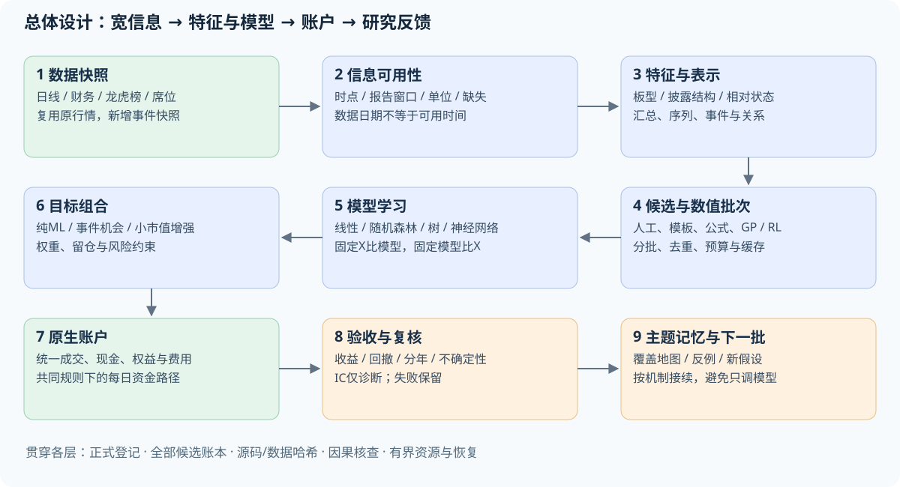
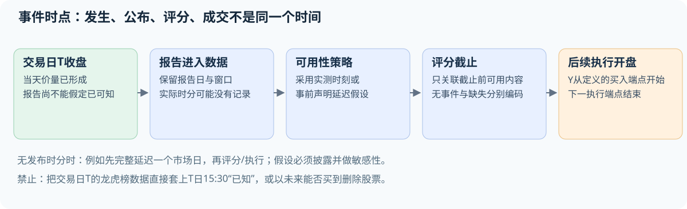
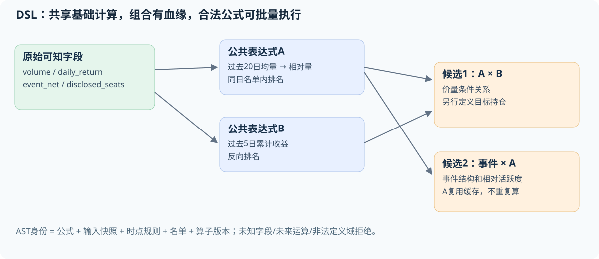
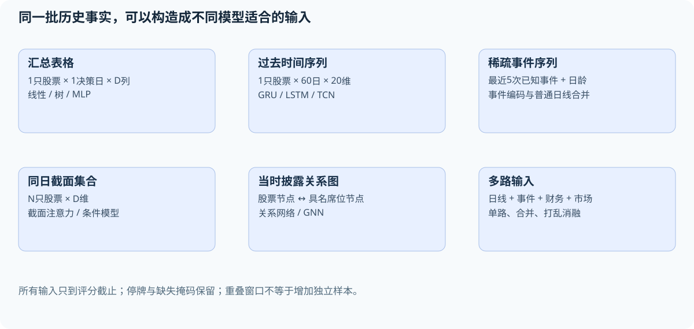
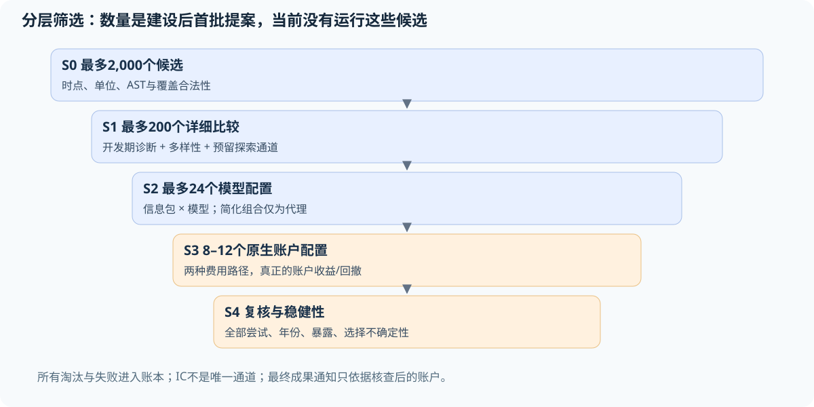
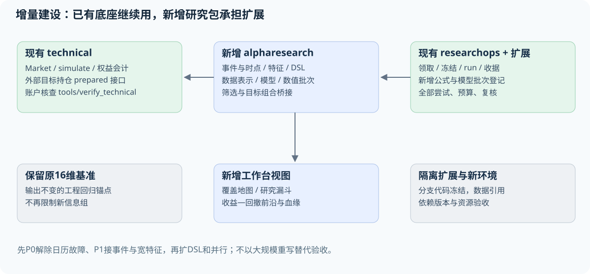

# 从16个特征的小实验，扩展到可批量研究的量化机器学习系统

**2026-10-05 · 系统蓝图 v0.1 · 设计任务 task-1c49d3f311dc**

这份文件回答的是：我们的数据还可以怎样用、哪些模型值得比较、如何自动构造组合特征、怎样把大量候选筛选落到代码，以及现有项目究竟需要改哪里。文中的新模块、候选公式、规模和验收要求都是建设设计，不表示已经实现或已经盈利。现状依据是实际源码、Parquet元数据和已有登记实验；本次没有新增模型训练或策略账户。

## 1. 先给结论，也承认前面研究范围的问题

**你的批评有依据。原16维价量输入只是最小基准，不足以代表你要求的广泛研究。我们没有证据支持“龙虎榜、板型、复杂特征或其他模型不值得继续尝试”。**

现在项目有可复用的日线账户、数据快照、实验登记和证据核查基础，但机器学习研究部分仍接近“几个固定实验的执行器”。尚未形成能统一处理事件、公式、序列、多个模型及大规模候选的研究系统。建设的重点是扩展研究层和数据接口，不需要先推翻账户引擎。

前面把研究越做越窄，主要有四个原因：

1. 起步先做了一个易核查的16维基准，这个起点合理；后来却继续围绕它安排研究，没有及时把数据和模型扩展列为独立主线。这是研究规划不足。
2. 主线 `src/mlresearch/contracts.py` 直接限制特征组；`complete/universe` 矩阵限定周频、Top100、原16维。增加一个新信息组经常需要新分支和专门核查器，而不是登记一个特征包。
3. 龙虎榜特征和旧板型研究分布在旧事件模块，当前 `technical` 行情快照不读取或冻结龙虎榜。数据在项目里，当前ML入口却没有消费它们。
4. 自动循环主要在调度AI研究会话，没有通用数值候选调度层。一小组实验也要经历阅读、实现、归档和复核；这些工作消耗额度，却不会自然增加数值实验吞吐量。

严谨核查有价值，但不该成为长期只试几个相似模型的理由。改进办法是让同一份经过验证的接口服务大量候选，AI按“研究主题和批次”工作，数值程序在机器上执行批量计算。

## 2. 现在已经有什么，缺什么

| 部分 | 现在的实际情况 | 后续处理 |
|---|---|---|
| 日线行情与历史状态 | 已有行情、ST、限价有效性、证券主表和日历 | 保留；增加逐字段可用性与覆盖检查 |
| 公司行动与账户 | 主板原生账户及逐日独立核查可复用 | 作为所有候选的共同最终检验器 |
| 财务快照 | 已有公告日、报告日、股本、利润、权益、资产 | 增加统一PIT财务特征，保留修订与代理口径限制 |
| 龙虎榜 | 汇总、多个报告窗口、席位及集中度代码存在 | 新建事件快照及向全股票面板的时点关联 |
| 原16维特征 | 收益、波动、偏离、价量比和当日蜡烛特征 | 保留为回归基准，不再作为输入上限 |
| 模型 | 已有岭回归、受限提升树及有限消融/重训 | 新建模型注册接口与不同数据结构适配器 |
| 自动特征发现 | 没有统一的类型化DSL和搜索执行器 | 增量建设表达式、缓存、去重、候选生成 |
| 批量筛选 | 固定矩阵能跑，通用批次筛选尚未建立 | 增加批次清单、数值工作进程、分层淘汰 |
| 研究任务与冻结 | 已有领取、登记、失败保留、归档、复核 | 扩展批次登记，不改变既有证据身份 |
| 真正未见验证 | 已看历史不能恢复成未见样本 | 新增事前冻结的未来影子运行，届时才有新证据 |
| 专业流程整体 | 有一些关键基础，尚未完成广域研究平台 | 通过后文验收逐块补齐，不给虚假的完成百分比 |

判断“专业”主要看能否把信息可用时点、特征血缘、实验全部尝试、模型拟合范围、账户比较和研究交接统一起来。是否用了Transformer、多少行代码或拥有几万个公式，不能单独回答这个问题。

## 3. 数据盘点：确实还有大量内容没有进入ML

下列数量来自本次本机Parquet文件元数据。**行数证明文件规模，不证明每行有效、覆盖完整或可用于预测；本次没有对所有字段做全量质量扫描。**

| 当前文件/快照 | 行数或规模 | 内容与边界 |
|---|---:|---|
| `data/clean/daily_kline.parquet` | 8,680,769行 | OHLC、参考前收、量额、换手率、限价及有效性、历史ST |
| 主板快照 `31eef7349722ec89cd1a3743` 的bars | 5,814,596行 | 目前账户研究主要使用的行情；3,389只有行情的历史代码 |
| 扩展快照 `f3ea89a21a917b3247ceeba6` | 5,458只历史代码 | 主板3,389、创业板1,448、科创板621；无北交所，不是完整全A |
| `data/clean/lhb_summary.parquet` | 118,237行 | 选择后的股票日期事件；包含不支持市场和不同披露类型 |
| `data/raw/lhb_summary_reports.parquet` | 139,192行 | 保留多个原因/窗口的源报告 |
| `data/clean/lhb_broker_detail.parquet` | 1,177,284行 | 买卖方向、排名、名称/代码、金额、报告ID、窗口、披露类型 |
| `data/factor/lhb_event_factors.parquet` | 118,237行 | 已有买一/卖一集中度、买卖比、净买比、机构席位计数等 |
| 主板 `fundamentals.parquet` | 133,367行 | 报告日、公告日、股本、归母利润、总权益、总资产，共7列含代码 |
| 主板 `actions.parquet` | 19,194行 | 当前账户使用的公司行动记录 |

### 3.1 已存在但未接入当前ML的例子

`src/features/compute_lhb_factors.py` 已计算 `buy1_concentration`、`sell1_concentration`、`buy_sell_ratio`、`net_buy_ratio`、`net_buy_float_mcap_ratio`、`inst_buy_count`、`inst_sell_count`、`inst_net_seats`、`northbound_buy` 等。

`src/features/build_lhb_features.py` 已保留报告窗口和席位来源。`src/workbench/data.py` 有机构披露净额和当时价量关联逻辑，可以借用其定义和测试经验；它把事件次日09:00作为**假定**可知时间，这不是实测发布时刻。

现有事件宽表按股票/日期聚合，不能完整表达同日全部报告ID。新事件快照应从保留的报告源和席位明细建立 `(stock_code, report_id, disclosure_date)` 主键、窗口起止与可用时点，再选择或关联。实际窗口包含1、3、10、30日和未知异常期间，不仅是单日/三日两类。

旧因子也不能整表原样当作已统一的X：买一/卖一集中度实现允许对部分缺失席位求和；部分净买比字段只在全列缺失时重算。新特征版本应重新核查完整席位、相同报告窗口、分母和来源单位，保留旧定义对照与改变原因，而不是静默覆盖旧表。

`research/exp03_board_chasing.py` 到 `exp06_seal_predictors.py` 曾研究连板、封板和炸板。它们是历史探索资料，不能直接当作当前通用、无泄漏的特征服务。

### 3.2 接入前必须区分四种情况

| 状态 | 例子 | 系统应怎样处理 |
|---|---|---|
| 有原始字段且能构建 | 同窗口买一占前五买入金额比例 | 核查完整性与窗口，登记公式 |
| 有字段但可用时点未完整记录 | 龙虎榜当天报告只有日期，没有发布时分 | 使用显式假设和延迟敏感性；不能自动设为收盘已知 |
| 可以由日线做近似描述 | 同日触及涨跌停两端 | 用准确名称，不宣称恢复盘中顺序 |
| 当前缺乏所需数据 | 封单金额、开板次数、逐笔委托撤单、完整历史行业成员 | 放入待补数据目录，不生成伪特征 |

财务快照不含完整现金流、营业收入、分析师预期或全部修订版本；不要把新加几项利润比值称为“完整基本面”。扩展板块快照主要用于学习，主板公司行动和会计支持不能自动推广到其他板块。

## 4. 特征、alpha、模型、策略分别是什么

用人话说：

- **特征**：对当时情况的描述，例如“今天买一占披露前五买入金额的40%”。
- **候选alpha**：希望能预测后来表现的信号，例如“集中买入、相对强净买、且最近不是极度拥挤的股票，是否更值得买”。它可能是一条公式，也可能是模型评分。
- **模型**：从历史里学习这些描述怎样组合，例如集中度在首板和四连板时是否有不同作用。
- **策略**：何时评分、从什么名单选多少股票、分配多少资金、何时调整。
- **账户结果**：依照共同规则实际模拟后，资金曲线得到的收益和回撤。

“alpha”在因子研究中常被宽泛地用作预测信号；在资产定价中也可指风险因子调整后的超额收益。文中“候选alpha”不等于已经证明存在这种超额收益。

**你说的二次、三次、四次构建可以做。它们更接近组合深度，不一定是数学上的高维。** 一条由五个运算组成的公式仍可能只输出一个数；同时使用300个不同公式才是300维输入。

组合不会凭空增加原始信息，但能把信息变得更适合某个模型。线性模型看不到的条件关系，乘积、分段或序列编码可以显式表达；树和神经网络也能隐式学习部分组合。需要比较手工结构与模型自动学习的增量。

## 5. 总体架构：在现有底座上补齐研究层



上图的绿色部分主要复用现有能力，蓝色部分是新增研究层，橙色部分是检验与反馈。完整关系如下：

1. **数据层**提供只读快照：日线、状态、财务、龙虎榜报告及席位。新增事件快照引用行情快照，不复制整份大数据。
2. **时点层**回答每个值何时可知、覆盖是否完整、单位和报告窗口是什么。
3. **特征层**把原始事实变成可复用的日线、事件、序列或关系特征，并记录计算公式。
4. **候选层**允许人工假设、论文复现、模板枚举、遗传程序、强化学习或LLM提出候选。
5. **数值执行层**批量计算与筛选，在固定预算内并行执行，不让每个公式触发一个新AI会话。
6. **模型层**学习单个或多个特征的组合，输出统一的股票评分/收益分布。
7. **组合层**把评分变成目标持仓，独立比较等权、低换手、风险约束和模型组合。
8. **账户层**通过现有原生账户和核查器给出最终收益、回撤及费用路径。
9. **研究层**记录全部尝试、复核、负面结论和下一阶段计划。论文指标和代理筛选不能冒充账户成功。

这九层是责任划分，开始可以仍在一个Python项目里运行，不要求九个微服务。

## 6. 一次实际研究怎样走完：以龙虎榜集中度为例

假设研究命题是：“强净买是否只有在买方比较集中、同时不是已经连续大涨很多天时，才提供选股价值？”这只是可检验假设。

### 6.1 每天数据进入系统

收盘后，行情记录当天OHLC、量额和状态。龙虎榜报告在自己的可用时间进入事件表。系统保留 `report_id`、统计窗口和披露类型，而不是只保留一个净买数字。

事件适配器把已可知事件关联到每只股票当天的输入。没有龙虎榜的股票仍留在全市场模型名单里。系统分别记录“确认没有事件”“采集未覆盖”“有事件但席位缺失”，不能全部填零。

### 6.2 某个调仓日为每只股票构造X

例如一只股票的X包括：过去20日收益、近20日成交额、当前连板长度、最近一次可知龙虎榜距今几天、同窗口买一集中度、净买强度、机构披露占比、当前市场涨停广度、PIT财务比值及缺失标志。它是一个按定义生成的向量，不再固定16维。

模型可以分别接收：一行100个汇总特征；过去60日×20个日线特征的序列；最近5次事件×若干事件属性。具体维度必须由特征包声明，不能只写“全部信息”。

### 6.3 训练、评分与交易

训练仅使用当时已成熟的Y。冻结的模型给当前共同名单中的每只股票评分，组合器选择目标持仓，下一个已定义可交易开盘执行。使用龙虎榜当天信息，必须确保它在评分截止前已经可知。

当前主基准是周末决策、下个市场开盘执行，标签从下个执行开盘到再下一次周调仓开盘；节假日按日历寻址。它不是统一的“周一开盘到周五收盘”。新实验可改日频或持有期，但X的可用时点、Y的起止和账户规则必须一同声明。



没有实际发布时刻时，可以预先声明“该报告交易日之后一个完整市场日结束才视作可用”，再在之后开盘使用；这是延迟假设，不是历史发布时刻认证。另一组可检验次日开盘可用的假设，但必须披露来源与敏感性，不能在结果好时才挑延迟。

## 7. 需要建设的特征目录：有意义的结构优先

下面是候选目录，不是有效策略清单。单个原始字段、归一化、事件属性和组合分别登记；完整机器可读目录见文末附件。

### 7.1 价量与交易行为

| 候选描述 | 构建方式/含义 | 可用性与注意点 |
|---|---|---|
| 开盘跳空 | open/pre_close−1 | 收盘评分时可知；开盘前不能用当日open |
| 隔夜与日内收益分解 | 跳空、close/open−1及两者关系 | 检验动量来自哪个交易区间 |
| 上下影线 | (high−max(open,close))/pre_close；下影线相应定义 | 结构描述，不证明买卖盘意图 |
| 路径效率代理 | 一段净收益绝对值/逐日绝对收益之和 | 区分连续推进与来回震荡 |
| 下行半波动 | 只对负收益做二阶统计 | 与普通波动不同的风险信息 |
| 量价方向不对称 | 上涨日和下跌日的量额强度差 | 避免把正负方向混为一个均量 |
| 流动性冲击代理 | abs(return)/amount等 | 单位核查；不等于盘口冲击测量 |
| 日均成交价格代理 | amount/volume | 核查量额单位；不是某时刻可成交VWAP |
| 换手与成交额偏离 | 原换手率/自身过去分布 | 当前ML快照未必保留换手率，需补充冻结来源 |
| 极端日及修复状态 | 已发生极端涨跌、随后已观察修复 | 阈值只在训练确定；不能按未来表现删事件 |

### 7.2 A股涨跌停与板型

| 候选描述 | 过去事实的定义 | 数据限制 |
|---|---|---|
| 收盘涨停/跌停 | 收盘等于当日已核验限价 | 限价未知时留未知，不用今天名称反推旧ST |
| 首板、当前连板长度 | 沿市场日历向过去累计收盘涨停 | 停牌、缺行情、制度例外单独处理 |
| 一字涨停/跌停 | OHLC均等于相应限价 | 可描述形态，不能判断排队是否成交 |
| 触板未封 | high触涨停但close未涨停；跌停对应 | 一天内触及次数和时间未知 |
| 高开跌停/低开涨停 | open接近一端、close在另一端 | 可定义日线形态，不能恢复途中完整路径 |
| 同日两端触及 | high与low分别触及两端 | 无法确定“先天后地”还是“先地后天” |
| 断板后已观察修复 | 过去连板结束后当日表现 | 不包含后来是否重新连板 |
| 距上次触板/封板日 | 过去事件的市场日龄 | 对无事件与记录未知分开编码 |
| 板强度与成交活跃度 | 板型×相对量额、换手 | 不是封单强度；需要单位与覆盖检查 |

**特别注意**：旧 `generate_future_labels.py` 中 `within_5d_limit_up`、`continue_board_*`、`next_day_open_at_limit` 等很多列描述的是未来，只能作为Y或诊断。旧配置中的“排除次日无法买入事件”也是事后条件，不能照搬成当时可选名单。当天首板等过去事实应重新从因果输入生成并独立核查。

### 7.3 龙虎榜结构与席位

| 候选描述 | 示例定义 | 需要守住的边界 |
|---|---|---|
| 买一/卖一集中度 | 第一席金额/同侧披露前五金额 | 前五不全时不能悄悄当完整五席 |
| 披露席位HHI | 同侧各席占比平方之和 | 仅披露席位集中度，不是全市场持仓集中度 |
| 买卖集中度差 | 买方HHI−卖方HHI | 同一报告窗口、已知方向 |
| 买卖不平衡 | (披露买额−卖额)/(买额+卖额) | 有界强度；不是全市场资金净流入 |
| 机构披露金额占比 | 可辨识机构席位金额/同侧披露额 | 机构专用是匿名类别，不是同一基金身份 |
| 席位方向重叠 | 可辨识营业部同时出现在两侧 | 匿名席位不跨方向强制合并 |
| 单日净买/成交额 | 同日同窗口的披露净额/当日amount | 三日榜不能除以一天amount冒充同口径 |
| 多日榜归一化 | 多日净额/同窗口累计成交额 | 窗口完整且明确时才计算，不平均成逐日实际流量 |
| 已发生事件密度 | 近期上榜次数、最近上榜日龄 | 重叠报告不可重复累计同一段金额 |
| 可知事件持续性 | 过去若干有效报告的方向一致性 | 明确单日/多日分组，缺失不是0 |
| 具名席位历史行为 | 当时已成熟历史的方向、持有代理及后续标签统计 | 必须时间折外编码与标签成熟；不能用全样本席位成功率 |
| 股票—席位关系 | 当时可知披露形成的关系边 | 只是公开披露子图，不是全市场真实资金网络 |

普通席位披露、投资者分类披露和融资融券监控披露不能直接混算。采集表中的提供方后续收益、解读成功率、当前名称等不进入预测X。项目数据约定已写明这些限制，应把它们变成程序契约。[项目数据约定](DATA_CONTRACT.md)

### 7.4 财务、市场环境与交叉结构

| 候选描述 | 当前可做的范围 | 当前不能直接声称的内容 |
|---|---|---|
| EP、BP、利润/权益代理 | 已公告年度利润与权益结合当时股本价格 | 年度利润不是TTM；总权益不是归母权益 |
| 利润及资产变化 | 同可比报告期、公告可知后同比变化 | 原字段累计/单季语义需先核查 |
| 财报龄与修订风险标志 | 公告距今、期末距今、缺失 | 缺完整版本史，不能认证真正原始时点版本 |
| 主板市场状态 | 当时股票等权收益、波动、涨跌广度 | 不是完整全A指数；不能用未来存续名单回算 |
| 涨停/跌停市场广度 | 当时支持名单的触板、封板、连板分布 | 指标分母及未知限价占比必须报告 |
| 个股相对市场 | 相对收益、过去beta/残差、下行关系 | 过去拟合，不以未来beta残差化 |
| 龙虎榜×板型 | 集中度在首板/高连板的差异 | 保留结构假设；不要枚举任意深度无限乘积 |
| 净买×拥挤×市场状态 | 资金集中、过去涨幅、市场广度交互 | 多个经济解释可能相反，正负方向只在开发区间确定 |
| 财务×行为 | EP与相对交易活跃度、利润变化与日内修复 | 区分规模暴露和新增财务信息 |
| 行业/主题相对强度 | 只有取得历史成员或有效当时标签后 | 当前行业或热点名单不能回填整个历史 |

没有必要为每个指标随意试1到500天。第一版使用少量有解释的时间尺度：事件日、交易周、交易月、季度公告和半年趋势；变化的时间尺度本身也属于尝试，全部记录。没有机制约束的窗口堆积容易变成同一信息的重复搜索。

## 8. Alpha DSL：让组合特征成为可登记、可批量执行的对象

DSL是受限制的表达式语言。研究者描述一个公式，系统检查输入、运算和时间，再确定性地计算。它不应允许生成器随意执行Python代码。

例如原提议：

```text
cs_rank(-past_return(5)) * cs_rank(volume / ts_mean(volume, 20))
```

`cs_rank` 表示在当天同一名单内排名；`ts_mean` 表示某只股票向过去求均值。这里输出的是“过去跌得较多而成交相对活跃”的评分，不包含仓位或收益承诺。交易策略还要另行定义。

一个龙虎榜候选可以写成：

```text
where(event_known,
      cs_rank(event_net_imbalance)
      * cs_rank(buy_top5_hhi)
      * (1 - cs_rank(past_return(20))),
      missing)
```

含义是观察净买方向、披露买方集中和过去涨幅的交互。它只在事件可知时有值；全市场模型可把该值与事件有无、日龄和其他特征一起输入。若把它直接做独立选股，事件股票不足Top100时的剩余现金/补足规则必须预先定义。

### 8.1 第一版运算符

| 类别 | 运算 | 应有的契约 |
|---|---|---|
| 数值 | add/sub/mul/safe_div/abs/log1p | 单位、定义域、除零与有限性 |
| 当日截面 | cs_rank/cs_zscore/group_demean | 名单、分组及当时可知成员；稳定并列排序 |
| 过去时间 | lag/delta/ts_mean/ts_std/ts_rank/ts_corr | 只允许过去窗口；按市场日历，缺失有明确定义 |
| 事件 | event_age/event_count/last_known_event | 已知发布时点、报告窗口、稀疏与缺失区分 |
| 条件 | where/clip/indicator | 条件也必须当时可知；阈值来源固定或只拟合训练 |
| 暴露处理 | residualize/neutralize | 暴露与回归只用当时可用数据；标明代理口径 |

### 8.2 每条公式记录什么

记录规范化AST、输入字段、数据快照ID、源文件哈希、单位、最大回看、可用时间策略、股票名单版本、缺失规则、所用常量、代码/算子版本、计算类型和解释。AST就是公式的运算树；不需要使用者读编译器知识才能写一个候选。

输出一个数不代表单独复制一列永久保存。公式可以延迟计算；共享子表达式只算一次。缓存键必须同时包括公式、快照、时点规则、名单和代码版本，不能只用名称。



“depth≤4、nodes≤20”等可以作为第一版复杂度预算；这是搜索工程规则，不是科学上保证四层最有效。首轮从浅层结构开始，复杂公式要证明相对简化公式的增量。

## 9. 自动寻找特征：不仅一种办法

| 路线 | 适合的角色 | 第一阶段取舍 |
|---|---|---|
| 研究者手工假设 | 龙虎榜、板型、数据口径、机制解释 | 先建立高质量种子和反例 |
| 可解释模板枚举 | 事件×价格状态、买卖不平衡×集中度 | 批量生成数百/数千候选的首选 |
| 已公布公式迁移 | Alpha101、Qlib特征族 | 逐项检查字段、名单、算子和市场差异 |
| 遗传程序GP | 在受限AST里交叉、变异、保留多样性 | DSL执行和候选账本建立后比较 |
| 符号回归 | 同时寻找表达式结构与数值常量 | 金融目标和时间验证需自行适配 |
| 强化学习公式生成 | 逐步选择运算符，奖励组合增量 | 与模板/随机合法AST/GP公平比较 |
| LLM生成 | 提出经济命题、公式和反向预测 | 按主题批量提案，不逐股实时随意发交易指令 |
| 神经网络表征 | 学序列、事件、关系的隐含组合 | 与显式公式并行存在，不强制翻译回公式 |
| 搜索代理模型 | 用已有结果预测哪些候选更值得计算 | 防止只在既有高分同类附近越搜越窄 |

这些路线都应有随机合法公式、简单人工种子及固定模型对照。所谓智能搜索要在相同数值计算和AI调用预算下证明价值，不能靠多跑几百倍尝试得到更好冠军。

AlphaGen强调因子集合的协同作用；AlphaForge把挖掘与动态组合分开。可以学习它们的设计，但它们主要的搜索指标并不自动等于我们账户的收益/回撤。[AlphaGen论文](https://arxiv.org/abs/2306.12964)，[AlphaForge论文](https://arxiv.org/html/2406.18394v5)

## 10. 梯度下降能不能找到这些组合？

**有些部分可以，公式结构本身通常不是直接对收益率反向传播就能解决的。**

假设已经有100个可知特征，模型 `score = Σ(w_j × x_j)` 可以对系数w求梯度；MLP、GRU、TCN等也可以学习非线性表示。训练损失可以是收益回归、排序、分位数或多任务损失。

但“用乘法还是除法”“回看5日还是20日”“增加哪个事件算子”是离散选择，普通梯度下降没有直接对应的连续导数。GP、RL或LLM可以搜索运算树；也可以用连续松弛或可微代理指导搜索，再把提议转成合法公式，并在真实数据上重新计算。

AlphaForge使用可微生成器和评分代理，说明这条路线可研究；它不是让真实账户回撤直接穿过全部离散交易规则求导。PySR的演化搜索与常量优化也提供了可复用思路。[AlphaForge方法](https://arxiv.org/html/2406.18394v5)，[PySR论文](https://arxiv.org/abs/2305.01582)

账户里的TopK、涨跌停阻止成交、整数股、换仓和最大回撤通常非光滑。可以研究可微近似组合及风险/换手惩罚，但最终仍需回到共同账户核查。**局部最优说明优化器在给定样本和目标下找到一个解，不说明找到真实规律，更不保证未来有效。**

训练目标、模型选择指标和最终接受标准可以不同。例如用稳健回归方便训练，用开发期账户收益与回撤选择少量模型，最后检查冻结候选的账户与不确定性。让IC做诊断、让收益回撤做接受标准，二者可以共存。

## 11. 不同模型需要什么样的数据



| 表示 | 输入的具体样子 | 我们现在能怎样构建 |
|---|---|---|
| 汇总表格 | 每只股票每决策日一行，例如100个特征 | 最先扩展的通用面板；树、线性、MLP可用 |
| 时间序列 | 每只股票过去60个市场日×20维 | 从日线构建，停牌/缺失掩码独立保存 |
| 稀疏事件序列 | 最近若干次已知龙虎榜的属性与时间间隔 | 保留不规则日龄，不能伪装每天都有事件 |
| 截面集合 | 同一天N只股票×D维 | 日期分批，截面操作/注意力；不能混入未来样本 |
| 股票—席位图 | 当时具名营业部与股票的披露关系 | 具名身份稳定性核查；匿名机构不当作同一主体 |
| 多路输入 | 日线编码+事件编码+财务+市场状态 | 首先比较每路单独、合并和打乱对照 |
| K线图片 | 过去窗口画成图 | 可研究，但需比较数值输入；图片不增加原始信息 |

序列只是重新组织过去数据，不会把60天重叠窗口变成60倍独立证据。新增事件、财务和市场信息比单纯把同一价量表reshape更可能增加信息来源；这也是要优先接入它们的原因。

## 12. 模型目录：树以外确实有很多值得试

| 模型族 | 要验证的能力 | 适配与先后顺序 |
|---|---|---|
| Ridge/ElasticNet | 高维特征线性组合、稀疏选择 | 当前依赖可支持；作为低成本透明基准 |
| 稳健线性/分位数回归 | 少受极端标签影响、学习收益分布 | 注意尾部也是收益来源，不能只把尾部删掉 |
| GAM/样条/显式交互 | 介于线性和复杂树之间的可解释非线性 | 检验集中度是否存在稳定分段关系 |
| RandomForest/ExtraTrees | 与提升树不同的随机集成结构 | 控制训练预算、树数与样本依赖 |
| HGB/LightGBM/XGBoost/CatBoost | 非线性与特征交互 | HGB已可用；其他依赖按版本隔离引入 |
| 排序学习模型 | 更直接学习同日相对排序 | 按日期分组；不能把RankIC提升直接判为成果 |
| MLP/表格网络 | 连续组合、高维表示 | 先用小网络，与相同X的线性/树比较 |
| GRU/LSTM | 学过去序列演化 | 保留原始与归一化序列，明确长度和缺失掩码 |
| TCN/1D-CNN | 多尺度时间模式 | 可比循环网络更易并行；实际成本要测量 |
| Transformer/时序注意力 | 远近时间和条件依赖 | 参数量、数据有效时间长度、内存需控制 |
| GNN/图注意力 | 席位/股票/当时关系的信息传播 | 在关系质量通过后做；避免未来边和全样本图 |
| 多专家/TRA类 | 不同市场状态或事件机制由不同专家处理 | 路由只能使用当时信息和成熟的过去误差 |
| MASTER类市场条件模型 | 市场状态影响特征权重与股票关系 | 需要日期截面批次和市场输入 |
| 多任务收益+风险模型 | 同时预测收益、下行风险、事件修复 | 每个任务的标签成熟和缺失独立核查 |
| 直接组合/策略学习 | 学持仓权重而非单只股票Y | 后置；必须处理长仓约束和与原账户的近似差异 |

Qlib官方基准已经提供线性、树、MLP、GRU/LSTM、TCN、Transformer和其他模型的统一工作流，支持“扩展表示和模型”的方向；它并不证明哪一类模型一定最强。其公开表格的名单、区间、超额收益/年化口径和交易规则不能直接对照我们的CAGR。[Qlib基准](https://github.com/microsoft/qlib/blob/main/examples/benchmarks/README.md)

TRA和MASTER可以作为后续结构研究来源，而非立即照抄论文收益。[TRA论文](https://arxiv.org/abs/2106.12950)，[MASTER论文](https://arxiv.org/abs/2312.15235)

当前虚拟环境有sklearn、numpy、scipy、duckdb、pyarrow、joblib；本次检查未发现lightgbm、xgboost或torch。这个依赖现状是实施顺序的因素，不是排除其他模型的研究理由。本次未核查GPU，不假定有可用训练GPU。

## 13. Y、训练损失与终极目标怎样对应

| Y/任务 | 学什么 | 与账户的联系及限制 |
|---|---|---|
| 执行开盘到下次执行开盘收益 | 参考价衔接的持有区间收益代理 | 原周频训练还减去同日有效标签均值；不含买入前跳空，也不等于含费用及权益应收的账户收益 |
| 同日相对收益/排序 | 当时股票谁相对更好 | 排序提高可能改善中间组，而Top100和账户未改善 |
| 多期限收益 | 1、5、20日等不同预测尺度 | 日历和成熟截止各自定义；不是每种都同日可训练 |
| 收益分位数/下行尾部 | 同时了解收益和风险分布 | 风险评分的价值要在组合账户验证 |
| 未来路径不利波动 | 期间最大不利变动、触板等 | 可作Y，但日线不能模拟所有盘中止损的真实成交 |
| 事件后修复/持续 | 当时事件随后是否延续 | 不按未来“是否可买”筛掉坏样本 |
| 多任务 | 收益、风险、流动性或事件持续一起学 | 共用表示可能有增量，也可能任务互相干扰 |

纯收益回归可以用MSE、Huber等；排序有pairwise/listwise等损失；分位数有pinball损失；多任务需固定权重或只在开发期选择。具体损失都属于研究配置，不能看评价结果后悄悄更换。

不要求一开始就对最大回撤反向传播。我们可以先学收益和风险，再从多个账户候选形成收益—回撤的帕累托前沿：一个方案收益更高但回撤也更大，不能只报“更好”。

## 14. 股票名单、小市值和中性化：三条路线都保留

| 路线 | 选股是否先筛小市值 | 回答的问题 |
|---|---|---|
| 纯ML全共同名单 | 不先筛 | 新信息和模型能否独立形成策略 |
| 小市值增强 | 明确先筛/加入规模评分 | 在原强基准上有没有实际增量 |
| 暴露匹配/中性化诊断 | 约束或控制规模等暴露 | 新信号是否只是重新编码小盘/高波动 |

共同名单可以是当前合格主板名单，也可以是更宽的当时可用主板名单；两者都要保留适当对照。事件模型另有“全市场带事件特征”和“仅事件机会”的不同问题，不能把事件子池当全市场策略。

纯ML不要求排除规模信息；“是否使用规模”是一项明确消融。小市值是对照与一条研究分支，不是所有模型必须依附的底座。

中性化也不是必经的“专业认证”。可以比较原信号、过去可知规模/波动暴露残差和暴露匹配账户。只有取得历史行业成员后才做严格行业处理；自建少数代理因子的风险模型不能称为完整Barra产品。

## 15. 广度要写进预算，防止系统再次越搜越窄

第一版建立以下并行研究主题：价量结构、涨跌停/板型、龙虎榜结构、事件持续与席位、PIT财务、市场环境、跨组交互、序列表示、关系表示、组合与风险、训练窗口/漂移、模型结构。

研究主题注册表记录每类当前覆盖、已尝试次数、最后一次新证据、失败原因和待补数据。每一研究周期必须说明哪些主题得到预算、哪些被推迟及理由；不能因为树模型工具已经写好就永久只做树。

一个**建设完成后的首批规模提案**如下，不是已经启动的实验：

| 层级 | 预设规模 | 数量到底表示什么 |
|---|---:|---|
| 基础特征种子 | 约80–150条定义 | 去重后的有解释特征，不是80个策略 |
| 模板与浅层公式 | 首批最多2,000条合法候选 | 公式结构、方向和参数全部计入尝试 |
| 低成本开发期筛选 | 最多200条进入更详细比较 | 保留不同机制与低相关性，不只按全截面IC |
| 特征包×模型 | 首批最多24个配置 | 如6个信息包×4个模型；分别冻结 |
| 原生账户晋级 | 首批8–12个配置、两种费用路径 | 最终策略证据；控制账户可核查后复用 |
| 后续扩容 | 先评估1,000/2,000的吞吐再到10,000 | 扩容是新登记批次，不在旧预算内无限追加 |

完整全因子笛卡尔积会迅速变成几十万次拟合，初期用分块设计：固定模型比较信息组、固定信息组比较模型、最后验证少量交互。这个设计允许广泛探索，同时能知道提升来自哪里。

这里的24是**模型配置数**，8–12是**目标组合配置数**；12个组合×2个费用情景是24条账户路径。第一次示范批次可固定每配置仅拟合一次，共最多24次拟合尝试，预处理范围一并冻结。年度重训、额外seed、调参或失败重试均另耗拟合名额，不能塞进“24配置”后隐去成本；这些后续路线另行有界登记。

例如公式搜索先按8个机制家族分配基础额度；选择部分低相关候选，另留预定探索名额测试稀疏事件、非线性组合和低IC但可能有条件收益的候选。实际家族数与名额写进批次协议，不事后按赢家改解释。

## 16. 为什么不直接对一万个候选做全部完整回测？



可以对很多候选计算信号和组合代理，但不能把一万个完全不同的模型、每个多年份重训、多个费用账户和独立复核等同于一万个简单公式计算。

| 阶段 | 执行内容 | 可以拒绝什么 | 不能声称什么 |
|---|---|---|---|
| S0 数据与公式检查 | 时点、单位、覆盖、常数列、合法AST、复杂度 | 不合法或不可算候选 | 不代表策略收益失败 |
| S1 批量信号诊断 | 开发区间IC、组内/TopK关系、稳定性、事件覆盖 | 单一机制重复、明显不稳定 | IC最高不等于赚钱最多 |
| S2 简化组合筛选 | 固定名单和权重的低成本净值代理、收益/风险/换手 | 明显不具备组合价值的方案 | 代理不是原生资金账户；不作成果通知 |
| S3 原生账户 | 少量冻结候选×费用情景 | 在共同会计下未达账户标准的方案 | 同期历史好不等于真正未见成功 |
| S4 稳健性与独立复核 | 分年、暴露、典型路径、配对区间、全部搜索选择影响 | 结果被泄漏、口径或单一时期解释 | 不用两个角色名冒充机构认证 |
| S5 未来影子记录 | 事前冻结、逐期记预测与真实新数据 | 看新时间里的失效与漂移 | 尚未运行前不预报未来验证结果 |

S1不能只用IC一刀切。少数稀疏事件可能全市场IC低，但事件条件下有价值；有些信号在单独交易时弱，组合后互补。系统要保留预先约定的多样性/探索通道。

S2先作为**明确受限的近似**，并用少量共同策略核对与原生账户的偏差。无法复现原账户关键规则时，就只用于粗筛，不输出“已审计收益”。对进入S3的候选必须走正式登记执行器，不能绕过 `register/run`。

## 17. 并行计算、内存和额度：分别管理

本机盘点：16个逻辑CPU，物理内存33,492,422,656字节，约31.2 GiB；盘点时可用约12.5 GiB。可用内存随其他应用变化。没有基于这些数值实测公式吞吐，因此不能现在承诺“每小时必跑一万个”。

### 17.1 不能一次把所有特征展开

8,680,769行×10,000个float32列，仅数值就约347.2 GB；即使按已有周面板940,485行计算，也约37.6 GB，尚未包含索引、临时拷贝、模型和事件表。大于当前可用内存。

按周面板每批64条float32特征，数值本体约241 MB；日线全量64条约2.22 GB。实际需额外工作空间，所以先采用32/64条分批、日期/股票分区、公共子表达式缓存和只持久化必要结果。序列张量按批次生成，不永久展开所有滑动窗口。

### 17.2 数值并行与AI并行不是一回事

第一版建议从2个数值进程、每个最多4个底层线程起步，测量后再考虑4个进程。Windows使用进程时避免把大DataFrame反复序列化；通过只读文件、内存映射和小配置传任务。不能16个进程各自再开16个BLAS线程。

线程上限和内层并行需要显式控制；Joblib/sklearn官方文档说明了多进程与底层线程叠加造成的过度订阅问题。[Joblib并行说明](https://joblib.readthedocs.io/en/latest/user_guide/parallel.html)，[sklearn资源管理](https://scikit-learn.org/stable/computing/parallelism.html)

研究任务数据库保持小型元数据和状态，数值大表放Parquet/DuckDB与分区文件。先保留SQLite WAL和集中写入；没有证据要求马上换成大型数据库、云集群或Kubernetes。

资源验收先运行固定32/64候选的小批，记录峰值RAM、磁盘写入、每候选耗时和恢复行为，再决定1,000/2,000/10,000级预算。调度器执行前原子预留内存和拟合/账户名额；总资源越界排队或失败，不让多个进程分别误判“还有12 GiB”。缓存有预先设定的磁盘上限，只清理可重算且未被运行引用的缓存，永久证据和冻结输入不参与自动淘汰。首版上限根据这一小批实测登记，而非凭CPU数承诺吞吐。

### 17.3 预算至少分六项

分别记录合法候选数、全部尝试数、模型拟合数、账户路径数、CPU/墙钟与内存、AI调用数及可读到的额度。候选生成、筛选、拟合、账户和复核都要有上限；失败也计数。

前一轮8个新策略/16个费用路径的登记矩阵执行315.17秒，另一次统计8.03秒；这是那个固定评分实验的记录，不能直接推算新模型或一万个账户的成本。它说明数值执行与完整AI会话的耗时不是同一件事。

额度不足时保存任务、批次游标、候选账本与收据。只有平台实际给出可用额度和重置时间时才安排接续；不靠猜测“固定五小时后一定恢复”。当前总控仍是有界本地调度，不能因此宣称无限常驻研究。

## 18. 上万个尝试后，怎样避免挑出历史幻觉

**尝试越多，越容易挑到噪声冠军。多跑是扩大探索范围的方法，不是提高结论可信度的方法。** 回测过拟合研究明确讨论了从多个候选中选择赢家带来的问题。[Bailey等：回测过拟合概率](https://www.davidhbailey.com/dhbpapers/backtest-prob.pdf)

系统需要以下规则：

1. 生成器只读取开发区间反馈，冻结晋级候选后才开启下一层检验；策略代码和模型选择不读取后来账户赢家。
2. 按时间划分，以标签真正结束日期清除边界重叠；重叠20日Y不能按“股票行数随机分割”。
3. 每次拟合记录特征转换的拟合范围、标签成熟上限、所用版本、候选族、seed和选择规则。
4. 截面/席位target encoding、因子动态权重和状态路由只用当时已经成熟的过去标签。过去几日IC在Y尚未成熟时也是未来信息。
5. 记录全部合法与失败尝试，跨任务按实质定义去重；换名称、新Chat或模型名称不是新证据。
6. 用按时间块的配对区间、所有候选的选择影响、年份/机制稳定性和负对照分析不确定性。只对冠军做一个普通t检验是不够的。
7. 使用日期内打乱Y、滞后事件、简化公式、单信息组、规模匹配和无事件模型等对照；不要把同一机制的很多近似公式当独立发现。
8. 2024—2026-09-24已有结果已被反复看过；即便开发程序限制信息读取，研究者知道这段历史的结果，它仍是回顾性评价。新的未来时间与事前冻结日志才可能提供真正前瞻证据。

独立复核需要检查方法和数据，而不只是报告措辞。同一模型扮演不同角色也可能有共同盲点，报告保留这个边界。

### 18.1 统计检验具体覆盖什么

第一版对进入筛选的候选保存共同日期上的TopK或组合代理收益向量，并保留所有模型配置在选择区间的评分，而非只存赢家。对最终账户用同日期、同时间块的配对重采样比较收益差和回撤差；共同使用4/8周块只是两个敏感性设置，不保证选对真实依赖长度。

对于预先固定候选集合，可以用时间块重采样的最大统计量，或核对后引入Reality Check/SPA类方法处理该集合的选择影响。检验集合、比较基准、绩效定义及零假设必须在运行前写明；不同名单/缺失窗口不能假装同一个完整返回矩阵。代理收益上的校正只支持代理层，不自动传给账户层。

方法来源：[White：Reality Check](https://onlinelibrary.wiley.com/doi/abs/10.1111/1468-0262.00152)，[Hansen：Superior Predictive Ability](https://papers.ssrn.com/sol3/papers.cfm?abstract_id=264569)。它们用于明确集合下的比较，不代表解决全部自适应研究偏差。

RC/SPA需要事前定义的逐期损失或绩效差矩阵；不能直接把一个最终CAGR或最大回撤值塞进普通检验。账户CAGR/MDD的路径区间另行计算并说明重采样假设。

**8–12个晋级账户的区间不等于对2,000个公式及自适应生成过程完成了全搜索校正。** 如果生成器根据结果继续学习、研究者跨多轮改主题，固定集合的bootstrap也不覆盖全部选择。严格评估自适应搜索需要在外层时间折中重做内层搜索，成本另计；当前已看历史只报告这些边界，不能把它包装成确认性显著性。建设验收要求报告“检验覆盖的候选集合”和“未覆盖的适应性选择”，即使无法计算一项校正，也明确留空。

## 19. 最终接受标准始终是账户收益与回撤

每个晋级候选都必须报告：CAGR、累计收益、每日净值最大回撤、分年收益、回撤持续时间、实际平均仓位、换手/成交覆盖、费用反事实、暴露、事件覆盖和期末权益情况。IC、RMSE、分类准确率等放到诊断部分。

比较必须采用相同时间、资金、共同名单和会计；同时保留适当的小市值、固定组合/固定随机、简单价量及零费用对照。模型打乱标签对照尤其重要。

目前循环已有事前账户门槛：相对同池小市值，年化高至少2个百分点且最大回撤最多增加2个百分点；或者年化最多降低2个百分点且最大回撤至少改善5个百分点，并有分年及复核要求。这是该循环的工作门槛，不是行业统一标准，也不是你指定的唯一效用函数。

新系统可以继续保留这类门槛，同时显示完整收益—回撤前沿。不把极大降仓带来的回撤降低包装成在相近收益下改善；也不因为小市值收益高就永久锁死其他信息和策略。

AQR公开研究把机器学习与组合经济目标、成本后的风险收益前沿联系起来，支持我们将最终账户作为目标。这里引用的是公开研究思路，不声称复制其内部实盘系统。[AQR：Machine Learning and the Implementable Efficient Frontier](https://www.aqr.com/insights/research/working-paper/machine-learning-and-the-implementable-efficient-frontier)

原生账户是同一冻结模拟口径下的最终比较器，仍继承既有近似：开盘成交量约束使用执行日全日成交量，限价部分来自上游按规则生成；公司行动、修订和覆盖也有已有边界。账本核查证明计算一致，不能认证真实开盘容量。这里保留这些共同规则，不将工程核查扩大为实盘可实现性认证。

## 20. 代码具体怎样扩展：保留底座，新增接口



建议新增 `src/alpharesearch/`。名称可调整，责任边界应固定。下面全是待建模块。

```text
src/alpharesearch/
  contracts.py          # FeatureSpec、ModelSpec、StudySpec、BatchSpec
  availability.py       # 数据时间、窗口、单位与缺失/覆盖契约
  snapshots.py          # 事件扩展快照；引用原行情快照
  features/
    registry.py         # 特征目录、版本与依赖
    price_structure.py  # 结构价量，不重复原16维定义
    boards.py           # 因果板型与当前连板
    lhb.py              # 披露结构、席位与事件持续
    financial.py        # 可知财务及代理口径
    market.py           # 过去可知的市场状态
  dsl/
    ast.py              # 类型化公式树与规范化
    operators.py        # 允许算子及时间/单位规则
    compiler.py         # 共享子表达式DAG
    executor.py         # 向量计算、分区及缓存
  generators/
    templates.py        # 可解释模板与浅层枚举
    random_ast.py       # 合法随机负对照
    gp.py               # 后续受限遗传搜索
    llm_proposals.py    # 有来源的主题批量提议
    rl.py               # 后续公式生成研究
  datasets/
    tabular.py          # 汇总表格
    sequence.py         # 序列与缺失掩码
    events.py           # 不规则事件序列
    graph.py            # 当时关系边
  models/
    registry.py         # 拟合/预测/模型保存统一接口
    sklearn_models.py   # 首批已有依赖的模型
    neural_models.py    # 独立环境引入后建设
  screen.py             # 开发期多指标筛选与探索通道
  portfolio.py          # 评分变目标权重，保留不同路线
  account_bridge.py     # 正式登记后接现有原生账户
  batch.py              # 预算、候选账本、去重、检查点
  workers.py            # 数值进程资源限制与恢复
  audit.py              # 前缀、血缘、选择及数值独立核查
  report.py             # 人话说明+全部尝试+研究路径
```

复用 `src/technical/runner.py` 已存在的 `prepared` 和 `frozen_external_decisions` 接口。它已经允许外部评分/目标持仓进入共同账户，因此不需要为了LSTM或DSL重写现金、公司行动、税费、T+1等会计。

`prepared` 是内部传参入口，**不是自动核验任意新模型输出的通用边界**。新增 `account_bridge` 必须先检查快照身份、共同名单、唯一股票/日期键、决策与执行日历、所有依赖known_at≤评分/决策截止<执行时点、每次训练label_end≤训练截止、参考close来自冻结行情、评分/权重有限、长仓权重非负且总和不超过1、并列排序稳定、剩余现金规则、目标表哈希与特征/模型收据关联，再调用原账户和数值核查。非法权重、重复股票或错价必须在进入账户前失败并留收据。

账户继续使用原主板行情/行动快照，新增事件快照作为评分父清单绑定。现有 `tools/verify_technical.py` 对账户快照检查无LHB来源，并输出 `no_lhb_inputs=True`；这个旧字段不能扩大解释为“新策略没有使用龙虎榜”。工程接入要区分 `account_snapshot_has_no_lhb_sources` 与 `signal_provenance`，独立核查后者的事件哈希、时点与公式。改审计描述及接入契约作为工程任务，保留账本计算规则和冻结旧核查结果。

扩展 `src/researchops` 的正式登记类型：增加“特征/公式批次”和“模型/账户批次”，冻结生成语法、选择规则、代码、输入清单和预算。现在 `attach` 仅事后归档文件完整性，不能拿它替代未来批次的事前登记执行。

冻结分支中的 `fixed_blend`、`financial_context` 扩展先分别做工程合并与核查；不能因为某个分支跑过就声称主线入口已经支持它。

## 21. 对象接口与每次实验应保存的内容

以下为设计示例，不能直接提交给目前的 `MLSpec`：

```json
{
  "kind": "alpha_batch_v1",
  "data_snapshot": "31eef7349722ec89cd1a3743",
  "event_snapshot": "to_be_created_and_verified",
  "universe": "dated_mainboard_qualified_v1",
  "feature_pack": "price_boards_lhb_v1",
  "decision_time": "weekly_after_all_required_inputs_known",
  "label": "next_execution_open_to_following_execution_open",
  "search_period": ["2020-01-01", "2022-12-31"],
  "selection_period": ["2023-01-01", "2023-12-31"],
  "retrospective_evaluation": ["2024-01-01", "2026-09-24"],
  "generator": "typed_templates_depth_le_4",
  "budget": {
    "max_proposals_including_invalid": 4000,
    "max_legal_candidates": 2000,
    "max_model_configurations": 24,
    "max_fit_attempts": 24,
    "max_portfolio_configurations": 12,
    "max_account_paths": 24
  },
  "scenarios": ["configured_costs", "zero_trading_costs"],
  "status": "design_only_not_executable_in_current_dispatcher"
}
```

| 对象 | 最少记录 |
|---|---|
| FieldSpec | 来源、单位、事件发生日、最早可知时点、披露窗口、修订/覆盖状态 |
| FeatureSpec | AST或确定性函数、依赖字段、输出结构、回看、缺失处理、因果测试 |
| DatasetSpec | 名单、日历、日期、Y定义、输入形状、变换拟合范围 |
| ModelSpec | 模型族、参数、seed、损失、训练标签截止、依赖版本 |
| PortfolioSpec | 评分方向、目标数量、权重、留仓/换仓、事件不足规则、风险约束 |
| BatchSpec | 假设、生成器、预算、淘汰/晋级规则、已知历史范围 |
| CandidateReceipt | 规范化ID、父候选、状态、失败理由、耗时、是否被看过、选择层级 |
| AccountReceipt | 正式实验ID、目标持仓哈希、各费用路径、原生核查结果 |
| EvidenceSummary | 全部尝试、各层数量、收益回撤、局限、复核和下一步 |

特征缓存与研究账本身份不同：同一特征可在多个任务复用，但每次模型/组合选择与开发反馈必须有新的明确血缘。不能复制一个旧结果就算新增成功。

## 22. 分阶段建设与验收：不做一次性大重写

| 阶段 | 建设内容 | 可以验收的具体输出 | 进入下一阶段的条件 |
|---|---|---|---|
| P0 修复当前阻断 | 财务/市场代理的日历范围契约；主线扩展接入整理 | 执行器与核查器一致，真实越界案例和60日窗口测试通过 | 保留旧失败；新冻结登记预算合法，不重置旧任务预算 |
| P1 数据接入与因果特征 | 事件快照、known_at、板型和LHB/财务/市场特征注册 | 能解释每列X；因果前缀、窗口、缺失与单位验收；原16维输出不变 | 事件延迟假设明确；旧未来标签与提供方解读被拒绝 |
| P2 DSL与缓存 | 类型化AST、运算、共享子表达式、去重、批次登记 | 相同定义相同ID；截断未来数据不改过去值；缓存不跨名单/版本误用 | 解析/执行边界、稳定排序、零分母及覆盖失败可追溯 |
| P3 1,000级筛选 | 数值进程、批次游标、主题分配和全部尝试账本 | 运行一批固定公式；实测耗时/RAM；中断后恢复且不重算已完成候选 | 代理收益清楚标识，筛选不读评价反馈 |
| P4 多模型与完整账户 | 多信息包×线性/随机森林/提升树等；8–12账户 | 固定X比较模型、固定模型比较X；所有账户双费用和核查 | 阶段性收益回撤报告+负面对照+两个复核 |
| P5 序列/关系与智能搜索 | GRU/TCN/事件编码、GP，再比较RL/LLM等 | 相同预算比较生成器；简化/多路消融；稀疏与新依赖成本记录 | 新结构必须证明信息或组合增量，不能只比模型名称 |
| P6 持续研究与未来记录 | 主题知识库、漂移/失效管理、前瞻影子运行 | 每周期全部路径简报、未来事前预测与结果对应 | 重要通知仅来自经过复核的账户成果/需处理的实质阻断 |

阶段之间可对独立模块并行工程，但数据契约、登记和依赖验证必须先于相关账户研究。这里给的是工作与验收拆分，没有在尚未做性能测量时许诺若干小时即可全部完成。

**第一项具体行动是P0解除已定位故障，并建设P1事件数据接口。随后先用现有依赖完成宽特征基准，再扩展神经网络。**

P1建议先实现日线板型、龙虎榜浓度/不平衡/事件龄、财务代理和市场广度，不一开始同时引入大型图网络。理由是这些新增信息现在就在数据里，能直接回答“16维没有充分利用数据”这个问题。

## 23. 自动循环与人类报告应怎样改

自动循环的基本单位从“一个模型名字”变成“一个有机制解释的研究批次”。每批先声明信息包、名单、标签、模型范围、搜索预算、晋级标准和来源，然后运行、复核、整理、选择下一主题。

报告首页必须写清：新接入了什么数据、构造了什么X、训练了几次、实际新增多少账户、最好候选与共同基准的CAGR/MDD、是否有增量、哪些失败以及下一步为何改变。附录保存所有候选和参数，不只报赢家。

工作台增加三张视图：

1. **覆盖地图**：每个信息组和模型族试过多少、缺什么数据、上次结论。
2. **研究漏斗**：生成/合法/筛选/拟合/账户/复核各有多少，运行成本、失败、游标。
3. **账户前沿**：收益对回撤、各年份、规模/事件暴露及费用，点击可查到X/Y/公式/训练与账本。

额度状态、计算状态、工程阻断、普通阶段否证和重要收益成果分开显示。遇到值得通知的账户成果时，报告末尾简述自上次通知以来的研究路径；不是拿IC改善提前结束整个循环。

## 24. 外部研究与专业团队：可以借鉴什么，不能声称什么

我们能依据公开机构材料、论文和开源项目设计流程，不能据此完整知道美国、中国所有顶尖公司的内部系统、私有数据和正在赚钱的策略。以下是本次核对的一手来源；“借鉴”列是对本项目的设计推论。

| 来源 | 已公开的事实/研究主题 | 对本项目的借鉴与限制 |
|---|---|---|
| [WorldQuant BRAIN官方2026比赛](https://www.worldquant.com/brain/iqc/) | 历史数据、预定义算子与alpha模拟 | 公式研究是实际公开流程之一；不代表其全公司生产架构 |
| [101 Formulaic Alphas](https://arxiv.org/abs/1601.00991) | 公开101条公式 | 用作表达式与算子参考；并非当前A股盈利保证，所需行业等字段逐条核查 |
| [Qlib官方代码](https://github.com/microsoft/qlib) | 因子、模型、组合与评估的开放工作流 | 借用模块接口与基准组织；当前项目保留自己的原生账户 |
| [Alpha158/360源码](https://raw.githubusercontent.com/microsoft/qlib/main/qlib/contrib/data/loader.py) | 汇总特征与历史价量表示 | 学特征分类/输入表示；158/360是配置下的表示维度，不是同样数量已验证策略 |
| [Qlib模型基准](https://github.com/microsoft/qlib/blob/main/examples/benchmarks/README.md) | 多模型统一比较及组合指标 | 比较数据结构与完整工作流；不把表格收益直接当本项目CAGR |
| [AlphaGen，KDD 2023](https://arxiv.org/abs/2306.12964) | RL搜索协同因子集合 | 因子组合增量比单因子最高分更有意义；在本项目重新检验账户 |
| [AlphaForge，AAAI 2025](https://arxiv.org/html/2406.18394v5) | 生成—评分代理与动态因子组合 | 可微代理、多样性与组合分层；动态权重必须只读成熟标签 |
| [PySR](https://arxiv.org/abs/2305.01582) | 可解释符号回归和演化/常量优化 | 可研究浅层表达式搜索；原科学基准不证明金融收益 |
| [TRA，2021](https://arxiv.org/abs/2106.12950) | 多预测专家与路由 | 检验机制混合与市场漂移；不是任意状态过滤必然有效 |
| [MASTER，AAAI 2024](https://arxiv.org/abs/2312.15235) | 市场条件、序列与股票关联 | 后续研究市场输入和截面关系；资源及数据划分自行核查 |
| [AlphaAgent，2025](https://arxiv.org/abs/2502.16789) | LLM候选、AST相似度、复杂度/解释约束 | 可启发重复与过复杂公式控制；本次按公开摘要理解，不视作数值复现 |
| [R&D-Agent-Quant论文](https://arxiv.org/abs/2505.15155)及[微软官方说明](https://www.microsoft.com/en-us/research/articles/rd-agent-quant/) | 因子与模型联合研发闭环 | 研究广度应覆盖数据和模型；AI闭环仍需确定性执行与实际账户反馈 |
| [Hubble，2026预印本](https://arxiv.org/abs/2604.09601) | 受限算子、AST、正负检索与家族反馈 | 扩展到机制家族记忆；本次阅读摘要，不当作A股效果证明 |
| [XALPHA，2026预印本](https://arxiv.org/abs/2607.08332) | 主题规划、假设到代码、循环研究记忆 | 启发主题覆盖和阶段反思；本次阅读摘要，未审计实现或收益 |
| [AQR公开研究](https://www.aqr.com/insights/research/working-paper/machine-learning-and-the-implementable-efficient-frontier) | 从预测到组合经济目标和风险收益前沿 | 最终看账户，不能只优化IC；不声称是该机构具体产品 |
| [回测过拟合论文](https://www.davidhbailey.com/dhbpapers/backtest-prob.pdf) | 多候选选择导致的过拟合 | 搜索扩容必须同时扩容尝试账本和选择影响分析 |

所以，用户提供的“Alpha101/158→中性化→IC/换手→组合”有可借鉴部分，但不是所有团队共同且唯一的开发路线。我们还需要事件结构、数据时点、多种表示、风险目标和真实账户；不能把一条学习路线当成完整专业标准。

## 25. 这次究竟完成了什么，以及之前循环的研究路径

### 本次完成

- 创建并领取架构任务 `task-1c49d3f311dc`，以暂缓财务任务为父任务，明确0新增fit、0新增账户。
- 对现有数据做一次Parquet元数据盘点、依赖和内存/CPU盘点；保留源码哈希及前两阶段任务上下文。
- 核对一手公开研究，输出本蓝图、六张离线图、候选特征机器目录与分阶段机器计划。
- 两个新上下文分别做了只读数据事实和架构方法复核；均接受为设计稿并提出修订。已补入报告ID重建、旧集中度缺失口径、账户桥接边界、实际拟合/账户预算、统计检验覆盖范围及资源验收。复核不是策略收益认证；没有新增数值重现。
- 明确“现有”“需核查”“待建”“缺数据”边界。本蓝图不是系统已建成报告；目录里的公式也没有在本次被回测。

### 自上一份账户循环报告以来

1. 第一轮固定8种评分/规模/风险组合已经结束并获复核收束：0新fit、8新策略、16条费用路径；均未达到原账户门槛。最高候选CAGR13.37%、最大回撤31.06%，同期小市值26.35%、41.40%。这是风险收益取舍，不是相近收益下的显著改进。
2. 第二轮计划接入PIT财务与市場环境，登记 `exp-368f9b7ceaed` 后，在模型拟合前因日历范围检查失败；诊断定位到快照从2019开始而检查覆盖了1990起的全日历。四模型0fit、0新账户，不能据此否证财务/环境特征。
3. 当前 `loop-33d1488ec3b8` 停在 `needs_attention`，财务任务 `task-d9034f6e1b3a` 为deferred。停止原因是需要新的工程修复证据，不是本次发现了重要收益成果，也不是该次状态记录中的额度耗尽。
4. 你的新要求促使下一主线转向广域系统建设：先给蓝图，再解决日历阻断和事件/特征接口，随后批量检验新信息组与多模型。不能继续把原16维的少量参数变化当作完成广泛研究。

### 可追溯附件

- 本机盘点JSON（本机证据，未随公开源码提供）：表结构、行数、设备/依赖与核心源码哈希。
- 候选特征目录JSON（本机证据，未随公开源码提供）：待实现定义与数据需求，不是已验证alpha。
- 系统计划JSON（本机证据，未随公开源码提供）：模块、阶段、预算提案及证据边界。
- 第一轮账户证据（本机证据，未随公开源码提供）：对应登记实验 `exp-bba0768f6a98`。
- 第二轮故障证据（本机证据，未随公开源码提供）：对应登记实验 `exp-368f9b7ceaed`。

上述设计证据可事后归档文件完整性，不表示经过策略事前登记、收益数值重现或两个独立研究复核。
