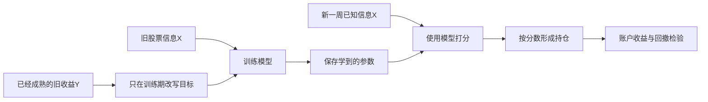

# 训练时到底让模型学什么，训练好的东西怎样留下来

日期：2026-10-09。工程阶段 E21 / E21A / E21B。正式模块已经迁入，本机31项迁入检查通过；公开发布及本次CI状态看项目总览。原蓝图E21是尚未开始的神经网络；本报告里的E21工程任务是补充目标/存档工作，总览记为E21T，避免混淆。这次没有新增市场模型训练或账户回测，也没有发现收益改善。

## 1. 先用一个星期讲清楚三种不同的数

到了一个星期最后一个交易日的15:30，我们为当时合格名单中的每只股票整理一行X。基础X仍是16项价量信息：有当日形态，也有过去5、20、60日的统计。另有已做过的板型、龙虎榜、财务和市场信息组。这次没有让X增加新的市场信息。

假设甲股票下周一开盘买入，再下周一开盘结束观察，参考链计算出的实际收益是1%。这个1%是**原始Y**。遇假期按市场交易日历安排，不固定成周一到周五；也不是未来股价的绝对值。

训练时可以把这个Y改写成“相对当周其他股票有多好”。改写后的数叫**训练目标**。模型训练完以后，根据新一周的X输出的数叫**预测分数**。这三者必须分开保存和解释。模型不会在新一周提前知道那一周的实际Y。

## 2. 四种目标，用三个股票就能说明

以下是虚构教学数字，并非本项目的投资结果。假设某个训练周甲、乙、丙的成熟实际收益分别为1%、2%、3%。我们提供四种明确的改写规则。

| 训练方式 | 甲 | 乙 | 丙 | 希望模型学会什么 |
| --- | --- | --- | --- | --- |
| 原始收益 | 0.01 | 0.02 | 0.03 | 预测收益的大小，0.01表示1% |
| 同期去均值 | -0.01 | 0 | 0.01 | 哪只股票高于或低于这个训练周的均值 |
| 同期标准化 | 约-1.225 | 0 | 约1.225 | 相对于这个训练周收益分散程度的好坏 |
| 同期排名 | -0.5 | 0 | 0.5 | 这个训练周三只股票之间的相对顺序 |

去均值仍是收益差；标准化和排名没有百分比单位。排名采用平均名次处理并列：如果两只收益相同，它们获得相同目标。标准化使用总体标准差。三种同期改写会要求最低可用股票数量；原始收益不依赖这个分母。标准化/排名组的收益全相同，也会明确留下不可用原因。

这里的“同期”是**这次声明的训练名单中，结果已经成熟、可观察的股票**，不是全部A股。暂时不知道结果的股票不进入均值或名次的分母，也不会被当成收益0。

## 3. 这是不是直接学排名、一定改善RankIC

这次建的是数据目标接口。以后可以把排名数值交给岭回归、树等模型学习；这属于对改写目标的回归，**还没有实现成对或整组排序损失**。它不等于已经训练过新的市场模型。

更换目标会改变模型拟合时惩罚哪种误差。例如原始收益回归主要关心预测值与真实收益之间的差；排名目标会让误差对应于名次位置。不同模型仍有自己的损失和拟合算法，并非都靠神经网络反向传播。

改写目标可能减少不同星期整体涨跌和收益尺度的干扰，也可能丢掉重要幅度信息，甚至削弱我们最关心的前100只选股。因此不能从目标名字推断测试RankIC一定提高，更不能推断账户收益一定改善。账户最终仍要看净收益和回撤，保留零费用反事实及对照。

## 4. “只用成熟结果”具体是什么意思

训练截止时，某条旧样本的持有区间已经结束，而且结果已经可知，它才能给模型提供训练目标。尚未成熟、结果不可观察或标签缺失时，股票记录仍保留，目标为空并注明原因，不把缺失填成0。如果时钟或标签区间互相矛盾，接口会拒绝整次输入，提示先修正数据。

接口只读取声明训练日期内的标签。未来预测区间的标签即使后来出现在同一张表里，也不参加训练目标。训练结束后，只给模型新X生成分数；不需要、也不允许用新一周的未来收益来算训练均值。

这次反例还覆盖了极细的时间边界：比截止晚一纳秒仍然属于未成熟。修复这类接口精度不代表现有市场数据拥有纳秒信息。

## 5. 保存模型，究竟保存了什么

以前原12次市场训练留下了预测表、元数据和拟合尝试记录，没有留下能直接重新加载的完整模型。现在的接口可以把**未来成功拟合的模型**留下来，包括填补缺失值、缩放和模型本身已经学到的参数。

可以把它理解成保存一台已经调好的评分机器。以后用同样的输入列把机器读回来，就能再次打分，不需要再训练一次。它不是每周账户持仓快照，也不是一串编号自动包含了所有股票名单。

存档还带上版本、源代码身份、训练数据/目标/权重的内容标识以及拟合截止时刻。内容标识相当于文件内容的核对号码：内容变了号码会变。它帮助检查是否用了同一份材料，不能证明材料的历史真实性，也不能凭一个号码恢复已经没保存的数据。

**目前存档不保存逐行训练权重值和训练期预测表。**这两项需要下一步接入正式学习worker时单独输出。调用方提供的训练身份也不是模块独立认证的。原12个市场模型的参数无法由这次接口补回来。

## 6. 这次实际怎么验证，而不是只画了方案

私有接口的第一批有38项检查，35项通过、3项失败。六类模型只各拟合一次，分别是岭回归、弹性网、Huber回归、随机森林、极端随机树和提升树。六项保存—加载—分数相等检查都在第一批通过。

剩下三项失败发生在测试输入构造：两项把纳秒写进了精度只有微秒的列；另一项把两个不同星期都改成同一日期，造成重复股票键。只修正这三个用例的构造，候选算法字节保持相同，再单独执行三个用例，全部通过，0新增拟合。

补验还留下了一个启动前失败：启动器误把XML测试记录当作JSON读取，尚未启动测试即停止。修正后实际补验用时3.266秒。失败版本和原拟合总账都保留。两个独立新会话检查了源代码及实际结果；这种复核仍可能共享盲点。

所以准确说法是：**原35项通过，加上3项补验通过，覆盖38种原定条件；没有把第一批失败改写成一次完整成功重跑。**软件通过只说明这些条件下接口工作，不说明策略赚钱。

## 7. 正式迁入与剩余缺口

E21B已经新增两个正式模块：`src/alpharesearch/targets.py`负责成熟训练目标，`src/alpharesearch/checkpoints.py`负责可信本机模型存取；正式测试使用正常包导入。原有141份生产Python源文件保持内容不变。

正式迁入实际执行25项不拟合的目标检查，以及六份已有模型存档的迁入分数对照，共31项。六份存档分别由旧模块和正式模块加载、预测一次，总共12次预测调用，**本机不再拟合**。这批31项全部通过，用时20.188秒，0新增本机拟合；原141源码和12个失败账户记录保持。

正式发布会触发Windows和Ubuntu两项软件CI。新增测试fixture各拟合六个小型合成模型，额外12次远端合成拟合单独计预算；既有测试也会运行。这些是软件检查，不是新增12次市场策略研究，也不自动重跑失败CI。

尚未完成：把改写目标、模型存档、训练预测表和逐行权重真正接进注册学习worker；真实目标账户对照；真实日历窗口试点和神经模型；公式分数到正式账户的来源接线。模型存档只加载自己生成、外部核对内容的可信本机产物。

## 8. 为什么做这些，后面会怎样研究

以前只看到测试账户差，却不能加载原模型检查训练与测试的差距。之后保留模型和训练预测，才能更具体地区分“训练已经没信号”和“训练很好、未来失效”。目标接口则让收益大小、同期超额和相对排名可以在同信息、同时间条件下对照，而不是偷偷同时换模型、股票池和规则。

下一步不只围着四个目标转。广泛路线包括256个有机制解释的价量、板型、龙虎榜、财务和市场交互公式，先在训练段按信息增量与家族配额筛选，再把少数候选送入模型和账户检验；保留所有失败候选。还包括有限真实序列试点、时间更新与留仓规则，按依赖和资源分批登记。

Qlib把模型分数和持仓策略分开，并说明排名策略不必把分数解释成收益；这启发我们保持目标/分数/账户单位清楚。[官方策略文档](https://raw.githubusercontent.com/microsoft/qlib/main/docs/component/strategy.rst) 同期资料上的组合公式研究只提供方法启发，不是本项目的盈利证明。[AlphaGen组合池源码](https://github.com/ICT-FinD-Lab/alphagen/blob/master/alphagen/models/linear_alpha_pool.py)

## 9. 自上次汇报以来的路径

全12模型账户核查与比较 → 全保存分数诊断（9个模型头部平均超额为负） → 正式日历窗口模块及32项检查、两平台CI → 本次四种成熟目标及六类模型存档接口 → 三个失败用例有限补验 → 正式模块迁入。原账户结论不变：12个机器学习方法扣费年化均为负；目前没有值得暂停报告的收益或回撤改善。

[当前总览与两级架构](PROJECT_MAP.html) · [完整最大蓝图](ML_SYSTEM_BLUEPRINT_20261005.html) · [完整工作包计划](CODEX_PROJECT_DELIVERY_PLAN_20261005.html) · [详细建设记录](BUILD_PROGRESS_20261006.md)
