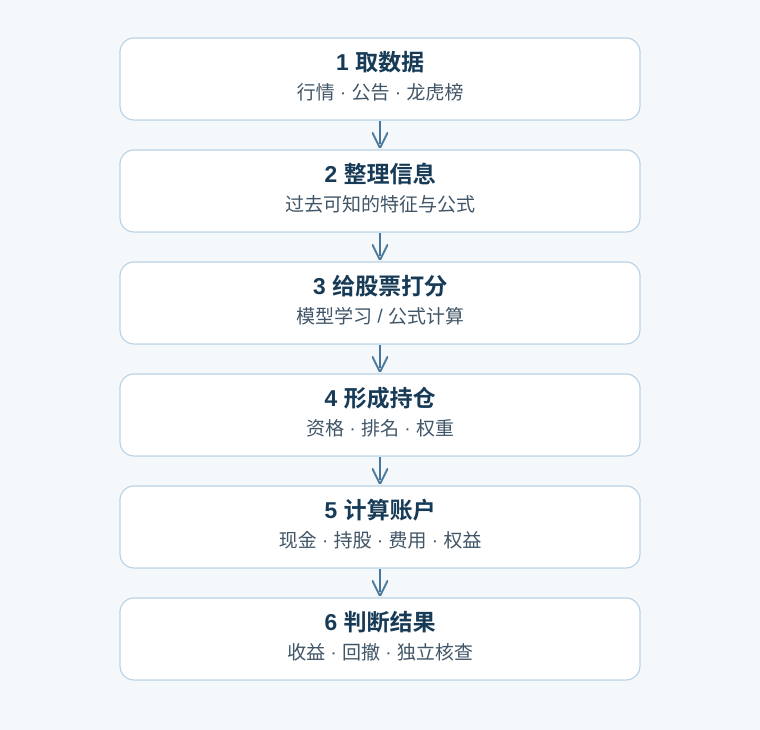
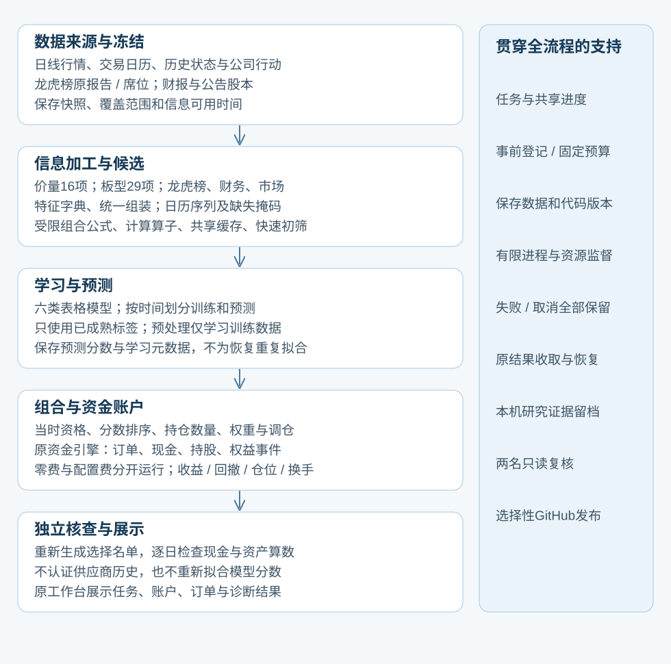

# 项目总览：当前架构、全计划和进度

更新（UTC）：2026-10-09T20:43:35.289673+00:00 · 当前工作包：E23H

我们建设的是：把已有市场信息变成可检验的投资方法，再用真实资金账户的收益和回撤判断它是否值得继续。当前软件模块已具备研究闭环的基本接线；真实账户计算与独立接受的进度分别见下文。

## 从这里看整个计划

- [完整最大系统蓝图](ML_SYSTEM_BLUEPRINT_20261005.md)（[网页](ML_SYSTEM_BLUEPRINT_20261005.html)）
- [完整工作包及交付计划](CODEX_PROJECT_DELIVERY_PLAN_20261005.md)（[网页](CODEX_PROJECT_DELIVERY_PLAN_20261005.html)）
- [逐阶段详细建设记录](BUILD_PROGRESS_20261006.md)
- [长期目标与持续探索准则](PROJECT_CHARTER.md)（[网页](PROJECT_CHARTER.html)）
- [本批实验的人话说明](ML_E19_REAL_MATRIX_20261008.md)（[网页](ML_E19_REAL_MATRIX_20261008.html)）
- [这次账户核查与研究路径](ML_E19_ACCOUNT_RECHECK_20261009.md)（[网页](ML_E19_ACCOUNT_RECHECK_20261009.html)）
- [本批全部账户结果](ML_E19_ACCOUNT_COMPARISON_20261009.md)（[网页](ML_E19_ACCOUNT_COMPARISON_20261009.html)）
- [模型保存分数学到了什么](ML_E19_SCORE_DIAGNOSIS_20261009.md)（[网页](ML_E19_SCORE_DIAGNOSIS_20261009.html)）
- [序列接口的人话说明](ALPHA_SEQUENCE_WINDOWS.md)（[网页](ALPHA_SEQUENCE_WINDOWS.html)）
- [训练目标与模型存档：人话说明](ML_TARGETS_AND_SAVED_MODELS_20261009.md)（[网页](ML_TARGETS_AND_SAVED_MODELS_20261009.html)）
- [公式组合研究的人话说明](ML_FORMULA_RESEARCH_20261009.md)（[网页](ML_FORMULA_RESEARCH_20261009.html)）
- [首次真实批次为何失败](ML_FORMULA_CAPACITY_20261009.md)（[网页](ML_FORMULA_CAPACITY_20261009.html)）
- [共享名单存储改造](ML_FORMULA_SHARED_STORAGE_20261009.md)（[网页](ML_FORMULA_SHARED_STORAGE_20261009.html)）

## 现在进行到哪里

本E19阶段：工程3作业（2完成/1取消）；模型登记12项，有收据确认拟合12次、模型核查完成12项；真实账户已计算32情景，其中当前核查接受32情景。上限12次真实拟合/32个真实账户情景，外部费用$0。

后续特征协议实际51条件/8合成公式验收；没有新账户收益。后续20真实公式X任务已创建，未执行。

原E19的12市场模型/32账户结论保持。G256表达式训练筛选归档；E21C存档实际39条件、本机13合成拟合，H0后续X协议51条件/8合成公式已归档。生产147源。20真实后续公式和扩展模型账户仍未执行；新公开CI待核查。下方31/12/32属于原E19，不是全阶段合计。

## 最简架构：六步就能理解

## 略详细架构：每一步里有什么

图中只画已经实现的有用功能。工程验收表示程序与约束经过检查，不表示有市场优势；模块可用也不表示所有大规模数据路径都已认证。神经网络、图模型、遗传/RL/LLM自动公式搜索仍在后面的计划表。

## 一周例子

示例：周五收盘后，以当时可知的信息给每只合格股票打分；按预先固定的规则选股和分配资金；下一个交易日开盘尝试调仓，此后逐日计算账户。新学习协议默认预测两次计划调仓开盘之间的收益，不是某天的绝对价格，也不是直接训练最大回撤。固定随机对照中的11是种子，不是11只股票。E19已固定共同主板名单、周调仓、100只目标持仓及四个对照；具体实验说明见本批报告。

## 接下来四步

1. 核查并公开E23H0源码、测试、报告、导航；核对该提交真实双平台CI
2. E23H固定20公式计算真实后续X，未来Y不得参与名单筛选
3. E19E同名单16/28/36个输入与有限模型、含费/零费账户
4. E23I直接公式组合另立交易映射；序列、随机表示、关系与自动搜索继续探索

## 全部工作包：原计划与补充包

原编号表示设计和依赖，不是按编号顺序执行；E15—E18先补接线，E12—E14后补有限执行能力，详见建设记录。没有用完成包数给项目虚构完成百分比。

| 工作包 | 人话说明 | 当前状态 | 已做到什么 / 还缺什么 | 依赖 |
|---|---|---|---|---|
| [R0](LOCAL_STRUCTURE_REVIEW_20261006.md) | 保留旧项目和已有改动 | 已完成首轮 | 旧脏Git与私人证据保留；发布用独立导出仓库。 | 无 |
| [R1](PUBLIC_DELIVERY.md) | 决定哪些文件能公开 | 已完成首轮 | 精确清单及忽略规则，行情/数据库/私密会话留本机。 | R0 |
| [R2](PUBLIC_DELIVERY.md) | 依赖、安装和打包 | 部分完成 | 当前wheel已核查；高级模型依赖随对应工作包接入。 | R0 |
| [R3](PUBLIC_DELIVERY.md) | 跨系统的软件检查 | 已完成首轮 | Windows/Ubuntu CI通过；不证明真实策略有效。 | R1,R2 |
| [R4](WORKER_GUIDE.md) | 新人说明与协作规则 | 部分完成 | 入场与长期准则已保存；许可证尚未决定。 | R1 |
| [R5](PUBLIC_DELIVERY.md) | 发布到GitHub | 已完成首轮 | 公开仓库已建立并多次核查发布，后续持续维护。 | R3,R4 |
| [E00](BUILD_PROGRESS_20261006.md) | 修复财务市场日历问题 | 已完成工程验收 | 执行器与核查器日期范围、60日回看一致；0策略fit。 | 已有task-28ab0d6b9fe2 |
| [E01](ALPHA_CAUSAL_CONTRACTS.md) | 什么时候能知道什么 | 已完成工程验收 | 明确决策、信息可用、成交、标签结束时间，拒绝未来信息。 | E00,R0 |
| [E02](ALPHA_EVENT_SNAPSHOTS.md) | 龙虎榜原报告快照 | 已完成工程验收 | 原报告、席位、重复及窗口可追溯；披露时间仍是保守代理。 | E01 |
| [E03](ALPHA_EVENT_PANEL.md) | 日期×股票的统一名单 | 已完成工程验收 | 行情/事件对齐，缺数据≠没事件；原工程真实切片27日。 | E01,E02 |
| [E04](ALPHA_DAILY_BOARDS.md) | 连板与涨跌停形态 | 已完成工程验收 | 29项定义；日线不能辨别天地板的盘中顺序。 | E03 |
| [E05](ALPHA_LHB_FEATURES.md) | 龙虎榜与集中度特征 | 已完成工程验收 | 34项报告、150项决策投影；部分全缺失，数量不代表有效Alpha。 | E03 |
| [E06](ALPHA_FINANCIAL_MARKET.md) | 财务和市场环境 | 已完成工程验收 | 14项财务、12项市场；保留财务修订及市场覆盖限制。 | E01,E03 |
| [E07](ALPHA_FEATURE_REGISTRY.md) | 特征字典与组装 | 已完成工程验收 | 255项登记定义，工程矩阵221列；包含缺失列，并非221个盈利信号。 | E04,E05,E06 |
| [E08](ALPHA_EXPRESSION_CONTRACTS.md) | 安全组合公式语法 | 已完成工程验收 | 受限表达式组合基础信息，拒绝任意代码执行。 | E01,E07 |
| [E09](ALPHA_NUMERICAL_OPERATORS.md) | 组合公式的计算算子 | 已完成工程验收 | 排序/滞后/差分/滚动按真实交易日历计算。 | E08 |
| [E10](ALPHA_SHARED_CACHE.md) | 共享表达式与缓存 | 已完成工程验收 | 复用中间计算、识别损坏；原小批实测未证明缓存更快。 | E09 |
| [E11](ALPHA_BATCH_REGISTRATION.md) | 先登记再运行 | 已完成工程验收 | 冻结候选、数据、代码、预算；失败和取消留档。 | E07,R3 |
| [E12](ALPHA_BATCH_EXECUTION.md) | 有限计算与中断恢复 | 已完成工程验收 | 监督进程、有限资源、取消与恢复；采样软限制。 | E10,E11 |
| [E13](ALPHA_SCREENING.md) | 快速筛掉差候选 | 已完成工程验收 | 用预测/代理收益诊断筛选，尚不是资金账户回测。 | E07,E11 |
| [E14](ALPHA_CAPACITY_RESULTS_20261007.md) | 实测机器能跑多少 | 已完成工程验收 | 160个公式意图只有8类工作形状；不是160个有效策略。 | E12,E13 |
| [E15](ALPHA_MODEL_INTERFACES.md) | 六类表格模型 | 已完成工程验收 | Ridge/ElasticNet/Huber/RF/ExtraTrees/HGB共同接口。 | E07,R2 |
| [E16](ALPHA_CAUSAL_LEARNING.md) | 训练、目标与预测协议 | 已完成工程验收 | 时间划分/成熟标签/预测名单约束；保存预测与元数据。 | E15,E11 |
| [E17](ALPHA_SCORE_TO_ACCOUNT.md) | 分数变成持仓名单 | 已完成工程验收 | 按当时资格/分数/持仓数/权重生成计划，不自动挖特征。 | E16,E01 |
| [E18](ALPHA_ACCOUNT_AUDIT.md) | 独立检查名单与账本 | 已完成工程验收 | 重建选择并复算现金/持仓/权益/收益，不重新训练。 | E17,E02 |
| [E19](ML_E19_ACCOUNT_COMPARISON_20261009.md) | 首次新流水线真实闭环 | 整批已核查并发布，模型未达收益目标 | 12fit/32账户全部结果已报告；原12failed保持。保存分数诊断另记E19D，不重训或补跑。 | E14,E18 |
| [E20](ALPHA_SEQUENCE_WINDOWS.md) | 序列与事件数据集 | 日历窗口已正式接入，事件序列/真实试点待做 | E20私有30检查，E20B正式32检查；明确每日特征、可知时间/缺失掩码和有限批。没有序列模型。 | E07,E16 |
| [E21](ML_SYSTEM_BLUEPRINT_20261005.md) | 神经网络模型 | 未开始 | MLP→GRU/TCN→Transformer，逐步比较并实测成本。 | E20,R2,E19 |
| [E22](ML_SYSTEM_BLUEPRINT_20261005.md) | 席位关系图 | 未开始 | 当时关系统计→图模型，隔离未来新增关系。 | E02,E20,E19 |
| [E23](ML_FORMULA_SHARED_STORAGE_20261009.md) | 遗传与符号搜索公式 | 有限公式库的八类训练筛选已完成；自适应搜索未开始 | 256有符号公式/128模板/8类完整训练筛选；原G14作业及原归档超时保留，独立恢复已接受。12表现+8探索只是模型输入候选，0新fit/account；GP/RL/LLM自适应搜索未实现。 | E09,E12,E19 |
| [E24](ML_SYSTEM_BLUEPRINT_20261005.md) | 强化学习生成公式 | 未开始 | 固定奖励和反馈范围，防止评价区间泄漏。 | E23 |
| [E25](ML_SYSTEM_BLUEPRINT_20261005.md) | LLM提出受限公式 | 未开始 | 提出假设与表达式，按调用/研究预算核查。 | E23 |
| [E26](ML_SYSTEM_BLUEPRINT_20261005.md) | 组合权重与风险研究 | 部分完成 | 旧系统已有组合/风险实验，新统一流水线研究待E19。 | E18,E19 |
| [E27](ML_SYSTEM_BLUEPRINT_20261005.md) | 工作台展示研究过程 | 部分完成 | 已有任务/账户/结果工作台；新候选前沿尚待接入。 | E11,E19 |
| [E28](ML_SYSTEM_BLUEPRINT_20261005.md) | 记录真正未来的预测 | 未开始 | 可载入实际拟合模型和训练trace的存档基础已由E21C接入；真正未来数据推断与前瞻预测封存仍未开始。旧E19没有保存拟合对象，不可补造；已看历史不算未见验证。 | E18,E19 |
| [E29](ML_SYSTEM_BLUEPRINT_20261005.md) | 备份和灾后恢复 | 部分完成 | 已有位置修复和运行恢复；整库备份与恢复演练待补齐。 | R3,E12 |
| [E12P](ALPHA_WINDOWS_CI_REPAIR.md) | 补充：Windows进程身份 | 已完成工程验收 | 进程身份与启动恢复修复，保留失败迭代。 | E12 |
| [E13B1](ALPHA_BINDING_INDEX.md) | 补充：复用特征绑定索引 | 已完成工程验收 | 复用绑定解析；非同口径实测不宣称精确加速倍数。 | E13 |
| [E13D](ALPHA_SCREEN_DURABLE.md) | 补充：持久初筛任务 | 已完成工程验收 | 正式3作业：2完成、1预期输出上限失败；0fit/账户。 | E12、E13 |
| [E16D](ALPHA_LEARNING_DURABLE.md) | 补充：持久训练任务 | 已完成工程验收 | 合成拟合3次：2完成、1预期不收敛；0真实拟合/账户。 | E12、E16 |
| [E19A](ML_E19_ACCOUNT_COMPARISON_20261009.md) | 补充：金额舍入与原账户重检 | 工程任务已完成，原档案保留 | 24模型场景修正核查+8原对照通过；16同名单比较发布；0新fit/模拟。 | E19 |
| [E19D](ML_E19_SCORE_DIAGNOSIS_20261009.md) | 保存分数的失效诊断 | 完成并已发布 | 保存分数全12诊断完成，9个头部标签超额为负；不改任何账户结果。 | E19,E19A |
| [E20B](ALPHA_SEQUENCE_WINDOWS.md) | 正式序列接口与日线接入 | 已发布；两平台CI通过 | sequence正式32检查；69e20f3 Windows1272/Ubuntu1269+3skip，真实试点和神经模型未做。 | E20,E19A |
| [E21T](ML_TARGETS_AND_SAVED_MODELS_20261009.md) | 补充：成熟目标与私有模型存档 | 已完成私有接口验收 | 实际任务标签E21。四种目标、六合成fit；原35+补3覆盖38条件；原12市场模型权重没有补回。 | E19D |
| [E21A](ML_TARGETS_AND_SAVED_MODELS_20261009.md) | 补充：三个测试构造修复 | 已完成 | 三节点实际补验通过，0fit；启动前XML读取失败保留。 | E21T |
| [E21B](ML_TARGETS_AND_SAVED_MODELS_20261009.md) | 补充：正式目标与模型存档模块 | 已完成并公开 | 正式独立API迁入，当时本地31通过0fit；精确12文件发布，Windows1310/Ubuntu1307+3skip CI成功。实际模型/训练trace存档由E21C接入；目标变换仍是独立接口，正式worker集成待做。 | E21T,E21A |
| [E23S](ML_FORMULA_SHARED_STORAGE_20261009.md) | 补充：共享名单存储与独立核查 | 已完成并公开 | 144生产文件；原29加补13验收42条件，v1/v2各2合成公式共4，0真实公式/fit/account。首次失败保留。 公开提交a21ecc7；Windows1331/Ubuntu1328+3skip CI成功。 | E23,E12 |
| [E23P](ML_FORMULA_SHARED_STORAGE_20261009.md) | 补充：真实32公式容量试跑 | 已完成并公开 | 1正式批次32全完成；7实际依赖/11PV输入列/32原料库。213MB，旧13完整语义一致；473s/1.43GB；0screen/fit/account。 | E23S |
| [E23F](ML_FORMULA_SCREEN_THROUGHPUT_20261009.md) | 补充：八家族训练筛选 | 部分阶段已归档：1/15例 | 复用P32完成32通道，native443s/outer1171.5s接近20min单例上限；全8家族尚未完成，余14案例未启动；先改造重复排序。 归档789.625s、两次原冻结核查；task-d878a2473869完成的是吞吐里程碑，整批仍待接续。 | E23P,E12 |
| [E23C](ML_EXACT_RANK_REUSE_20261009.md) | 补充：精确共同名单排序复用 | 已完成并公开 | 75软件通过；1次真实379842×32/496对全部与原算法/原表精确相同，rank992→32、pair124.25→7.891s；145源码，0fit/account。两名结果接受并归档，未宣称whole-screen提速。 公开提交457a90f；Windows1353/Ubuntu1350+3skip CI成功。 | E23F,E23S |
| [E23G](ML_EIGHT_FAMILY_TRAINING_SCREEN_20261009.md) | 补充：接续七类224公式与筛选 | 已完成本地归档；公开发布待核查 | 224新公式/224新筛选＋首32复用＝256有符号公式/128模板/8类；20候选并非成功策略。双RESULT接受，原7200秒归档超时保留；独立恢复实际完成14次核查，未重置原阶段；0新模型/账户。 | E23C,E23F |
| [E21C](ML_ACTUAL_TRAINING_ARTIFACTS_20261009.md) | 补充：真实训练作业存档与零重训重现 | 实际工程归档、公开发布与新双平台CI完成 | 39项合成条件实际通过，原失败5fit保留；独立短目录恢复5库级+3隔离=8新fit，本机共13合成fit；其中存档容量失败仍计数。实际模型/X/Y/权重/train分数保存与0refit重载接入；145→146源。0新真实模型/账户。 精确15文件发布，新提交Windows1392/Ubuntu1389+3skip通过，打包与模板通过；这些CI中的合成拟合另记，未计入本机13。 | E21B,E23G |
| [E23GR](ML_EIGHT_FAMILY_TRAINING_SCREEN_20261009.md) | 补充：最终裁决超时后的独立恢复 | 已完成；原超时保留 | 原7200秒案例失败，145源/30旧数据库行及完整目录保全。独立7800阶段/5400案例实际14核查，0新公式/fit/account；通过review.next_task_id准确衔接E21C。 | E23G |
| [E23H0](ML_FORECAST_FEATURE_PROTOCOL_20261009.md) | 补充：原生后续期公式执行协议 | 实际工程归档完成；公开发布待核查 | 51条件实际通过，4隔离批8合成公式。后续X、预热与固定训练名单原生协议接入，v1/v2兼容，146→147源；0真实公式/模型/账户。 | E21C |
| [E23H](ML_SYSTEM_BLUEPRINT_20261005.md) | 补充：固定20候选的真实后续特征 | 实际后续任务已创建；SOURCE与市场X执行待做 | 固定20公式后续X设计；≤8登记作业/7200秒。真实后续公式尚未执行，不读取未来Y筛选。 | E23G,E23H0 |
| [E19E](ML_SYSTEM_BLUEPRINT_20261005.md) | 补充：组合特征的真实模型与账户对照 | 7拟合/14账户依赖设计，未执行 | Ridge/HGB×原16/加12表现/加8探索，加1个打乱Y负对照；含费及零费账户。依赖实际模型存档与后续X，预算需另冻结。 | E21C,E23H |
| [E23I](ML_SYSTEM_BLUEPRINT_20261005.md) | 补充：公式直接选股与条件/平分对照 | 独立研究路线，未开始 | 不伪装成已训练模型；明确零分、平分、资格和现金规则，另登记真实账户。 | E23H,E18 |

## 报告接续规则

以后每份阶段结果和最终回复都附本总览、完整蓝图、完整工作包计划、详细建设记录；重要策略成果仍以经核查的收益/回撤改善为准，不能仅以RankIC或工程通过作为停止理由。

进度依据：本机任务库、CHECKPOINT及阶段收据。本页是当前摘要，不覆盖历史冻结结果。旧报告的‘下一步’指写作当时，当前下一步以本页和任务库为准。更新方式：修改PROJECT_MAP.json后运行python tools/render_project_map.py；阶段报告仍须关联原始证据。
